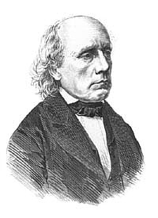
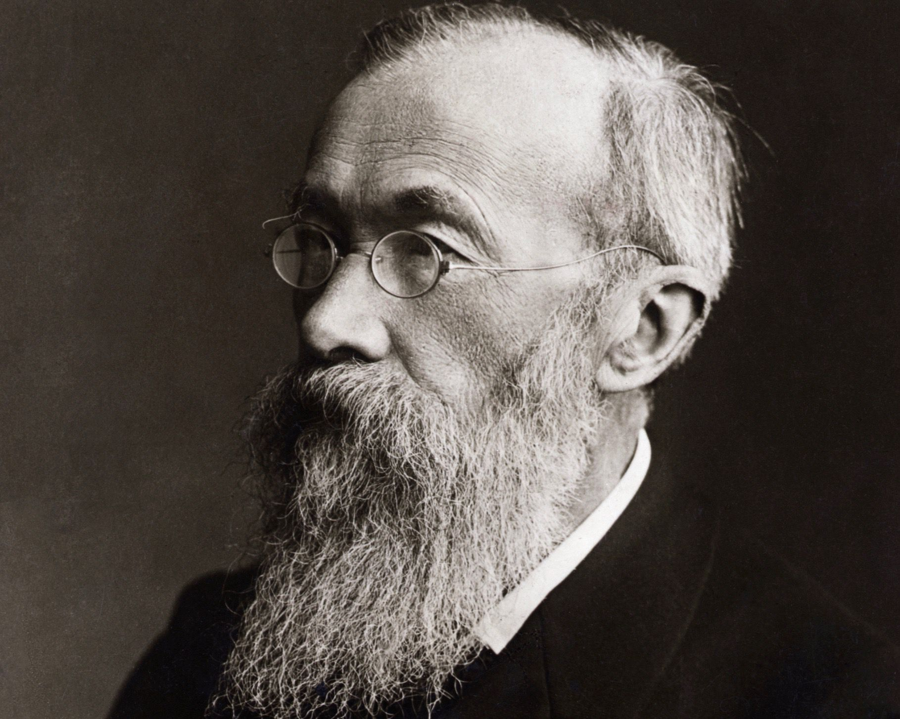

```{r setup, include=FALSE}
options(htmltools.dir.version = FALSE)

setwd("/Users/stephangoerigk/Desktop/Universität/CFH/Lehre/Bachelor/Einführung in die Forschungsmethoden der Psychologie und Psychotherapie/EFPP_Folien/")

library(tidyverse)
library(kableExtra)
library(ggplot2)
library(plotly)
library(htmlwidgets)
library(MASS)
library(ggpubr)
library(xaringanthemer)
library(xaringanExtra)

style_duo_accent(
  primary_color = "#621C37",
  secondary_color = "#EE0071",
  background_image = "blank.png"
)

xaringanExtra::use_xaringan_extra(c("tile_view"))

use_scribble(
  pen_color = "#EE0071",
  pen_size = 4
  )

knitr::opts_chunk$set(
  fig.retina = TRUE,
  warning = FALSE,
  message = FALSE
)

# library(RefManageR)
# BibOptions(
# check.entries = FALSE, 
# bib.style = "authoryear", 
# cite.style = "authoryear", 
# style = "markdown",
# hyperlink = FALSE, 
# dashed = FALSE)
# myBib = ReadBib("/Users/stephangoerigk/Desktop/Universität/CFH/Lehre/Bachelor/Einführung in die Forschungsmethoden der Psychologie und Psychotherapie/EFPP_Folien/myBib.bib")
```

name: Title slide
class: middle, left
<br><br><br><br><br><br><br>
# Einführung in die Forschungsmethoden der Psychologie und Psychotherapie

### Einheit 1: Wie ist Psychologie als Wissenschaft möglich? 
##### 12.10.2022 | Dr. Stephan Goerigk

---
class: top, left
name: Contact Slide

### Kontakt

.pull-left[
Dr. Stephan Goerigk 

Psychologische Methodenlehre

Infanteriestraße 11a · 80797 München ·

[stephan.goerigk@charlotte-fresenius.de](mailto:stephan.goerigk@charlotte-fresenius.de)

Zoom Sprechstunde (bitte per Email anmelden): 

Meeting-ID: 284 567 8838

Kenncode: 807174

[Publikationen](https://scholar.google.at/citations?user=nlvO-e4AAAAJ&hl=de)

[Commitment to Research Transparency](http://www.researchtransparency.org)
]

.pull-right[
.center[
<br><br><br>
.bottom[]
]
]
---
class: top, left
### Übersicht Lehrveranstaltung 

Termine:
* 14 Termine
* Mittwoch 13:50 - 15:20

Begleitende Vorlesung:
* Dienstag 10:50-12:20 (Audimax / P3)
* Dozentin: Prof. Dr. Nina Sarubin ([nina.sarubin@charlotte-fresenius-uni.de](mailto:nina.sarubin@charlotte-fresenius-uni.de))

Materialien:
* werden auf [Studynet](https://studynet.hs-fresenius.de/goto_STUDYNETHSF_fold_17283.html) bereitgestellt

Interaktion während der Lehrveranstaltung:
* [Note-Pad](https://docs.google.com/document/d/1dnTL3c64X8Z9hgiLzWk-SrjS0QJodd1TMauePhHf7dk/edit) 

Prüfungsleistung:
* Mündliche Prüfung (beide VOs gemeinsam)

---
class: top, left
### Termine

```{r echo = F}
df = readxl::read_xlsx("Einführung in die Forschungsmethoden der Psychologie und Psychotherapie_Termine.xlsx", sheet = "Tabelle1")[1:14, 1:3]
df$Datum = format(as.Date(df$Datum), "%d.%m.%Y")
df %>%
  kbl() %>%
  kable_classic(full_width = T)
```

---
class: top, left
### Wissenschaftliche Methoden?

.center[
*"Nichts beflügelt die Wissenschaft so wie der Schwatz mit Kollegen auf dem Flur."*

Arno Penzias 
]

#### Psychologische Methodenlehre

* Instrumentarium zur systematischen Entwicklung und Überprüfung (!) psychologischer Theorien

* Manchmal mehrere Zugänge zur Erkenntnis (**Methodenpluralismus**)

* Nutzen wissenschaftlicher Methoden unterscheiden Psychologie und Alltagspsychologie

* Wissenschaftliche Systematik ermöglicht vergleichbare Erfassung individueller psychologischer Eigenschaften
---
class: top, left
### Was macht Psychologie einzigartig?

#### Definitionen

.center[
**Frage:**

„Womit befasst sich die Psychologie?“

Wissenschaftlich ausgedrückt: 

„Was ist der Gegenstand der Psychologie?“
]

**Definition:**

Gegenstand der Psychologie sind 
* **Verhalten**
* **Erleben**  
* **Bewusstsein** des Menschen
* deren Entwicklung über die Lebensspanne 
* und deren innere (im Individuum angesiedelte) Bedingungen und Ursachen 
* und äußere (in der Umwelt lokalisierte) Bedingungen und Ursachen.

---
class: top, left
### Was macht Psychologie einzigartig?

#### Verhalten, Erleben und Bewusstsein

* Gegenstand psychologischer Untersuchungen: **Individuum** (Neugeborenes, Athlet, Student, Frau, Mann...)

* **Verhalten:** Mittel durch welches Individuum sich an die Umwelt anpasst

.pull-left[
* Wesentlicher Teil der Psychologie: **Beobachtbares Verhalten**

  * Lachen
  * Weinen
  * Sprechen
  * Berühren
  * ...
]
.pull-right[

* Aber: Viele menschliche Aktivitäten laufen als private, **innere Prozesse** ab

  * Denken
  * Schlussfolgern
  * Fantasieren
  * Träumen
  * ...
]  

**Annahme der meisten Psychologen:**

$\rightarrow$ Menschliches Verhalten ist ohne mentale Prozesse (Erleben und Bewusstsein) nicht verständlich.

---
class: top, left
### Was macht Psychologie einzigartig?

#### Ziele der Psychologie

1. Beschreibung

2. Erklärung

3. Vorhersage

4. Kontrolle

... menschlichen Verhaltens, Erleben und Bewusstseins (Gegenstand der Psychologie).

---
class: top, left
### Was macht Psychologie einzigartig?

#### Ziele der Psychologie

.pull-left[

##### Beschreibung

**Wahl angemessener Analyseebene (grob $\rightarrow$ spezifisch)**

**Aufgabe 1:** 

Sie wollen sich mit einem Freund vor diesem Gemälde verabreden. Wie würden Sie es beschreiben?
]

.pull-right[
.center[
```{r eval = TRUE, echo = F, out.width = "250px"}
knitr::include_graphics("bilder/eifel.jpg")
```
]
]

---
class: top, left
### Was macht Psychologie einzigartig?

#### Ziele der Psychologie

.pull-left[
##### Beschreibung

**Wahl angemessener Analyseebene (grob $\rightarrow$ spezifisch)**

**Aufgabe 2:** 

Sie wollen, dass Ihr Freund das Gemälde exakt kopiert. Wie würden Sie es beschreiben?
]

.pull-right[
.center[
```{r eval = TRUE, echo = F, out.width = "250px"}
knitr::include_graphics("bilder/eifel.jpg")
```
]
]

---
class: top, left
### Was macht Psychologie einzigartig?

#### Ziele der Psychologie

##### Beschreibung

**Wahl angemessener Analyseebene (grob $\rightarrow$ spezifisch)**

Beispielverhalten: Jemanden überzeugen.

.pull-left[
**Beispiel Sprache:**

* Gespräch
* Aussage
* Satz
* Wort
* Phonem 
* Buchstabe
]

.pull-right[
**Beispiel Physiologie:**

* Gehirn
* Frontallappen
* Gyrus praecentralis
* Neuron
* Synapse
* Protein
]

---
class: top, left
### Was macht Psychologie einzigartig?

#### Verhalten, Erleben und Bewusstsein

**Beschreibungsebenen:** behavioral, emotional, kognitiv, (physiologisch) 

.pull-left[
<br>
]
.pull-right[

**SORK-Schema** der kognitiven Verhaltentherapie

**S:** Person drängelt an Supermarktkasse vor.

**O:** Meine Biographie, Einstellungen, Kompetenzen...

**R (k):** "Das war ja klar..", "Ich bin es nicht wert..."

**R (e):** Niedergeschlagenheit

**R (p):** Erröten, Knoten im Hals

**R (b):** Ich sage nichts, lasse es geschehen.

**K (-):** Ich werde übergangen. **K (+):** Kein Konflikt
]

---
### Was macht Psychologie einzigartig?

#### Ziele der Psychologie

#####  Erklärung

* Erklärungen gehen über das Beobachtbare hinaus

* **regelhafte Muster** in Verhalten und mentalen Prozessen finden

* Ideal: Identifizieren von **Kausalitäten**

* verstehen, "wie etwas funktioniert"

* Psychologie: i.d.R. **Komination** von Determinanten

  * innere/organismische/dispositionelle Variablen
  * externale/situationale/Umweltvariablen
  
* **Aufgabe:** Erklären Sie warum Menschen mit dem Rauchen anfangen?

---
class: top, left
### Was macht Psychologie einzigartig?

#### Ziele der Psychologie

#####  Vorhersage

* Wahrscheinlichkeit über Auftreten bestimmten Ereignisses

* Wann und unter welchen Bedingungen?

* z.B. mehrere Erklärungen (s.o.) denkbar $\rightarrow$ die wahrscheinlichste gewinnt

* **Prädiktoren** = bedingende Faktoren

* Vorhersagen müssen exakt formuliert werden

---
class: top, left
### Was macht Psychologie einzigartig?

#### Ziele der Psychologie

#####  Kontrolle

* für viele das zentralste Ziel

* setzt häufig genaue Beschreibung/Vorhersage, bzw. Verständnis voraus

* Verhalten oder mentale Prozesse 

  * auftreten lassen
  * sie aufrechterhalten
  * sie beenden
  
* Verhaltenskontrolle durch **Interventionen** (z.B. Psychotherapie)

* **Aufgabe:** Was fallen Ihnen für psychologische Möglichkeiten der **Kontrolle** ein?
---
class: top, left
### Entwicklung der modernen Psychologie

#### Historische Grundlagen

.center[
*"Die Psychologie hat eine lange Vergangenheit, aber nur eine kurze Geschichte."*

Gedächtnisforscher Hermann Ebbinghaus (1908)
]

.pull-left[
Was ist damit gemeint?

Seit Jahrtausenden denken Menschen nach über
* die Natur des Menschen
* die Geheimnisse seiner Seele
* die Beweggründe seines Handelns
* seine Gefühle
* seine Erkenntnisfähigkeit
]

.pull-right[
.center[
```{r eval = TRUE, echo = F, out.width = "200px"}
knitr::include_graphics("bilder/ebbinghaus.jpg")
```
]
]

**ABER:** Psychologie als empirische, methodisch überprüfbare Forschung wird erst seit dem 19. Jahrhundert betrieben.

---
class: top, left
### Entwicklung der modernen Psychologie

#### Historische Grundlagen

.pull-left[
**Deutungshoheit** über Natur des Menschen vor dem 19. Jahrhundert:

* Dichter und Denker
* Philosophie
* Religionen und ihre Vertreter

**Erkenntnisgewinn** durch: 

* gründliches Nachdenken
* Spekulation
* Debatte
]

.pull-right[
.center[
```{r eval = TRUE, echo = F, out.width = "200px"}

```
]
]

**Ab 19. Jahrhundert:**
* Naturwissenschaften emanzipieren sich und gegenüber Geisteswissenschaften und Religion 
* beanspruchen Deutungshoheit über Mensch und Welt

---
### Wie ist Psychologie als Wissenschaft möglich?

#### Die Welt im Kopf

.center[
Haben sich sicher schon einmal gefragt...

"Erlebt mein Gegenüber die Welt genauso wie ich sie erlebe?"
]
**Fragen:**

* Siehst Du, wie ich es tue? 
* Höhrst Du, wie ich es tue? 
* Denkst Du,  wie ich es tue? 
* Fühlst Du,  wie ich es tue? 
* Wie kann ich wissen, was in einem Menschen gerade vorgeht?  

**Problem:** 

* Das einzige, was ich sicher weiß, ist, was **ich** sehe, fühle, denke, kurz: was ich erlebe.
* Wie und was andere erleben, erleben eben die anderen, und nicht ich selbst.

---
### Wie ist Psychologie als Wissenschaft möglich?

#### Die Welt im Kopf

.center[
**Analogieschluss: **

Ich habe ich ein Bewusstsein meiner selbst und der Welt um mich herum 

$\downarrow$

Andere müssen auch ein solches Bewusstsein haben.
]

**ABER:** Was aber berechtigt mich zu diesem Schluss? 

Ich bediene mich einer **Heuristik**:
* Ich bin nicht alleine auf der Welt
* Ich beobachte (meistens), dass Menschen sich so verhalten wie ich es erwarte.
* Also: Andere Menschen funktionieren in ähnlichen Situationen so wie ich
* Schlussfolgerung: Vermutlich denken und fühlen sie dann auch wie ich.

---
### Wie ist Psychologie als Wissenschaft möglich?

#### Die Welt im Kopf

.pull-left[

##### Das Dilemma des Analogieschlusses

**Untersuchungsgegestand der Psychologie:**

* Verhalten des Menschen $\rightarrow$ **beobachtbar**
* Erleben des Menschen $\rightarrow$ **?**
* Bewusstsein des Menschen $\rightarrow$ **?**
]

.pull-right[
.center[
```{r eval = TRUE, echo = F, out.width = "250px"}

```
]
]

**Dilemma**:

Wie kann über etwas, das ganz allein meine innerste private Erfahrung ist wissenschaftlich etwas ausgesagt werden?

---
### Wie ist Psychologie als Wissenschaft möglich?

#### Anspruch einer Wissenschaft

Wissenschaft ist...
* ein soziales, kollektives Unterfangen
* ein Kommunikationssystem
* funktioniert nach bestimmten (oft implizit) festgelegten Regeln 

**Oberster Grundsatz der Wissenschaft**:

Das, was erforscht wird und das Wie des Forschens (Entstehung, Begrüngung, Methode) muss ...

* kommunizierbar sein

...und von jedem Teilnehmer des Kommunikationssystems, der sich entsprechend kundig gemacht hat...

* intersubjektiv nachvollziehbar 

* überprüfbar sein.

---
### Wie ist Psychologie als Wissenschaft möglich?

#### Anspruch einer Wissenschaft

Wie also soll in diesem Sinne öffentliches Wissen über privates Erleben möglich sein? 

.center[
**Zentralproblem der Psychologie**

*Das forschende Subjekt muss sich selbst als Forschungsobjekt nehmen. *

**Forschungspraktisch formuliert: **

*Das beobachtende Subjekt fällt mit dem zu beobachtenden Objekt zusammen.*
]

**Weitere Zuspitzung:**

* Wie der Gegenstand, so ist auch die **Auffassung** dieses Gegenstandes ein privater Vollzug.
* Der Beobachter muss sein eigenes Beobachten beobachten.

$\rightarrow$ Wie kann unter diesen Umständen die Psychologie eine Wissenschaft sein?

---
### Wie ist Psychologie als Wissenschaft möglich?

#### Psychisches Erleben und Selbstbeobachtung

.pull-left[
**Begriffsklärungen und Voraussetzungen:**

**Psychisches Erleben** (z.B. denken, fühlen...)
* Vorgang ist uns irgendwie „gegeben“ 
* existiert unabhängig davon, ob wir es bewusst registrieren (d. h. bewusst beobachten) oder nicht

**Introspektion**:
* Das bewusste Selbstbeobachten des psychischen Erlebens
* Beobachten = Aufmerksamkeit gezielt auf die in Frage stehenden Erscheinungen richten
]

.pull-right[.center[
```{r eval = TRUE, echo = F, out.width = "300px"}

```
]
]

---
### Wie ist Psychologie als Wissenschaft möglich?

#### Psychisches Erleben und Selbstbeobachtung

##### Übung in Introspektion

.center[
*“Es ist nicht immer einfach, zwischen Nachdenken und dem Blick aus dem Fenster zu unterscheiden.”*

Wallace Stevens

**Übung:** 2 Minuten Selbstbeobachtung

```{r eval = TRUE, echo = F, out.width = "700px"}
knitr::include_graphics("bilder/hopper.jpg")
```
]
---
### Wie ist Psychologie als Wissenschaft möglich?

#### Psychisches Erleben und Selbstbeobachtung

.center[
Zentraler Gegenstand der **Erkenntnistheorie** (aka Epistemologie)

$\downarrow$

Was kann der Mensch über sich selbst erkennen? (s.h. 2. Vorlesung)

```{r eval = TRUE, echo = F, out.width = "700px"}

```

*Das Höhlengleichnis*, Platons Republik
]

---
### Wie ist Psychologie als Wissenschaft möglich?

#### Einwände gegen die Introspektion als wissenschaftliche Methode


.center[
„*Der Vorgang der Beobachtung verändert bereits das, was zur Beobachtung ansteht.*“

**Immanuel Kant (1786)**

„*Denn wer den Zorn, der in ihm glüht, beobachten wollte, bei dem wäre er offenbar bereits gekühlt, und der Gegenstand der Beobachtung verschwunden.*“

**Franz v. Brentano (1838-1917)**
]

#### Umgang mit dem Introspektionsproblem

.center[
Unterschiedliche Ansätze zur Lösung des Introspektionsproblems 

$\downarrow$

Grundrichtungen der Psychologie (**Paradigmen**, s.h. 3. Vorlesung)
]

---
### Wie ist Psychologie als Wissenschaft möglich?

#### Hermann Ludwig von Helmholtz (Sinnesphysiologie)

* sinnliche Wahrnehmung aus der Perspektive der **Physiologie**

* Aufnahme von **Reizen** durch Sinnesorgane mit Bildung **neuronaler Signale** (Verarbeitung im Nervensystem)

  * Sehen – visuelle Wahrnehmung
  * Hören – auditive Wahrnehmung
  * Riechen – olfaktorische Wahrnehmung
  * Schmecken – gustatorische Wahrnehmung
  * Gefühl für Lageänderung im Raum – vestibuläre Wahrnehmung
  * Gefühl für Stellung und Spannung einer Ruhehaltung, Kraft und Geschwindigkeit einer Bewegung (Tiefensensibilität)
  * Fühlen von Berührung, Druck, Vibration, Wärme, Kälte und Schmerz der Körperoberfläche (Oberflächensensibilität)

---
### Wie ist Psychologie als Wissenschaft möglich?

#### Gustav Theodor Fechner (Psychophysik)

.pull-left[
* **Psychophysik** 1860 von Fechner begründet

* Teilgebiet der **experimentellen Psychologie** 

* Fokus: v. A. Wahrnehmung (**low Level**)

* Unterscheidung: äußere (1) vs. innere (2) Psychophysik

* Zusammenhang zwischen Reizungen der Sinnesorgane und Erleben

* befasst sich z. T. auch mit **ästhetischen** Fragen des Geschmacks
]

.pull-right[
.center[
.pull-left[
```{r eval = TRUE, echo = F, out.width = "200px"}

```
]
.pull-right[
```{r eval = TRUE, echo = F, out.width = "300px"}
knitr::include_graphics("bilder/psychophysik.png")
```
]
]
]

$\rightarrow$ gesetzmäßige Wechselbeziehungen zwischen subjektivem, mentalen Erleben vs. quantitativ messbaren, also objektiven physikalischen Reizen
---
### Wie ist Psychologie als Wissenschaft möglich?

#### Gustav Theodor Fechner (Psychophysik)

##### Beispiele für Studien aus Psychophysik:

* Fechner untersuchte z.B. ästhetische Präferenz für **Goldenen Schnitt** (aka göttliche Proportion)

* Größenverhältnis (**Proportion**) zweier Abschnitte mit definierter unterschiedlicher Länge einer Strecke (Euklid)

* Teilung nach nach dem Goldenen Schnitt:

  *Der größere Teil verhält sich zum kleineren, wie beide zusammen zum größeren Teil.*
 
.center[
```{r eval = TRUE, echo = F, out.width = "300px"}

```
]

---
### Wie ist Psychologie als Wissenschaft möglich?

#### Gustav Theodor Fechner (Psychophysik)

##### Beispiele für Studien aus Psychophysik:

.pull-left[
**Wahrnehmungsschwelle (Absolutschwelle):**

  Wie stark die Reizung eines gegebenen Sinnesorgans sein muss, damit eine Reaktion erfolgt.

**Diskriminationsschwelle (Reizunterscheidung):**
  
  Wie verschieden müssen zwei Reize sein, damit sie in einem gegebenen Kontext als unterschiedlich empfunden werden
 
**Reizerkennung**

  Wann etwa ein blaues Dreieck als ein blaues Dreieck erkannt wird.
]

.pull-right[
**Fechners Gesetz (auch Fechner-Skala)**

Zusammenhang zwischen Reiz- und Erlebnisintensität:
$$E=k\cdot \log R+f$$
.center[

.pull-left[
```{r eval = TRUE, echo = F, out.width = "200px"}
knitr::include_graphics("bilder/fechnersquare.png")
```
]
.pull-right[
```{r eval = TRUE, echo = F, out.width = "300px"}
knitr::include_graphics("bilder/fechnergesetz.png")
```
]
]

]

---
### Wie ist Psychologie als Wissenschaft möglich?

.pull-left[
#### Würzburger Schule

* "Denkpsychologie"

* Forscherkreises zu Beginn des 20. Jahrhunderts

* begründet durch Oswald Külpe (1862-1915)

* Wichtige Mitglieder:
  * Narziss Ach
  * Ernst Dürr
  * Karl Marbe
  * August Messer
  * Otto Selz
  * Karl Bühler (berühmtester Vertreter)
  ]

.pull-right[
.pull-left[
```{r eval = TRUE, echo = F, out.width = "200px"}
knitr::include_graphics("bilder/Kuelpe.jpg")
```
]
.pull-right[
```{r eval = TRUE, echo = F, out.width = "200px"}
knitr::include_graphics("bilder/Buehler.jpg")
```
]
]
* Methodische Lösung des Introspektionsproblems: **Retrospektion** statt Introspektion

---
### Wie ist Psychologie als Wissenschaft möglich?

#### Würzburger Schule

Wissenschaftliche Methodik:

* **Retrospektion** = rückschauenden Selbstbeobachtung

* **Ziel:** experimentelle Erforschung von Denk- und Willensvorgängen

* Assistenten und Professoren waren Versuchsleiter und Versuchperson

* „unkundige“ Versuchspersonen im  Forschungslabor nicht erwünscht

**Ablauf:**

1. komplexe Denkaufgaben vorgegeben
2. Aufgabe möglichst rasch zu lösen
3. Nach Lösung: während Problemlösung abgelaufene Denkvorgänge genau beschreiben (Erlebnisprotokoll)
4. Analyse der Erlebnisprotokolle
5. allgemeine Aussagen über die dokumentierten Denkprozesse ableiten

---
### Wie ist Psychologie als Wissenschaft möglich?

#### Würzburger Schule

Beispiele für damals verwendete **Denkaufgaben**:

* Wissensfragen

* Gedankenpaarungen eingeprägen und reproduzieren (z.B. *Hannibal, Elefant*)

* philosophische Aphorismen verstehen (z.B. *Wer ein Warum hat, dem ist kein Wie zu schwer.*)

* Teile von Sprichwörtern ergänzen (z.B. *Eigensinn – ist die Energie der Dummen.*)

aus "Tatsachen und Probleme einer Psychologie der Denkvorgänge", Karl Bühler (1907/1908)

**Hauptergebnisse laut Bühler:**

1. Träger jedes geordneten Denkverlaufs = **Gedanken**
2. Gedanken = "unanschauliche“, von Sinnesempfindungen und Wahrnehmungen losgelöste Erlebniseinheiten
3. **Gedankenfolge** im Denkverlauf gehorcht nicht primär Gesetzen der Assoziation, sondern Forderungen der gedachten Gegenstände.

---
### Wie ist Psychologie als Wissenschaft möglich?

#### Würzburger Schule

**Beispiel:** Selbstbeobachtungsprotokoll aus den Bühlerschen Experimenten (Versuchsperson Ernst Dürr)

Bühler liest Dürr einen Satz vor. Er muss entscheiden, ob dieser Satz richtig ist:

„Ist es richtig? Das Zukünftige ist ebenso eine Bedingung des Gegenwärtigen wie des Vergangenen“

Antwort (nach 10 sec.): „Nein“

**Protokoll:**

„*Zuerst dachte ich: das klingt wie etwas Richtiges. Dann machte ich den Versuch, es mir zu vergegenwärtigen. Es kam mir der Gedanke: durch Gedanken ans Zukünftige werden die Menschen bestimmt. Dann aber gleich der Gedanke: dass der Gedanke an das Zukünftige nicht mit der Zukunft selbst verwechselt werden darf, dass ... solche Verwechslungen aber einen häufigen Trick im philosophischen Denken bilden. Von Worten oder Vorstellungen war bei alledem keine Spur. Daraus die Antwort: nein.*“

---
### Wie ist Psychologie als Wissenschaft möglich?

#### Würzburger Schule

* **Retrospektion** = unmittelbarer Ausdruck inneren Erlebens?

* **nachträgliche Beschreibung** in der versucht wird, über innere Abläufe so zu reden, wie ein Naturforscher über Vorgänge der äußeren Natur redet

* **Voraussetzung:** Beschreibung muss vom Versuchsleiter verstanden und für seine wissenschaftlichen Zwecke verwertet werden können

* in einer weitgehend formelhaften, **normierten Sprache** erfolgt

* Je mehr aber die sprachliche Kommunikation normiert wird, desto mehr ist sie zwangsläufig von der **phänomenalen Wirklichkeit** des Erlebens entfernt.

* In der Würzburger Schule wird das Problem der Selbstbeobachtung zum Problem der **sprachlichen Kommunizierbarkeit** inneren Erlebens.

---
### Wie ist Psychologie als Wissenschaft möglich?

#### Willhelm Wundt (Experimentelle Psychologie und Strukturalismus)

.pull-left[
* Wundt gilt als **Begründer der Psychologie** als eigenständige Wissenschaft

* gründet 1879 weltweit erstes **experimentalpsychologisches Laboratorium** (Leipzig)

* Methode: unter **experimentell kontrollierte** Selbstbeobachtung

* Experiment $\neq$ ungeschulte („naiven“) Introspektion der persönlichen Alltagserfahrung

* **Lösung Introspektionsproblem:** innere psychische Vorgänge im Experiment zu externalisieren (veröffentlichen)
]
.pull-right[
.center[
```{r eval = TRUE, echo = F, out.width = "300px"}

```
]
]

---
### Wie ist Psychologie als Wissenschaft möglich?

#### Willhelm Wundt (Experimentelle Psychologie und Strukturalismus)

##### Von Wundt genutzte Methoden:

.pull-left[
Reaktionsmethoden zur Chronometrie (Reaktionszeitmessung):

* Bestimmung des Zeitaufwands elementarer geistiger Prozesse

* Beispiele

  * z.B. Suche nach Zielreiz in Menge von Distraktoren

  * z.B. Wahl einer reizadäquaten Reaktion

* Methoden: Chronoskop, Noematachograph (wörtl. Gedankengeschwindigkeitsschreiber)
]
.pull-right[
.center[
```{r eval = TRUE, echo = F, out.width = "250px"}

```

```{r eval = TRUE, echo = F, out.width = "220px"}
knitr::include_graphics("bilder/noema.jpg")
```
]
]
---
### Wie ist Psychologie als Wissenschaft möglich?

#### Willhelm Wundt (Experimentelle Psychologie und Strukturalismus)

##### Von Wundt genutzte Methoden:

Quantifizierung von Bewusstseinsphänomenen:

* **Apperzeption:** Eintreten eines Bewusstseinsinhaltes in das "innere Blickfeld"

* würde man heute ggf. mit Aufmerksamkeit übersetzen

* z.B. Anzahl an Vorstellungen, die im perzeptiven Fokus gehalten werden können (Methode: Tachistoskop)

.center[
```{r eval = TRUE, echo = F, out.width = "450px"}

```
]

---
### Wie ist Psychologie als Wissenschaft möglich?

#### Willhelm Wundt (Experimentelle Psychologie und Strukturalismus)

##### Von Wundt genutzte Methoden:

.pull-left[
Quantifizierung von Bewusstseinsphänomenen:

* **Emotion:** Provokation bestimmter Affekte

* Registrierung Puls und Atmung 

* Methode: Kymograph

  * rotierende Walze mit aufgespanntem Papier
  
  * Schreiber zeichnet Kurven auf (Bewegung, Blutdruck, etc.)
]

.pull-right[
.center[
```{r eval = TRUE, echo = F, out.width = "320px"}
knitr::include_graphics("bilder/kymo.jpg")
```
]
]

---
### Wie ist Psychologie als Wissenschaft möglich?

#### Willhelm Wundt (Experimentelle Psychologie und Strukturalismus)

##### Wundts Definition: Das psychologische Experiment

1.  willkürliche Wahl des Zeitpunktes

2.  optimale Einstellung der Aufmerksamkeit des Beobachters

3.  Wiederholung zur Sicherung der Ergebnisse

4.  systematische Variation der Randbedingungen; Ein- und Ausschalten der für die Erscheinung

Neuere Lehrbücher geben Definitionen, die an Wundt anschließen, jedoch weitere Definitionsmerkmale und Unterscheidungen enthalten (vgl. Psychologisches Experiment).

---
### Wie ist Psychologie als Wissenschaft möglich?

#### Willhelm Wundt (Experimentelle Psychologie und Strukturalismus)

##### Implikationen des Experimentellen Ansatzes

*  Psychologen-Generation nach Wundt begann, Psychisches in seiner Beziehung zu physischen Vorgängen zu betrachten. 

* private,s subjektives Erleben nicht objektiv, d. h. intersubjektiv verbindlich beobachtbar 

* **ABER:** körperlichen Vorgänge (begleiten viele psychischen Vorgänge) sind messbar

* **Diskussion:** Wie sehr ist dieser Ansatz haltbar?

**Grenzen der Methode nach Wundt:**

* geeignet für einfache psychische Vorgänge (z.B. Wahrnehmung)
* ungeeignet für höhere psychische Vorgänge (z.B. Denken, Problemlösen)

---
### Wie ist Psychologie als Wissenschaft möglich?

#### Willhelm Wundt (Experimentelle Psychologie und Strukturalismus)

##### Berühmte Wundt-Schüler

* Wundts Assistenten gehören zu der Gründergeneration der Psychologie als wissenschaftlicher Disziplin 
* **Stanley Hall** (1844–1924)   
 * gründete erstes psychologische Laboratorium der USA() Johns Hopkins University)
* **James McKeen Cattell** (1869-1944)
  * Einer der Begründer der Differentiellen und Persönlichkeitspsychologie
* **Lightner Witmer** (1867-1956)
  * einer der Pioniere der Schulpsychologie
  * gründete er die erste „psychologische Klinik“ in den USA
  * prägte den Begriff „klinische Psychologie“.
* **Edward Bradford Titchener** (1867–1927)
  * Begründer des Strukturalismus
* **Emil Kraepelin** (1856–1926)
  * der Pionier der modernen Psychiatrie
* **Oswald Külpe** (1862-1914)
  * Gründer der Denkpsychologie und der Würzburger Schule

---
### Wie ist Psychologie als Wissenschaft möglich?

#### Ausblick: Versuche zur experimentellen Untersuchung höherer Kognitionen

.pull-left[

##### Beispiel: Einstellungen

**Implizite Assoziationstest (IAT)**

* Messverfahren in der Sozialpsychologie

* Ziel: Stärke der Assoziationen zwischen einzelnen Elementen des Gedächtnisses messen

* impliziten Messung von Einstellungen (z.B. **Stereotype**)

* **Logik:** Personen fällt es leichter (schneller) assoziierte Konzepte mit derselben Antworttaste zu reagieren
]
.pull-right[
.center[
```{r eval = TRUE, echo = F, out.width = "320px"}
knitr::include_graphics("bilder/iat.gif")
```
]
]
 https://de.wikipedia.org/w/index.php?curid=1884957
---
class: top, left
### Take-Aways
.content-box-gray[
* Psychologie befasst sich mit **Verhalte, Erleben und Bewusstsein**

* Ziele psychologischer Forschungsarbeit sind **Beschreibung, Erklärung, Vorhersage Kontrolle**

* Menschen denken seit jeher über ihre Natur nach, wissenschaftliche Psychologie seit **19. Jahrhundert**

* **Introspektion** = Selbstbeobachtung mentaler Prozesse

* **Introspektionsproblem:** Beobachteter = Beobachtender

* Schließen auf Inneres durch Erfassung des Beobachtbaren (**Experimenteller Ansatz**)

* Unterschiedliche Lösungsansätze für Introspektionsproblem führten zu **Paradigmen** der Psychologie
]


