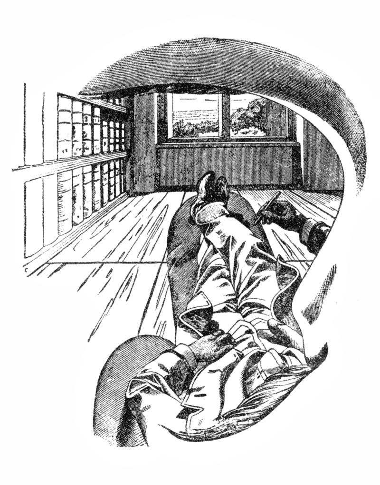
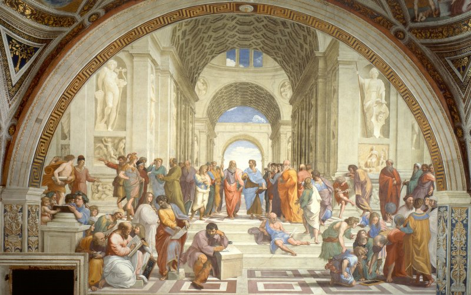
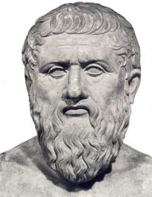
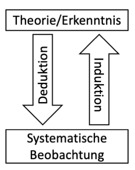
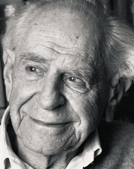

```{r setup, include=FALSE}
options(htmltools.dir.version = FALSE)

setwd("/Users/stephangoerigk/Desktop/Universität/CFH/Lehre/Bachelor/Einführung in die Forschungsmethoden der Psychologie und Psychotherapie/EFPP_Folien/")

library(tidyverse)
library(kableExtra)
library(ggplot2)
library(plotly)
library(htmlwidgets)
library(MASS)
library(ggpubr)
library(xaringanthemer)
library(xaringanExtra)

style_duo_accent(
  primary_color = "#621C37",
  secondary_color = "#EE0071",
  background_image = "blank.png"
)

xaringanExtra::use_xaringan_extra(c("tile_view"))

use_scribble(
  pen_color = "#EE0071",
  pen_size = 4
  )

knitr::opts_chunk$set(
  fig.retina = TRUE,
  warning = FALSE,
  message = FALSE
)

# library(RefManageR)
# BibOptions(
# check.entries = FALSE, 
# bib.style = "authoryear", 
# cite.style = "authoryear", 
# style = "markdown",
# hyperlink = FALSE, 
# dashed = FALSE)
# myBib = ReadBib("/Users/stephangoerigk/Desktop/Universität/CFH/Lehre/Bachelor/Einführung in die Forschungsmethoden der Psychologie und Psychotherapie/EFPP_Folien/myBib.bib")
```

name: Title slide
class: middle, left
<br><br><br><br><br><br><br>
# Einführung in die Forschungsmethoden der Psychologie und Psychotherapie

### Einheit 2: Wissenschafts- und Erkenntnistheorie
##### 19.10.2022 | Dr. phil. Stephan Goerigk

---
class: top, left
### Erkenntnisgewinn in der Psychologie

.pull-left[
.center[
```{r eval = TRUE, echo = F, out.width = "300px"}

```

*Die Analyse der Empfindungen*, Ernst Mach (1900)
]
]

.pull-right[
**Modell von der Welt:**

* Die Welt wie ich sie sehe

* Welche Teile gehören zu „mir“, welche zur „Außenwelt"?

* Mit welcher Interpretation der Wahrnehmungen leiste ich die Zuordnung?
]
---
class: top, left
### Erkenntnisgewinn in der Psychologie

#### Was ist der beste Weg zur Erkenntnis?

.center[
"A paradigm is what you think before you think."
]

*  Aktuell dominantes methodisches Vorgehen der Psychologie: **empirisch-wissenschaftliches Arbeiten**

  * Experiment als Königsweg zum Kausalschluss
  * Wissen ist "erfahrungsbasiert"
  * Objektivierung durch "Beobachtbares" Verhalten
  * Hypothesenprüfung als Erkenntnisgewinn

* **Paradigma** = Welt- und Wissenschaftssicht

* Studium: Sozialisation in die gängigen Paradigmen des Fachs

* **Erkenntnis- und Wissenschaftstheorie:** historische Entwicklung von Positionen zum Erkenntnisgewinns

**Frage:**

Wie können wir in der Psychologie zu validen, wissenschaftlichen Erkenntnissen kommen? 

---
class: top, left
### Erkenntnisgewinn in der Psychologie

#### Erkenntnistheoretische Grundpositionen der Psychologie (Stangl, 2022)

##### Realismus vs. Idealismus

.pull-left[
**Realismus** 

* Wirklichkeit existiert **unabhängig** von uns
  
* Wirklichkeit ist durch Wahrnehmung bzw. Denken erfahrbar.
  
* Psychologische Theorie als Versuch der Wirklichkeitsabbildung
]
.pull-right[
**Idealismus** 

* nur **geistige Wirklichkeit** ist gegeben
  
* Erkennbarkeit einer “äußeren” Wirklichkeit wird geleugnet 
  
* Psychologische Theorie beschreibt nichts tatsächlich Existierendes 
  
* Wert einer Theorie ergibt sich nur aus ihrem (instrumentellem) Nutzen.
]

---
class: top, left
### Erkenntnisgewinn in der Psychologie

#### Erkenntnistheoretische Grundpositionen der Psychologie (Stangl, 2022)

##### Empirismus vs. Rationalismus

.pull-left[

**Empirismus** 

* **Sinneserfahrung** ist die alleinige oder zumindest wichtigste Erkenntnisquelle. 
  
* Psychologische Theorie = Zusammenfassung der in psychologischen Beobachtungen und Experimenten gesammelten, möglichst **zuverlässigen Erfahrungen**
]
.pull-right[
**Rationalismus**

* Form und Inhalt allen Wissens liegt primär in **Verstand und Vernunft** begründet
  
* Psychologische Theorie ist keine Sammlung voraussetzungsfreier Erfahrungen
  
* Primat der **Theorie** über die Erfahrung
]  

---
class: top, left
### Erkenntnisgewinn in der Psychologie

#### Erkenntnistheoretische Grundpositionen der Psychologie (Stangl, 2022)

.pull-left[
##### Skeptizismus:

* generelle oder teilweise **Leugnung** von Erkenntnismöglichkeiten

* Wir können **nichts wissen**

* Beispiel: Skeptizismus Argument **Gehirn-im-Tank**

  1. Wenn ich weiß dass ich Eis esse, dann weiß ich auch, dass ich kein Gehirn im Tank bin.

 2.  Ich kann nicht wissen, ob ich ein Gehirn im Tank bin.

 3.  Daher weiß ich nicht, dass ich Eis esse.
]
.pull-right[
.center[
```{r eval = TRUE, echo = F, out.width = "300px"}
knitr::include_graphics("bilder/tank.png")
```
]
]

---
class: top, left
### Erkenntnisgewinn in der Psychologie

#### Erkenntnistheoretische Grundpositionen der Psychologie

##### Konstruktivismus (z.B. Jean Piaget und Paul Watzlawick):

* Gegenstand vom Betrachter selbst durch den Vorgang des Erkennens konstruiert 

* zentral nicht Wesen der Dinge, sondern der Prozess und die Entstehung ihrer Erkenntnis

* Orientierung am Beobachter (erkennende Instanz), nicht an der beobachterunabhängigen Realität

* Abschied von der Vorstellung einer absoluten Wahrheit bzw. einer empirischen Objektivität

* Interesse an der Pluralität von Auffassungspositionen

* Erschaffung eigener (verzerrter) Realitäten
---
class: top, left
### Erkenntnisgewinn in der Psychologie

.pull-left[
#### Wissenschafts- und erkenntnistheoretische Perioden

1. Vorgaben der Antike

2. Achsenzeit

3. Erstarken des Empirismus

4. Erneuerung des Rationalismus

5. Kritischer Rationalismus
]
.pull-right[
.center[
```{r eval = TRUE, echo = F, out.width = "450px"}
knitr::include_graphics("bilder/kopernikus.jpg")
```

L’Atmosphère: Météorologie Populaire 
(die kopernikanische Wende)
]
]

---
class: top, left
### Erkenntnisgewinn in der Psychologie

#### Vorgaben der Antike

##### Vorlogische Voraussetzungen europäischer Wissenschaft: 

.pull-left[
* Abstraktion statt Situation

* Distanz statt Einbettung 
]

.pull-right[
* Beobachten statt Teilhaben und Teilnehmen

* immer statt jetzt
]

.center[
```{r eval = TRUE, echo = F, out.width = "450px"}

```
]

---
class: top, left
### Erkenntnisgewinn in der Psychologie

.pull-left[

#### Vorgaben der Antike

##### Platon (Idealismus)

* Viertes Jahrhundert vor Christus

* Hinrichtung seines Lehrers Sokrates
]

.pull-right[
.center[
```{r eval = TRUE, echo = F, out.width = "150px"}

```
]
]

* Unzufriedenheit mit der kulturellen und politischen Situation seiner Heimatstadt Athen

* 387 v. Chr. Gründung einer Schule (Gott namens Akademos geweiht) $\rightarrow$ **Akademie**

* Gegenentwurf zu Wissen und Reden auf der Agora, den Markt- und Versammlungsplatzen der Stadt

* Polemik der Volksredner $\rightarrow$ Verführung, Verhetztung und Verblödung der Menschen vs. **Vernunft, das Schöne und Gute**

* **Ideal von Wissenschaft** $\rightarrow$ Vernunft über Verführung

---
class: top, left
### Erkenntnisgewinn in der Psychologie

#### Vorgaben der Antike

##### Platon - Vernunft vs. Verführung

* Menschen lassen sich von unmittelbaren Eindrücken und Situationen affizieren

* Abstand gewinnen vom **bloßen Meinen**

* Akademisches Wissen $\neq$ Alltagswissen

* Erstmalig in der Geistesgeschichte: **Entwertung des Situationswissens**

  * Individuelle Auslegung aktueller Situation ungenügend (*Hypnose durch Einzelerscheinungen*)
  
  * es braucht abstraktes Wissen, dekontextualisiertes Wissen, Theorie

**Ausdifferenzierung des Erkenntnisproblems: **

$\rightarrow$ Erkennen, das auch morgen noch wahr ist  
$\rightarrow$ Erkennen das für alle wahr ist, nicht nur für den Einzelnen

---
class: top, left
### Erkenntnisgewinn in der Psychologie

#### Vorgaben der Antike

##### Platon - Rolle der Geometrie

.center[
Ἀγεωμέτρητος μηδεὶς εἰσίτω.

*Hier trete nur ein, wer Geometer ist.*

Inschrift über dem Torbogen zur platonischen Akademie
]

.pull-left[
**Geometrie**

* exakte Wissenschaft, hohe Fähigkeit zur Abstraktion
* geometrisches Prinzip = **Verstehen**
* hilft nicht 100 Dreiecke zu beobachten
* Zugang zum **Reich der Ideen**
* Idealen Prinzipien $\rightarrow$ gelten **immer und überall**
]

.pull-left[
**Erkenntnis im Sinne idealer Prinzipien**
* Grundformen des Seienden = **Ideen**
* unwandelbar und unvergänglich
* **Wirklichkeit** hinter der Sinnenwelt
* Weg zur Erkenntnis: **innere Einsicht** = Anamnesis
* Zugang durch Weisheitsdialoge und Einsichtsübungen
]

---
class: top, left
### Erkenntnisgewinn in der Psychologie

#### Achsenzeit (Begriff nach Jaspers, 1949)

* Zeitspanne von 800 bis 200 v. Chr.

* Zeit technologischer und philophischer Entwicklung in vier voneinander unabhängigen Kulturräumen

  * Hinduismus und Buddhismus in Indien
  * Daoismus und dem Konfuzianismus in China
  * Judentum und Zoroastrismus im alten Orient
  * Philosophie im antiken Griechenland
  
* Abstraktionsschub durch neue Medien
  * Schrift
  * Geld

$\rightarrow$ Materielles wird abstrakt

$\rightarrow$ Gesprochenes wird dauerhaft

---
class: top, left
### Erkenntnisgewinn in der Psychologie

#### Achsenzeit (Begriff nach Jaspers, 1949)

Schrift und Abstraktion:

*  Inhaltliche Kontrolle von Argumenten im Detail

* Kommunikation in zeitlicher und räumlicher Ferne (Überzeitlichkeit und Übersituativität)

* Trennung des visuellen Sinnes vom Intellekt (Nah- vs. Fern-Sinn)

* Erkenntnis durch Abstandnahme

---
class: top, left
### Erkenntnisgewinn in der Psychologie

#### Vorgaben der Antike

##### Aristoteles (Realismus)

**Platon prägte wesentlich die heutige Ausrichtung der Wissenschaft:**

* Naturwissenschaft: Streben nach nomothetischen Wissen (nomos = Gesetz)

* Platonsches "Wissen hinter der Sinnenwelt" = **Theorie**

**Von Platon nicht übernommen:**

* **kontemplative**, d.h. nach innen gerichtete Erkenntnishaltung (armchair philosphy)

* Abkehr von der Kontemplation $\rightarrow$ Aristoteles Peripatetische Schule (peripatein = herumgehen) 

* wissenschaftlicher Habitus der Weltaneignung und -umgestaltung

* realistische, an der Erfahrung orientierte Grundposition

---
class: top, left
### Erkenntnisgewinn in der Psychologie

#### Vorgaben der Antike

.pull-left[

##### Aristoteles (Realismus)

* Idealismus vs. Realismus seit Antike lange von Idealisten dominiert (heute von Realisten)

* Aristoteles Hauptwerk **Organon**: Beobachtungen und Beschreibungen zur Natur, Biologie und Physiologie des Menschen

* Platon =  spontane Einsicht; Aristoteles = systematische Entwicklung des Denkens und Argumentierens

* **Syllogismen** (Schlussfolgerungen) = Ausbildung eines Systems der einer formalen Logik
]

.pull-right[
.center[
```{r eval = TRUE, echo = F, out.width = "250px"}
knitr::include_graphics("bilder/aristoteles.jpg")
```
]
]

---
class: top, left
### Erkenntnisgewinn in der Psychologie

#### Vorgaben der Antike

.pull-left[

##### Aristoteles (Realismus)

**Form der Syllogistik:**

Prinzip der **Deduktion**:

  * **Prämisse 1:** Alle Menschen sind sterblich.
  * **Prämisse 2:** Sokrates ist ein Mensch. 
  * **Schluss:** Sokrates ist sterblich.
  
Prinzip der **Induktion**:
  * **Beobachtung 1:** Sokrates ist sterblich.
  * **Beobachtung 2:** Sokrates ist ein Mensch.
  * **Schluss:** Alle Menschen sind sterblich.
]

.pull-right[
.center[
```{r eval = TRUE, echo = F, out.width = "250px"}

```
]
]

---
class: top, left
### Erkenntnisgewinn in der Psychologie

#### Erstarken des Empirismus: Beobachtung und Experiment (Francis Bacon)

* Im 15. Jhd. **Renaissance** und **beginnende Neuzeit** (Renaissance = Wiedererstarken von Idealen der Antike)

* Moderne Wissenschaft: Neubewertung der Wichtigkeit von **Beobachtung**

* Ziel: verlässlichen Kontakt der Wissenschaft mit der Wirklichkeit (Blüte 17. Jhd in England)

.pull-left[

* Francis Bacon (1561-1626): Wegbereiter des **Empirismus**

  * Hauptwerk *Novum Organum* (Referenz an Aristoteles)
  
  * Verstand ist täuschbar, **systematische Beobachtung** der Natur
  
  * **neue methodischen Überlegungen** zur Beobachtung
]

.pull-right[
.center[
```{r eval = TRUE, echo = F, out.width = "200px"}
knitr::include_graphics("bilder/bacon.jpg")
```
]
]
---
class: top, left
### Erkenntnisgewinn in der Psychologie

#### Erstarken des Empirismus: Beobachtung und Experiment (Francis Bacon)

**Bacons Idolenlehre** (4 Arten von menschlichen Erkenntnisirrtümern)

1. **Idole des Stammes (idola tribus)**

  * gattungsspezifische Mängel des menschlichen Erkenntnisapparates

2. **Idole der Höhle (idola specus)**

  * individuell erworbene, Verhaltens- und Erlebensweisen des jeweils einzelnen Menschen (z.B. Erziehung, Verdrängung, etc.)
  
3. **Idole des Marktes (idola fori)**

  * infolge des engen Beieinanderseins des menschlichen Geschlechtes (z.B. Irrtümer im Sprachgebrauch)

4. **Idole des Theaters (idola theatri)**

  * dogmatischen Behauptungen philosophischer Lehrmeinungen und verkehrte Gesetze der Beweisführung
  
---
class: top, left
### Erkenntnisgewinn in der Psychologie

#### Erstarken des Empirismus: Beobachtung und Experiment (Francis Bacon)

* Angesichts Fehlerquellen der Idolenlehre braucht irrtumsanfälliger Verstand *instrumenta und experimenta*

* absichtliche, **bewusst gesteuerte Beobachtung** (kontrolliert und geplant) vs. naive Kenntnisnahme

* **ABER:** Beobachten nicht ausreichend $\rightarrow$ handelnd-manipulativens Eingreifen (**Experiment**)

* zum Zweck absichtlicher und wiederholter Beobachtungen in die Abläufe der Natur eingreifen

* Determination der kontrollierten Bedingungen unter denen sich ein Verhalten zeigt

---
class: top, left
### Erkenntnisgewinn in der Psychologie

.pull-left[

#### Erneuerung des Rationalismus: Descartes und Kant

* Parallel zum Empirismus erstarkt mit Beginn der Neuzeit der Rationalismus
* Erkenntnis nicht aus Erfahrungen, sondern vom Verstand (lat. ratio)
* Rationalistische Abkehr vom religiösen Dogma des Mittelalters
]

.pull-right[
.pull-left[
```{r eval = TRUE, echo = F, out.width = "200px"}
knitr::include_graphics("bilder/descartes.jpg")
```
]
.pull-right[
```{r eval = TRUE, echo = F, out.width = "190px"}
knitr::include_graphics("bilder/kant.jpg")
```
]
]
.pull-left[
**Rene Descartes:**

* *Ich denke, also bin ich.*
* Tatsache, dass ich denke ist Gewissheit, dass ich existiere
* **Gewissheit** $\rightarrow$ Unterschied zur pragmatischeren wissenschaftlichen Haltung der Empiristen
]
.pull-right[
**Immanuel Kant:**
* psychologische Zustände lassen sich zwar zeitlich, aber nicht räumlich verorten
* Introspektion = Veränderung des Gegenstands
* rational ist was **mathematisch beweisbar** ist
]

---
class: top, left
### Erkenntnisgewinn in der Psychologie

#### Induktionsproblem – der erkenntnislogische Übergang zum Kritischen Rationalismus

* Empirismus: vom Verstand darf nicht ausgegangen werden (sondern nur von Erfahrungen)

* **Frage:** Wie kommt man von Einzelbeobachtungen zur wissenschaftlichen Erkenntnis (Theorie/ Naturgesetz)?

.pull-left[
**Induktion** (John Locke):

* bereits in der aristotelischen Logik vorhanden

* Komplementärverfahren zur Deduktion

* inducere = (hin)einführen

* abstrahierenden Schluss aus einzelnen Beobachtungen auf eine allgemeinere Erkenntnis
]

.pull-right[
**Induktionsproblem** (David Hume):

* aus beobachteten Einzelereignissen kann nicht mit Sicherheit auf allgemeines Prinzip geschlosse werden
* Beispiel Psychologie: 
  *  Depressiver 1 erfuhr Kindheitstrauma
  *  Depressiver 2 erfuhr Kindheitstrauma
  *  Depressiver 3 erfuhr Kindheitstrauma
  
 Induktionsschluss: $\rightarrow$ Alle Depressiven erfahren Kindheistraumata
]

---
class: top, left
### Erkenntnisgewinn in der Psychologie

.pull-left[

####  Kritischer Rationalismus (Sir Karl Popper)

* Erkenntnisposition moderner Psychologie

**Ansatz zur Lösung des Induktionsproblems:**

* Primat der **Erfahrung beibehalten**
]
.pull-right[
.center[
```{r eval = TRUE, echo = F, out.width = "150px"}

```
]
]

* Durch Induktion gewonnenen Aussagen haben **vorläufigen** Charakter

* Umkehrung der induktiven Vorgehensweise

  * nicht von den Erfahrungen auf wissenschaftlichen Theorien schließen
  
  * umgekehrt: Theorien **empirische Bewährungsproben** aussetzen
  
* Erfahrung nicht Baustein, sondern **Prüfstein** der Theorie

* Am Anfang soll Entwurf stehen (**Prognose**), den der Verstand (ratio) liefert 

* kreativer Einfall = Voraussetzung zur **Hypothesenbildung**

---
class: top, left
### Erkenntnisgewinn in der Psychologie

####  Kritischer Rationalismus (Sir Karl Popper)

**Erkenntnisfortschritt nach Popper:**

* Suche nach **Falsifikationen** einer Theorie

* Falsifikation = Verfahren zur Beurteilung bestehender Theorien (Entdeckungs- und Begründungszusammenhang getrennt)

* Methode von **Versuch und Irrtum**

* Wenn-Dann Prämisse (Deduktion) gepaart mit **modus tollens** (Verwerfen einer Hypothese)

* Wenn Hypothese eine empirische Prüfung überlebt, rückt sie ein Stück in Richtung Wahrheit (**Wahrheitsnähe**)

---
class: top, left
### Erkenntnisgewinn in der Psychologie

####  Kritischer Rationalismus (Sir Karl Popper)

**Erkenntnisfortschritt nach Popper:**

.center[*„Auch durch ihre verifizierten Folgerungen können Theorien niemals als "wahr" oder auch nur als "wahrscheinlich" betrachtet werden“*]

* selbst wenn die Erfahrungswelt die Prognose stützt Prognose gibt ist Theorie nicht zwischen wahr

* Beispiel des **schwarzen Schwans**:

  * selbst wenn meine Prognose 1000x eingetroffen ist, dass Schwäne weiß sind kann endlich doch ein schwarzer Schwan beobachtet werden (Entdeckung des "Trauerschwans" in Australien)

**Poppers Leitgedanken:**

1.  Alles Wissen ist Vermutungswissen (aber besser Mutmaßung als Anmaßung).
2.  Wir wissen nicht, wir raten.
3.  Kritik statt Dogma.
4.  Wir lernen nicht durch Beobachtung, sondern durch Versuch und Irrtum.

---
class: top, left
### Erkenntnisgewinn in der Psychologie

####  Kritik an Popper (innerhalb Empirismus)

##### Beobachtungen sind "theoriegeladen"

* Popper zu prüfende Theorie entspringt der Ratio (Daten und Theorie **getrennte Instanzen**)

* **ABER:** Theorie und Beobachtung nicht sauber voneinander zu trennen 

* „Data are theory-laden“ (Duhem & Quine)

* Theorie bestimmt mit, welche Phänomene sichtbar werden können

$\rightarrow$ Eigene Vorstellung/Überzeugung veranlasst uns erst zur Beobachtung

* Forscher, der alles  beobachtet $\rightarrow$ idealisierte Vorstellung (Forscher = **Ko-Konstrukteur**)

* **Folge:** Wesentlicher Einfluss der aktuell dominanten Forschungsmeinung

---
class: top, left
### Erkenntnisgewinn in der Psychologie

####  Kritik an Popper (innerhalb Empirismus)

##### Theorien sind gegenüber Falsifikation abgepuffert

* Prognose trifft nicht zu $\rightarrow$ Problem ist nicht zwangsläufig Theorie, sondern ggf. **fehlerhafte Ableitung** aus der Theorie (Operationalisierung/experimentelle Umsetzung)

* Verständnis aller Bedingungen, welche für Eintreten der Hypothese gegeben sein müssen (Problem: Psychologie = hochgradig mulifaktoriell)

* es bedarf genaue Formulierung/Ausdifferenzierung der Bestandteile einer Theorie (sehr komplexes "wenn" in "wenn ... dann")

* Popper wird für mangelnde Berücksichtigung von Operationalisierung kritisiert

---
class: top, left
### Erkenntnisgewinn in der Psychologie

####  Alternative Betrachtung - Wissenschaftsgeschichter Ansatz

##### Denkstile und Denkkollektive (Ludwig Fleck & Robert Merton)

* Popper: **wissenschaftsimmanenter Ansatz** (Vorgabe einer Forschungslogik für die Wissenschaft)

Alternative Betrachtung:

* Wandlung von Forschungsinteressen in Relation zu **gesamtgesellschaftlichen Entwicklungen**

* **Denkstil:** gemeinsame Fragestellungen, Urteile und Methoden

* **Denkkollektiv:** Menschen, die im Gedankenaustausch oder in gedanklicher Wechselwirkung stehen (Spekulationsgemeinschaft)

* **Folge:** es setzt sich für bestimmte Zeiträume eine dominierende Forschungshaltung durch

---
class: top, left
### Erkenntnisgewinn in der Psychologie

####  Alternative Betrachtung - Wissenschaftsgeschichter Ansatz

##### Der Begriff des Paradigmas - Struktur wissenschaftlicher Revolutionen (Thomas Kuhn)

* Kuhn: Forschungslogik für Entwicklung von Wissenschaften **nicht entscheidend**

* Schicksal wissenschaftlicher Theorien entscheidet sich **nicht** daran, ob sie falsifiziert werden oder nicht

* **Paradigma:** Überzeugungen, Wertvorstellungen und Techniken, die von Mehrheit der Wissenschaftler akzeptiert sind

* Theorie = Inhalt der Wissenschaft, Paradigma = Inhalt + Praktiken der Wissenschaft (Methoden, Institutionen, Wissensweitergabe)

* **Machtwirkung:** Weclhe Formate des Erkenntnisgewinns haben Gewicht (Spielregeln der Wissenschaft)

---
class: top, left
### Erkenntnisgewinn in der Psychologie

####  Alternative Betrachtung - Wissenschaftsgeschichter Ansatz

##### Der Begriff des Paradigmas - Struktur wissenschaftlicher Revolutionen (Thomas Kuhn)

**Phasen des Paradigmenwechsels:**

1. **Prä-paradigmatische Periode**
 * Theorienpluralismus, Wettkampf divergenter Ansichten (alle mit verfügbaren Beobachtungen vereinbar)
2. **Dominierendes Paradigma**
  * plausibler Rahmen für meiste verfügbaren Beobachtungen, bietet Leitfaden für weitere Forschung
3. **Periode der normalen Wissenschaft**
  * keine Grundsatzprobleme, Wissenschaft in theoretischen und methodologischen Grenzen des Paradigmas (theoretische Ausdehnung)
4. **Anomalie**
  * Stolperstein, Problem mit aktuellem Annahmen- und Methodenkomplex nicht lösbar
5. **Stadium der außerordentlichen Wissenschaft**
  * vermehrte Angriffe, Verunsicherung der Disziplin, Versagen alter Regeln, Suche nach neuen Lösungen
6. **Wissenschaftliche Revolution**
  * Kapitulation vor neuem Denkstil, standespolitische Übernahme
  
---
class: top, left
### Erkenntnisgewinn in der Psychologie

####  Kritik am kritischen Rationalismus - Zusammenfassung

* Paradigmatische Machtpolitik dominiert Wissensschaft (nicht nur Forschungslogik oder Argumente)

* Wissenschaftliche Theorien werden nicht widerlegt, sondern **verlassen** $\neq$ Falsifikationsprinzip

* **Praxeologische** Sicht auf Wissenschaft (entscheident ist nicht Wahrheitsgehalt von Sätzen, sondern wissenschaftliche/soziale Aktivität)

* Wissenschaftlicher Fortschritt $\neq$ **kontinuierlich bzw. kumulativ** (Entfaltungskonzept vs. Paradigmenwechsel)

* Forschungsparadigma (und seine Methoden) entsteht in Abhängigkeit vom Menschenbild (sh. nächste Einheit)

  * Behaviorismus
  * Humanistische Psychologie
  * Tiefenpsychologie
  * Kognitionspsychologie
  * Psychobiologie
  
---
class: top, left
### Take-Aways
.content-box-gray[
* Moderne Psychologie entwickelt sich im Kontext **erkenntnistheoretischer** Überlegungen

* **Erkenntnistheoretische Grundpositionen:** Idealismus, Realismus, Empirismus, Rationalismus, Skeptizismus

* Platon (**Idealismus**) $\rightarrow$ Identifikation idealer (unwandelbarer und unvergänglicher) Grundprinzipien

* Aristoteles (**Realismus**) $\rightarrow$ Beobachtung der Natur und syllogistische Logik (Induktion + Deduktion)

* Bacon (**Empirismus**) $\rightarrow$ Verstand  täuschbar; Systematische Beobachtung und Eingreifen in Natur

* Descartes und Kant (**Rationalismus**) $\rightarrow$ Logische Gewissheit und mathematische Beweisführung

* Popper (**kritischer Rationalismus**) $\rightarrow$ Wissen = Vermutungswissen, Erkenntnisgewinn durch Versuch + Irrtum

* Kuhn: **Paradigmenwechsel** $\rightarrow$ wissenschaftshistorischer Ablauf wissenschaftlicher Revolutionen
]

[**Link zur Wissensüberprüfung**](https://docs.google.com/forms/d/e/1FAIpQLSfYowpbKPtvJ8w_c03ZjYdpoaV5jFXAA2zivqCi34bH_VXxuw/viewform?usp=sf_link)

