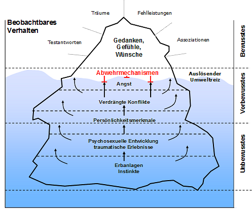
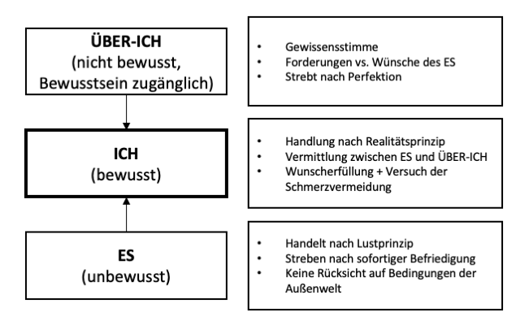
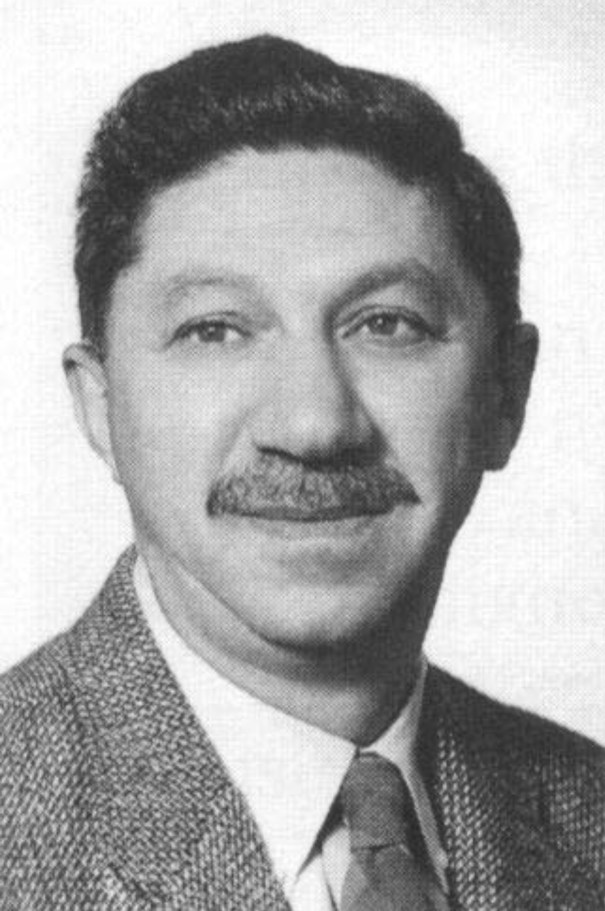
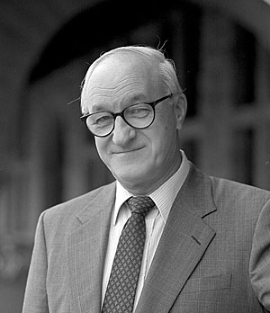
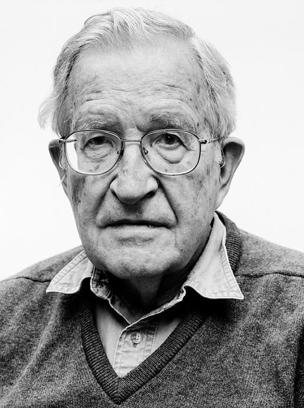
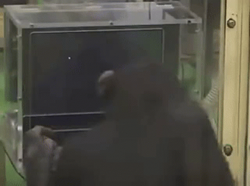
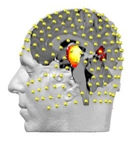

```{r setup, include=FALSE}
options(htmltools.dir.version = FALSE)

setwd("/Users/stephangoerigk/Desktop/Universität/CFH/Lehre/Bachelor/Einführung in die Forschungsmethoden der Psychologie und Psychotherapie/EFPP_Folien/")

library(tidyverse)
library(kableExtra)
library(ggplot2)
library(plotly)
library(htmlwidgets)
library(MASS)
library(ggpubr)
library(xaringanthemer)
library(xaringanExtra)

style_duo_accent(
  primary_color = "#621C37",
  secondary_color = "#EE0071",
  background_image = "blank.png"
)

xaringanExtra::use_xaringan_extra(c("tile_view"))

use_scribble(
  pen_color = "#EE0071",
  pen_size = 4
  )

knitr::opts_chunk$set(
  fig.retina = TRUE,
  warning = FALSE,
  message = FALSE
)

# library(RefManageR)
# BibOptions(
# check.entries = FALSE, 
# bib.style = "authoryear", 
# cite.style = "authoryear", 
# style = "markdown",
# hyperlink = FALSE, 
# dashed = FALSE)
# myBib = ReadBib("/Users/stephangoerigk/Desktop/Universität/CFH/Lehre/Bachelor/Einführung in die Forschungsmethoden der Psychologie und Psychotherapie/EFPP_Folien/myBib.bib")
```

name: Title slide
class: middle, left
<br><br><br><br><br><br><br>
# Einführung in die Forschungsmethoden der Psychologie und Psychotherapie

### Einheit 3: Paradigmengeschichte - Menschenbild bestimmt Methode
##### 26.11.2022 | Dr. phil. Stephan Goerigk

---
class: top, left
### Erkenntnisgewinn in der Psychologie

####  Alternative Betrachtung - Wissenschaftsgeschichter Ansatz

##### Der Begriff des Paradigmas - Struktur wissenschaftlicher Revolutionen (Thomas Kuhn)

* Kuhn: Forschungslogik für Entwicklung von Wissenschaften **nicht entscheidend**

* Schicksal wissenschaftlicher Theorien entscheidet sich **nicht** daran, ob sie falsifiziert werden oder nicht

* **Paradigma:** Überzeugungen, Wertvorstellungen und Techniken, die von Mehrheit der Wissenschaftler akzeptiert sind

* Theorie = Inhalt der Wissenschaft, Paradigma = Inhalt + Praktiken der Wissenschaft (Methoden, Institutionen, Wissensweitergabe)

* **Machtwirkung:** Welche Formate des Erkenntnisgewinns haben Gewicht (Spielregeln der Wissenschaft)

---
class: top, left
### Paradigmen und Perspektiven in der Psychologie

.center[
*Wer als Werkzeug nur einen Hammer hat, sieht in jedem Problem einen Nagel.*

Mark Twain (Law of the instrument)
]

* Perspektive bestimmt über Sichtweise auf ein Problem

* Paradigma bestimmt Auswahl der Forschungsmethoden und Forschungsgegenstände

* Beispiel Fußballspiel: Fans 2er unterschiedlicher Teams verfolgen das selbe Spiel

**VORSICHT:**

* Klar abgegrenzte Ansätze: Gefahr eines "Tunnelblicks"

* Jede Perspektive erweitert holistisches Verständnis menschlicher Erfahrung 

* die meisten Psychologen entlehnen heutzutage Konzepte verschiedener Perspektiven und verschmelzen diese (**integrativer Ansatz**)

---
class: top, left
### Paradigmen und Perspektiven in der Psychologie

#### Aktuelle Perspektiven psychologischer Forschung

1. Psychodynamische Perspektive

2. Behavioristische Perspektive 

3. Humanistische Perspektive

4. Kognitive Perspektive

5. Biologische Perspektive

6. Evolutionäre Perspektive

7. Kulturvergleichende Perspektive

---
class: top, left
### Paradigmen und Perspektiven in der Psychologie

#### Aktuelle Perspektiven psychologischer Forschung

.pull-left[
**Psychodynamische Perspektive**

Annahmen:

* Verhalten durch starke innere Kräfte motiviert

* ererbte Instinkte + biologische **Triebe** $\rightarrow$ psychische Deprivation (Lustprinzip)

* Innere **Konflikte** zwischen gegenläufigen Bedürfnissen

* Deprivation + psych. Erregung + Konflikte $\rightarrow$ **Energie für Verhalten** (Dampfkesselmodell)

* Trieb/Bedürfnis befriedigt $\rightarrow$ Ende des Verhaltens
]
.pull-right[
.center[
```{r eval = TRUE, echo = F, out.width = "250px"}
knitr::include_graphics("bilder/freud.jpg")
```

Siegmund Freud (1856-1939)
]
]

---
class: top, left
### Paradigmen und Perspektiven in der Psychologie

#### Aktuelle Perspektiven psychologischer Forschung

.pull-left[
**Psychodynamische Perspektive**

Eisbergmodell des Bewusstseins (Freud):

* Ableitung aus Strukturmodell der Psyche (Ich, Es, Über-Ich)

* Laut Freud 80–90% psychischer Prozesse unbewusst

* Im Unterbewusstsein liegen Ängste, verdrängten Konflikte, traumatischen Erlebnisse, Triebe und Instinkte

* Nur Bewusstes (über der Wasseroberfläche beobachtbar)
]
.pull-right[
.center[
```{r eval = TRUE, echo = F, out.width = "550px"}

```
]
]

---
class: top, left
### Paradigmen und Perspektiven in der Psychologie

#### Aktuelle Perspektiven psychologischer Forschung

.pull-left[
**Psychodynamische Perspektive**

Beispiel **Drei-Instanzen-Modell** (aka topisches Modell):

* Modell der Psyche des Menschen

* Besteht aus 3 Instanzen unterschiedlicher Funktionen: 
  * Es
  * Ich 
  * Über-Ich

* ES und wesentliche Teile des ÜBER-ICH sind **unbewusst**
]
.pull-right[
.center[
```{r eval = TRUE, echo = F, out.width = "500px"}

```
]
]

---
class: top, left
### Paradigmen und Perspektiven in der Psychologie

#### Aktuelle Perspektiven psychologischer Forschung

**Psychodynamische Perspektive**

Beispiel Konfliktmodell:

* Immer wieder gibt es **Konfliktsituationen** im Leben

* in der Regel aus finden wir aber Konfliktsituationen heraus

* in manchen Konflikten lassen wir jedoch kein „Sowohl-als-auch“ zu (Freud: **Grundkonflikt**)

* Operationalisierten Psychodynamischen Diagnostik (OPD) unterscheidet 8 **Konflikttypen** (in abgeschwächter Form bei fast jedem vorhanden)

* Diese Konflikte laufen i.d.R. **unbewusst** ab

* Konfliktverhalten: passiv-selbstbezogener vs. aktiv-objektbezogener Modus

* **Annahme der psychodynamischen Therapie:** Konfliktlösung führt zu Symptombewältigung

---
class: top, left
### Paradigmen und Perspektiven in der Psychologie

#### Aktuelle Perspektiven psychologischer Forschung

**Psychodynamische Perspektive**

Beispiel: 8 Konflikttypen nach OPD:

1. Abhängigkeit versus Autonomie 

2. Unterwerfung versus Kontrolle

3. Versorgung versus Autarkie

4. Selbstwert versus Objektwert

5. Egoistische versus prosoziale Tendenzen

6. Ödipal-sexueller Konflikt

7. Identität versus Dissonanz

8. eingeschränkte Konflikt- und Gefühlswahrnehmung

---
class: top, left
### Paradigmen und Perspektiven in der Psychologie

#### Aktuelle Perspektiven psychologischer Forschung

**Psychodynamische Perspektive**

Beispiel Abwehrmechanismen (Anna Freud, Auswahl):

.pull-left[
* Verdrängung
  * Triebregungen ins Unbewusste verdrängen
* Reaktionsbildung
  * auf Trieb durch das Gegenteil reagieren
* Regression
  * Rückzug auf eine frühere Entwicklungsstufe
* Verleugnung
  * Realität in Bedeutung nicht anerkennen
* Vermeidung
  * Triebregungen werden umgangen
* Verschiebung
  * Triebregungen auf andere Objekte übertragen
]
.pull-right[
* Spaltung
  * Inkompatibles auf mehrere Objekte verteilen
* Verneinung
  * Negierung eines Sachverhalts
* Projektion
  * Selbstanteile anderen Personen zuschreiben
* Intellektualisierung
  * Entfernung durch Abstraktionsbildung und theoretisches Analysieren
* Sublimierung
  * Triebwünsche durch gesellschaftlich höher bewertete Ersatzhandlungen ersetzen
]


---
class: top, left
### Paradigmen und Perspektiven in der Psychologie

#### Aktuelle Perspektiven psychologischer Forschung

**Psychodynamische Perspektive**

* Beobachtungsgegenstand ist **unbewusst** $\rightarrow$ Zugang zum Unbewussten herstellen

* **Herausforderung:** Umgehung der **Zensur** des psychischen Apperats

* **Ziel:** Aufdeckung unbewußt gebliebener / gewordener Prozesse

Methoden der psychodynamischen Perspektive:

* Freie Assoziation
* Hypnose
* Traumanalyse
* Widerstandsanalyse
* Theorieorientierte Deutung

---
class: top, left
### Paradigmen und Perspektiven in der Psychologie

#### Aktuelle Perspektiven psychologischer Forschung

**Psychodynamische Perspektive**

**Freie Assoziation** (Methode der freien Einfälle):

* Methode der psychoanalytischen Selbsterfahrung

* Analysand soll Einfällen zu Personen, Ereignissen, Träumen oder Symbolen völlig freien Lauf lassen

* Äußerungen **nicht zensieren**, auch wenn sie unpassend, unangenehm, sittenwidrig, unsinnig oder unwichtig erscheinen

* **Grundregel** der Freud'schen Behandlungstechnik

* Psychoanalytiker begegnet Assoziationen mit **frei schwebender Aufmerksamkeit**

[**Beispiel-Video**](https://www.youtube.com/watch?v=uTYHuXzkUCE)

---
class: top, left
### Paradigmen und Perspektiven in der Psychologie

#### Aktuelle Perspektiven psychologischer Forschung

**Psychodynamische Perspektive**

**Freie Assoziation** (Methode der freien Einfälle):

Setting: 

* Assoziation im Liegen (Förderung der Regression, Verringerung der Zensur)

* ohne Blickkontakt

* Schlafen nachempfundene Position zur Reduktion der Spannung im Körper

* Analytiker:in sitzt hinter Patient:in (Gefühl unbeobachtet zu sein)

* Zu Beginn: „Arbeitsvertrag“ in Form der Grundregel $\rightarrow$ Assoziationen vorbehaltlos und ohne bewusste Zensur zur Sprache bringen

---
class: top, left
### Paradigmen und Perspektiven in der Psychologie

#### Aktuelle Perspektiven psychologischer Forschung

**Psychodynamische Perspektive**

**Hypnose:**

* **Ziel:** Erreichen einer hypnotischen **Trance**

* vorübergehend geänderte Aufmerksamkeit und tiefe Entspannung $\rightarrow$ **Reduktion der Zensur**

* Auto- oder Selbsthypnose vs. Fremd- oder Heterohypnose

* während Hypnose erhält Proband:in ggf. verbale Anweisungen (**Suggestionen**), die direkt auf das Unbewusste wirken sollen

* **Posthypnotische Suggestionen**: Suggestionen, die nach Auflösung der Hypnose (Exduktion) noch wirksam 

* Vermeintlicher neurowiss. Beleg für reduzierte Zensur: bildgebenden Verfahren $\rightarrow$ Aktivität bestimmter Gehirnareale selektiv reduziert

---
class: top, left
### Paradigmen und Perspektiven in der Psychologie

#### Aktuelle Perspektiven psychologischer Forschung

**Psychodynamische Perspektive**

**Traumanalyse:**

* Traumgeschehen als wichtige Informationsquelle über unbewusste Erlebensweisen

* Freud: "Die Traumdeutung" - (Via regia lat.: der Königsweg) zur Kenntnis des Unbewussten

* Im Traum: Manifestation verdrängter **aktueller/infantiler Wünsche**

* Wünsche werden durch Trauminhalte in **entstellter Form** als erfüllt dargestellt

* **Entstellung:** direkte Erfüllung wäre für Träumer unangenehm und würde Schlaf stören

* Trauminhalt: **Kompromiss** zwischen den zu erfüllenden Wünschen und der Zensur

---
class: top, left
### Paradigmen und Perspektiven in der Psychologie

#### Aktuelle Perspektiven psychologischer Forschung

**Psychodynamische Perspektive**

Wissenschaftliche Methode:

* Theoriebildung durch Vergleich von Einzelfallstudien (Kasuistiken)

[**Freud Beispiel-Text: Der kleine Hans**](https://www.projekt-gutenberg.org/freud/5jaehrig/5jaehrig.html)

* Sprachliche Metaphorik für unbewusste Phänomene (Freud Literaturnobelpreis)

* Hermeneutik: Verstehender Ansatz

* Experimenteller Ansatz: z.B. Assoziationsstudien von C. G. Jung

* Forschung im Sinne qualitativer Interviewmethoden (z.B. qualitative Inhaltsanalyse nach Mayring)

* Übertragung psychodynamischer Konzepte auf empirische Wissenschaft (z.B. experimenteller Vergleich von psychoanalytischen Therapievarianten)

---
class: top, left
### Paradigmen und Perspektiven in der Psychologie

#### Aktuelle Perspektiven psychologischer Forschung

.pull-left[
**Behavioristische Perspektive**

* Verhalten ohne Introspektion oder Einfühlung untersuchen

* Entschiedene Gegner der gleichzeitig aufkommenden psychoanalytischen Richtungen (v.a. USA)

Annahmen:

* „objektive Methode“: alles Verhalten in **Reiz $\rightarrow$ Reaktion** zerlegen

* **Gehirn = Black Box** (antwortet auf Reiz automatisch mit Reaktion)

* Verhalten entsteht durch Erlernen von Reiz-Reaktions-Mustern
]
.pull-right[
.pull-left[
```{r eval = TRUE, echo = F, out.width = "160px"}
knitr::include_graphics("bilder/watson.jpg")
```
]
.pull-right[
```{r eval = TRUE, echo = F, out.width = "200px"}
knitr::include_graphics("bilder/skinner.jpg")
```

]
John Watson (1878-1958) und B. F. Skinner (1904-1990)
]

---
class: top, left
### Paradigmen und Perspektiven in der Psychologie

#### Aktuelle Perspektiven psychologischer Forschung

**Behavioristische Perspektive**

Paradigmen der behavioristischen Lernpsychologie:

.pull-left[
**klassische Konditionierung**

```{r echo = F}
df = data.frame(Phase = c("Kontrollphase", "Kontrollphase", "Lernphase", "Lernergebnis"),
                Reiz = c("Neutraler Reiz (NS)", "Unbedingter Reiz (UCS)", "Neutraler Reiz (NS) + Unbedingter Reiz (UCS)", "Bedingter Reiz (CS)"),
                Reaktion = c("Keine spezifische Reaktion", "Unbedingte Reaktion", "Unbedingte Reaktion", "Bedingte Reaktion"))
df %>%
  kbl() %>%
  kable_styling(font_size = 18) %>%
  kable_classic(full_width = T)
```

* Der lernende Organismus hat keine Kontrolle über den Reiz oder seine Reaktion
]
.pull-right[
**operante Konditionierung**
```{r echo = F}
df = data.frame(v1 = c("", "Angenehme Konsequenz", "Unangenehme Konsequenz"),
                v2 = c("Konsequenz dargeboten", "positive Verstärkung", "positive Bestrafung"),
                v3 = c("Konsequenz fällt weg", "negative Bestrafung", "negative Verstärkung"))
names(df) = c("Valenz", "Darbietung", "Keine Darbietung")
df %>%
  kbl() %>%
  kable_styling(font_size = 18) %>%
  kable_classic(full_width = T)
```

* Häufigkeit eines Verhaltens wird durch seine Konsequenzen nachhaltig verändert
]

---
class: top, left
### Paradigmen und Perspektiven in der Psychologie

#### Aktuelle Perspektiven psychologischer Forschung

**Behavioristische Perspektive**

Methoden des Behaviorismus: Experimentelle Verhaltensanalyse

* Streng wissenschaftliche **Laborexperimente**

* Selbstbeobachtung wird **abgelehnt**

* untersucht funktionalen Zusammenhänge zwischen dem Verhalten und der Umwelt (**Reiz-Reaktions-Muster**)

* **Ziel:** Verhalten zu beschreiben, zu erklären, vorherzusagen und zu kontrollieren

* datenbasierter **induktiver Ansatz**

* **Topografie** des Verhaltens = von außen beobachtbares Verhalten

* **Funktion** des Verhaltens = Zusammenhang zwischen Verhalten und Umweltereignis

---
class: top, left
### Paradigmen und Perspektiven in der Psychologie

#### Aktuelle Perspektiven psychologischer Forschung

**Behavioristische Perspektive**

Methoden des Behaviorismus: Experimentelle Verhaltensanalyse

* Funktionsanalyse (**ABC-Modell**): Modell zur Beschreibung von operanten Abläufen

**A (antecedent): **
* vorausgehenden (antezedenten) Funktionen des Verhaltens

 **B (behavior):  **
* das Verhalten (behavior) und damit alles was ein Organismus tut (latent und manifest)

 **C (consequence):  **
* alle (verstärkenden oder bestrafenden) Konsequenzen des Verhaltens

**WICHTIG:**
Kontrolle äußerer Störeinflüsse auf den ABC-Mechanismus

---
class: top, left
### Überblick: Paradigmen und Perspektiven in der Psychologie

#### Aktuelle Perspektiven psychologischer Forschung

.pull-left[
**Behavioristische Perspektive**

Methoden des Behaviorismus: Beispiel **Skinner-Box**

* reizarmer Käfig für ein Testtier zum Erlernen neuartigen Verhaltens

* standardisiert und weitgehend automatisiert

* keine unnatürliche Einschränkung, keine Versuchsleitereffekte
]

.pull-right[
.center[
```{r eval = TRUE, echo = F, out.width = "400px"}
knitr::include_graphics("bilder/skinnerbox.png")
```
]
]

---
class: top, left
### Paradigmen und Perspektiven in der Psychologie

#### Aktuelle Perspektiven psychologischer Forschung

.pull-left[
**Humanistische Perspektive**

* Menschen sind
  * aktive Geschöpfe
  * von Grund auf gut
  * verfügen über Freiheit der Wahl
  
* **Self-actualization** (Selbstverwirklichung - Drang das eigene Potential umfassend zu verwiklichen)

* Relevanz eigener **Wertevorstellungen**

* Ansatz: tiefes **Verstehenwollen** des Individuums

* Mensch als empfindendes soziales Wesen (Wilhelm Dilthey)
]
.pull-right[
.pull-left[
```{r eval = TRUE, echo = F, out.width = "200px"}
knitr::include_graphics("bilder/rogers.jpg")
```
]
.pull-right[
```{r eval = TRUE, echo = F, out.width = "160px"}

```
]
Carl Rogers (1902-1987) und Abraham Maslow (1908-1970)
]

---
class: top, left
### Paradigmen und Perspektiven in der Psychologie

#### Aktuelle Perspektiven psychologischer Forschung

**Humanistische Perspektive**

Methoden:

* **Holistische** Herangehensweise und Betonung **qualitativer Forschungsmethoden** (siehe Folgevorlesung)

* Wissen über Geist, Körper und Verhalten vor dem Hintergrund sozialer und kultureller Faktoren (Literatur, Geschichte, Künste)

* **Hermeneutischer Zirkel** (Auslegekunst, Interpretationskunst)
  * beginnend mit Grundverständnis (häufig Texte, Bilder etc.) als Hintergrund für Feinanalysen
  * an Teilen erzieltes Verständnis wird auf Grundverständnis rückbezogen
  * schrittweise Wiederholung des Verfahrens für ein verbessertes Gesamtverständnis

**Ziel hermeneutischen Schließens:**
* Verringerung hermeneutischer Differenz
* "Horizontverschmelzung"

---
class: top, left
### Paradigmen und Perspektiven in der Psychologie

#### Aktuelle Perspektiven psychologischer Forschung

.pull-left[
**Kognitive Perspektive**

* Entstand aus Limitationen des Behaviorismus (Kognitive Wende)

* Fokus: menschliches Denken und wissensbasierte Prozess
  * Aufmerksamkeit
  * Erinnern
  * Verstehen...

* Personen reagieren nicht auf objektive Realität sondern wegen **subjektiver Realität**

* Verhalten nur zum Teil durch Reize bestimmt, sondern auch durch deren **Verarbeitung** und **Bewertung**
]
.pull-right[
.pull-left[
```{r eval = TRUE, echo = F, out.width = "230px"}

```
]
.pull-right[
```{r eval = TRUE, echo = F, out.width = "200px"}

```
]
Albert Bandura (1925-2021) und Noam Chomsky (geb.1928)
]

---
class: top, left
### Paradigmen und Perspektiven in der Psychologie

#### Aktuelle Perspektiven psychologischer Forschung

**Kognitive Perspektive**

Zentrale Annahmen:

* Gedanken sind **Ergebnis und Ursache** offen gezeigten Verhaltens

* Alles Erleben und Verhalten des Menschen basiert auf **Informationsverarbeitung**

* Prozess zwischen Wahrnehmen, Denken und Handeln steht im Mittelpunkt

* Jedes Verhalten ist **aktiv, zielgerichtet und plangesteuert** (kybernetisch regulierter Prozess)

* Verhalten entsteht aus der Wahrnehmung von Diskrepanzen und zielt auf Reduktion dieser Diskrepanzen (wie bewertet der Mensch eine wahrgenommene Situation?)

---
class: top, left
### Paradigmen und Perspektiven in der Psychologie


.pull-left[
#### Aktuelle Perspektiven psychologischer Forschung

**Kognitive Perspektive**

Methoden:

* Versuch der Anwendung möglichst objektiver, quantitativer empirischer Modelle (Experimente)

* Objektive Tests zur Erforschung kognitiver Fähigkeiten

* Labor- und Feldexperimente
]
.pull-right[
.center[
```{r eval = TRUE, echo = F, out.width = "370px"}
knitr::include_graphics("bilder/moca.jpg")
```
]
]

---
class: top, left
### Paradigmen und Perspektiven in der Psychologie

#### Aktuelle Perspektiven psychologischer Forschung

**Kognitive Perspektive**

Methoden:

* Versuch der Anwendung möglichst objektiver, quantitativer empirischer Modelle (Experimente)

* Objektive Tests zur Erforschung kognitiver Fähigkeiten

z.B. **Problemlösen (Türme-von-Hanoi):**

.center[
```{r eval = TRUE, echo = F, out.width = "350px"}
knitr::include_graphics("bilder/hanoi.gif")
```
]

---
class: top, left
### Paradigmen und Perspektiven in der Psychologie

#### Aktuelle Perspektiven psychologischer Forschung

**Kognitive Perspektive**

Methoden:

* Versuch der Anwendung möglichst objektiver, quantitativer empirischer Modelle (Experimente)

* Objektive Tests zur Erforschung kognitiver Fähigkeiten

z.B. **Gedächtnis**:

.center[
```{r eval = TRUE, echo = F, out.width = "300px"}

```
]

---
class: top, left
### Paradigmen und Perspektiven in der Psychologie

#### Aktuelle Perspektiven psychologischer Forschung

**Kognitive Perspektive**

Methoden:

* Versuch der Anwendung möglichst objektiver, quantitativer empirischer Modelle (Experimente)

* Objektive Tests zur Erforschung kognitiver Fähigkeiten

z.B. **Aufmerksamkeit**:

.center[
```{r eval = TRUE, echo = F, out.width = "300px"}
knitr::include_graphics("bilder/monkey.gif")
```
]

---
class: top, left
### Überblick: Paradigmen und Perspektiven in der Psychologie

#### Aktuelle Perspektiven psychologischer Forschung

.pull-left[
**Biologische Perspektive**

* Menschliches Verhalten resultiert aus **biologischen Prozessen** (Gene, Hormone, Nervensystem, Gehirn)

* Psyche und Körper stehen in **Wechselwirkung**

* Erfahrungen und Verhalten sind Ergebnisse chemischer/elektrischer synaptischer Übertragungen

* **Zergliederung** komplexer Prozesse in kleinere, spezifische Einheiten

* Zentrale Rolle **genetischer** und **epigenetischer** Grundlagen
]
.pull-right[
.center[
```{r eval = TRUE, echo = F, out.width = "150px"}
knitr::include_graphics("bilder/damasio.jpg")
```

António R. Damásio (geb. 1944)
]
]

---
class: top, left
### Überblick: Paradigmen und Perspektiven in der Psychologie

#### Aktuelle Perspektiven psychologischer Forschung

**Biologische Perspektive**

Methoden:

* Messung biologischer Marker von Verhalten
* zentral und periphere Messungen (siehe Folgevorlesung)

Einteilung von Messmethoden in:

.pull-left[
**Messungen von Indikatoren außerhalb des ZNS**
  * Elektrodermale Aktivität
  * Elektromyogramm
  * Elektrookulogramm und Eyetracker
  * Elektrokardiogramm (EKG)
  * Hormonspiegel im Blut
  * ...
]
.pull-right[
**Messungen von Indikatoren der Aktivität des ZNS**
  * Elektroenzephalogramm
  * Magnetenzephalogramm
  * Computertomografie (CT)
  * Positronenemissionstomografie (PET)
  * funktionelle Magnetresonanztomografie (fMRT)
  * ...
]

---
class: top, left
### Überblick: Paradigmen und Perspektiven in der Psychologie

#### Aktuelle Perspektiven psychologischer Forschung

**Biologische Perspektive**

Methoden: Beispiel EEG

* fängt die elektrischen Potenziale von Neuronen auf
* Messung per Elektroden auf der Schädeloberfläche
* Aktivität von Neuronenverbänden kann zeitlich simultan gemessen werden

.pull-left[
.center[
```{r eval = TRUE, echo = F, out.width = "230px"}

```
]
]
.pull-right[
.center[
```{r eval = TRUE, echo = F, out.width = "350px"}
knitr::include_graphics("bilder/eeg.gif")
```
]
]

---
class: top, left
### Überblick: Paradigmen und Perspektiven in der Psychologie

#### Aktuelle Perspektiven psychologischer Forschung

```{r echo = F}
df = data.frame(Perspektive = rep(NA,5),
                Untersuchungsschwerpunkt = rep(NA,5),
                Forschungsthemen = rep(NA,5))
df$Perspektive = c("Psychodynamisch",
                   "Behavioristisch",
                   "Humanistisch",
                   "Kognitiv",
                   "Biologisch")
df$Untersuchungsschwerpunkt = c("Unbewusste Triebe, Konflikte",
                                "Spezifische Verhaltensreaktionen",
                                "Menschliche Potentiale und Erleben",
                                "Mentale Prozesse",
                                "Prozesse im Nervensystem, Gehirn")
df$Forschungsthemen = c("Sichtbarer Ausdruck unbewusster Prozesse",
                                "Verhalten und seine Abhängigkeit von Reizen und Konsequenzen",
                                "Werte, Ziele",
                                "Geistige Prozesse durch Verhalten messbar machen",
                                "Biochemische Grundlagen von mentalen Prozessen und Verhalten")
df %>%
  kbl() %>%
  kable_styling(font_size = 18) %>%
  kable_classic(full_width = T)
```

---
class: top, left
### Take-Aways
.content-box-gray[
* **Paradigma** und dahinterstehendes **Menschenbild** bestimmen Auswahl der Forschungsmethoden

* **Psychodynamische Perspektive** muss Zugang zu unbewussten Inhalten und Prozessen herstellen

* **Behaviorismus** untersucht Reinz-Reaktionsketten in streng kontrollierten Verhaltensbeobachtungen

* **Humanistische Psychologie** versucht mittels qualitativen Methoden und hermeneutischem Schließen den Mensch als "Ganzes" zu verstehen

* **Kognitionspsychologie** untersucht kognitive Prozesse in objektiven Tests im Labor oder Feld

* **Biologische Psychologie** nutzt Messverfahren zum Verständnis biochemischer Prozesse im Organismus, die mit Verhalten einhergehen 

* Psychologen **integrieren** heutzutage Konzepte (und Methoden) verschiedener Perspektiven in ihrer Forschung
]

[**Link zur Wissensüberprüfung**](https://docs.google.com/forms/d/e/1FAIpQLSfLqVNr1XUNk-b-cNoFcBMoy6iLSrOfkEMDdh2LUw4mAW9BdA/viewform?usp=sf_link)

