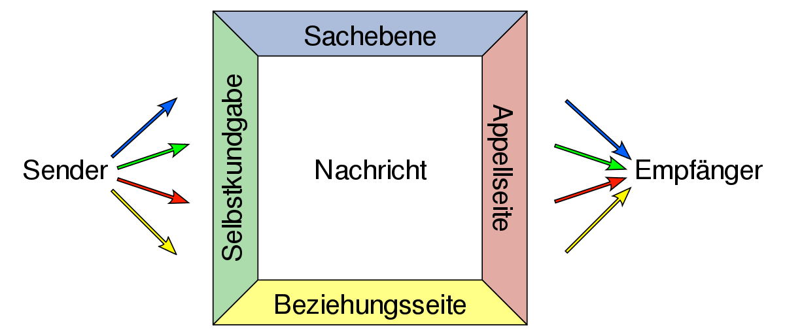
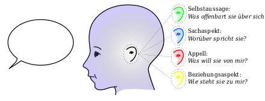

```{r setup, include=FALSE}
options(htmltools.dir.version = FALSE)

setwd("/Users/stephangoerigk/Desktop/Universität/CFH/Lehre/Bachelor/Einführung in die Forschungsmethoden der Psychologie und Psychotherapie/EFPP_Folien/")

library(tidyverse)
library(kableExtra)
library(ggplot2)
library(plotly)
library(htmlwidgets)
library(MASS)
library(ggpubr)
library(xaringanthemer)
library(xaringanExtra)

style_duo_accent(
  primary_color = "#621C37",
  secondary_color = "#EE0071",
  background_image = "blank.png"
)

xaringanExtra::use_xaringan_extra(c("tile_view"))

use_scribble(
  pen_color = "#EE0071",
  pen_size = 4
  )

knitr::opts_chunk$set(
  fig.retina = TRUE,
  warning = FALSE,
  message = FALSE
)

# library(RefManageR)
# BibOptions(
# check.entries = FALSE, 
# bib.style = "authoryear", 
# cite.style = "authoryear", 
# style = "markdown",
# hyperlink = FALSE, 
# dashed = FALSE)
# myBib = ReadBib("/Users/stephangoerigk/Desktop/Universität/CFH/Lehre/Bachelor/Einführung in die Forschungsmethoden der Psychologie und Psychotherapie/EFPP_Folien/myBib.bib")
```

name: Title slide
class: middle, left
<br><br><br><br><br><br><br>
# Einführung in die Forschungsmethoden der Psychologie und Psychotherapie

### Einheit 5: Messen in der Psychologie - latent
##### 09.11.2022 | Dr. phil. Stephan Goerigk

---
class: top, left
### Erhebungsmethoden der psychologischen Forschung

#### Selbstberichtsverfahren: Befragung und Rating

* Die Befragung ermöglicht einen Zugang zu psychischen Prozessen und Strukturen

**Drei Voraussetzungen:**

1. Untersuchte Personen müssen **Zugang** zu den interessierenden psychischen Prozessen haben

2. Untersuchte Personen müsse interessierende psychischen Prozesse **kommunizieren** können

3. Selbstauskünfte von Untersuchungsteilnehmer:innen müssen hinreichend **reliabel und valide** sein

Selbstauskünfte in Befragungen beinhalten **drei elementare kognitive bzw. mentale Prozesse**:

1. Interpretation der Frage
2. Bildung eines Urteils
3. Übersetzung in eine kommunizierte Auskunft

---
class: top, left
### Erhebungsmethoden der psychologischen Forschung

#### Selbstberichtsverfahren: Befragung und Rating

##### Wie werden Selbstberichte kommuniziert?

* Selbstbericht = Akt der Kommunikation
* Person teilt sich bewusst mit (wendet sich an einen oder mehrere Adressaten)
* Menschliche Kommunikation = Informationen + Absicht des Senders (z.B. Appell)

$\rightarrow$ Selbstbericht sollte nicht auf die übermittelte Information reduziert werden

$\rightarrow$  Interpretation vor dem Hintergrund der (vermutlichen) Mitteilungsabsicht des Senders

.pull-left[
.center[
```{r eval = TRUE, echo = F, out.width = "450px"}

```
4-Seiten-Modell, F. Schulz von Thun
]
]
.pull-right[
.center[
```{r eval = TRUE, echo = F, out.width = "450px"}

```
]
]

---
class: top, left
### Erhebungsmethoden der psychologischen Forschung

#### Selbstberichtsverfahren: Befragung und Rating

##### Befragung - Varianten und Prinzipien der Konstruktion

* **Schriftliche** (Fragebogen) vs. **mündliche** Befragung (Interview
* **Standardisierte** vs. **nichtstandardisierte** Befragung
  * Standardisiert: Antwortmöglichkeiten vorgeben (geschlossener Fragen)
  * Nichtstandardisiert: Befragte Person kann Antwort in ihren eigenen Worten formulieren (offene Fragen)
* **Strukturierte** vs. **unstrukturierte** Befragung
  * Strukturiert: Wortlaut und Reihenfolge der Fragen bzw. Items genau vorgegeben
  * Halbstrukturiert: Leitfaden mit vorformulierten Fragen zur Orientierung
  * Unstrukturierte: Keine Vorgaben hinsichtlich Frageformulierung und Reihenfolge der Items
* **Anzahl** der befragten Personen
  * Einzelbefragung (1 Person)
  * Gruppenbefragung (kleine Gruppe)
  * Survey (Umfrage mit großer Zahl an Befragten)

---
class: top, left
### Erhebungsmethoden der psychologischen Forschung

#### Selbstberichtsverfahren: Befragung und Rating

##### Befragung - Varianten und Prinzipien der Konstruktion

**Unterschiede zwischen schriftlicher und mündlicher Befragung**

* Konstruktion schriftlicher Befragungen erfordert mehr Vorwissen (Interview = explorativer)

* Bei schriftlichen Befragungen ist das Reaktivitätsproblem geringer (Face-to-face-Kontakt $\rightarrow$ Beeinflussungs- oder Übertragungseffekte)

* Befragte äußern sich bisweilen eher und ausführlicher in mündlichen Befragungen

* Interviews i.d.R. aufwändiger und  kostenintensiver

$\rightarrow$ Entscheidung nach Forschungsziel und Ressourcenverfügbarkeit

---
class: top, left
### Erhebungsmethoden der psychologischen Forschung

#### Selbstberichtsverfahren: Befragung und Rating

##### Befragung - Tipps zur Formulierung von Fragenbogenitems

Ein guter Fragebogen ist gekennzeichnet durch (Pelham und Blanton, 2007):

* einfache Formulierung und gute Verständlichkeit
* keine zu hohen Anforderungen an die mentale oder kognitive Leistungsfähigkeit der Befragten
* adressatenorientierte Formulierung
* keine (doppelten) Verneinungen in den Fragen
* keine überfrachteten Fragen
* keine »Forced Choice« bei unabhängig beantwortbaren Aspekten
* keine Fragen, die die Befragten sehr ähnlich beantworten
* Einsatz mehrerer Items zur Beantwortung einer Frage
* Beachtung der Ausgewogenheit in der Reihenfolge der Fragen
* eine klare und informative Instruktion

---
class: top, left
### Erhebungsmethoden der psychologischen Forschung

#### Selbstberichtsverfahren: Befragung und Rating

##### Ratings: Beurteilungen auf Skalen

* Sehr häufiges Format in schriftlichen Befragungen

* Gegenstand hinsichtlich eines bestimmten Merkmals auf einer Skala zu beurteilen

* Ratingskalen geben gleich große markierte Abschnitte des Merkmalskontinuums vor

* diejenige Stufe der Ratingskala anzukreuzen, die persönlichem am ehesten entspricht

**Gründe für Beliebtheit in Psychologie:**
1. liefern vergleichsweise direkt quantitative (auswertbare) Daten
2. Unterteilung der Merkmalsausprägungen in gleich große Abschnitte $\rightarrow$ datenanalytisch günstiges Skalenniveau (Intervallskalenniveaus)

* **Vorsicht:** Intervallskalenniveau ist nicht aus dem Format der Skala, sondern nur inhaltlich psychologisch/ empirisch zu begründen (wird aber i.d.R. bei Ratingskalen akzeptiert)

---
class: top, left
### Erhebungsmethoden der psychologischen Forschung

#### Selbstberichtsverfahren: Befragung und Rating

##### Ratings - Aspekte bei der Konstruktion von Ratingskalen

**Formulierung als Frage oder Aussage**

  * Aussagen in der "Ich-Form" und Fragen in der "Du/Sie-Form" formuliert
  * Entscheidung basierend auf gewünschter Art der Ansprache

**Verwendung unipolarer oder bipolarer Endpunkte**

  * Vorteil bipolare Skalen: definieren Begriffe an den Endpunkten der Skala einander wechselseitig 
  * Wann unipolare Skalen? 
  
    $\rightarrow$ wenn der Gegensatz eines Begriffs unklar ist (z. B. bei "schüchtern")
    
    $\rightarrow$ zur Beurteilung von Merkmalen mit einem natürlichen Nullpunkt
    
---
class: top, left
### Erhebungsmethoden der psychologischen Forschung

#### Selbstberichtsverfahren: Befragung und Rating

##### Ratings - Aspekte bei der Konstruktion von Ratingskalen

**Abstufung der Skala**

1. Geringe vs. hohe Anzahl der Stufen

  * Cave geringe Anzahl: relevante Unterschiede zwischen verschiedenen Beurteilungen nicht abbildbar
  * Cave hohe Anzahl: sollte die Differenziertheit des Urteils nicht übersteigen
  * In der Praxis i.d.R. 4- bis 9-stufige Ratingskalen 

2. Gerade vs. ungerade Anzahl von Stufen

  * Gerade Anzahl: Urteil in Richtung des einen oder anderen Pols der Skala wird erzwungen
  * Ungerade Anzahl: neutrale Urteilsmöglichkeit verfügbar
  * Cave neutrales Urteil: nicht eindeutig interpretierbar (Ambivalenz-Indifferenz-Problem)

---
class: top, left
### Erhebungsmethoden der psychologischen Forschung

#### Selbstberichtsverfahren: Befragung und Rating

##### Ratings - Aspekte bei der Konstruktion von Ratingskalen

**Bezeichnung der Abstufungen einer Skala**

* Zahlen (numerische Marker)
  * Vorteil: Stufen sind eindeutig
  * Vorteil: Abstände zwischen den Stufen der Ratingskala sind gleich 

* Wörter (verbale Marker)
  * Voteil: leichter verständlich (forschungssnaive Personen)
  * Nachteil: gleicher Abstand zwischen den Stufen unklar

* sprachfreie Zeichen (grafische bzw. ikonische Marken, z.B. Smileys oder Frownies)
  * Vorteil: leichter verständlich (forschungssnaive Personen, Kinder)
  * Nachteil: gleicher Abstand zwischen den Stufen unklar

---
class: top, left
### Erhebungsmethoden der psychologischen Forschung

#### Selbstberichtsverfahren: Befragung und Rating

##### Urteilstendenzen bei der Beantwortung von Ratingskalen

* **Tendenz zur Mitte**
  
  * Extremurteile werden vermieden
  
  * insbesondere wenn Urteilsobjekte wenig bekannt sind 
  
  * insbesondere wenn Skalen an den Endpunkten nicht verankert sind (die Extreme unklar bleiben)
  
  * Gegenmaßnahme: Untersuchungsteilnehmer:innen hinreichend über zu beurteilenden Objekte informieren
  
* **Gedankenlose Reproduktion**

  * bei ähnlich erscheinenden Items nach erster Antwort bei folgenden Fragen selben Wert reproduzieren
  
  * Gegenmaßnahme: Mischung von Fragen bzw. Umpolung der Fragerichtung


---
class: top, left
### Erhebungsmethoden der psychologischen Forschung

#### Testen

##### Definition Psychologischer Test

* wissenschaftliches Routineverfahren

* Untersuchung eines oder mehrerer empirisch unterscheidbarer Merkmale

* Ziel: möglichst genaue quantitative Aussage über den relativen Grad der individuellen Merkmalsausprägung

* Besteht in der Regel aus mehreren Aufgaben oder Fragen (Items)

* Aufgaben werden von Menschen mit unterschiedlichen Fähigkeiten oder Eigenschaften unterschiedlich gelöst

* Test = standardisierte Verhaltensstichprobe

* Testwert = Aggregation aus den Einzelitem /-aufgaben des Tests
---
class: top, left
### Take-Aways
.content-box-gray[

]

[**Link zur Wissensüberprüfung**]()

