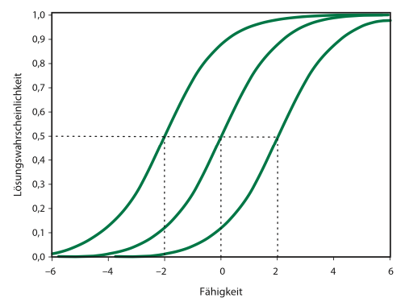

```{r setup, include=FALSE}
options(htmltools.dir.version = FALSE)

setwd("/Users/stephangoerigk/Desktop/Universität/CFH/Lehre/Bachelor/Einführung in die Forschungsmethoden der Psychologie und Psychotherapie/EFPP_Folien/")

library(tidyverse)
library(kableExtra)
library(ggplot2)
library(plotly)
library(htmlwidgets)
library(MASS)
library(ggpubr)
library(xaringanthemer)
library(xaringanExtra)

style_duo_accent(
  primary_color = "#621C37",
  secondary_color = "#EE0071",
  background_image = "blank.png"
)

xaringanExtra::use_xaringan_extra(c("tile_view"))

use_scribble(
  pen_color = "#EE0071",
  pen_size = 4
  )

knitr::opts_chunk$set(
  fig.retina = TRUE,
  warning = FALSE,
  message = FALSE
)

# library(RefManageR)
# BibOptions(
# check.entries = FALSE, 
# bib.style = "authoryear", 
# cite.style = "authoryear", 
# style = "markdown",
# hyperlink = FALSE, 
# dashed = FALSE)
# myBib = ReadBib("/Users/stephangoerigk/Desktop/Universität/CFH/Lehre/Bachelor/Einführung in die Forschungsmethoden der Psychologie und Psychotherapie/EFPP_Folien/myBib.bib")
```

name: Title slide
class: middle, left
<br><br><br><br><br><br><br>
# Einführung in die Forschungsmethoden der Psychologie und Psychotherapie

### Einheit 5: Messen in der Psychologie - latent
##### 09.11.2022 | Dr. phil. Stephan Goerigk

---
class: top, left
### Erhebungsmethoden der psychologischen Forschung

#### Selbstberichtsverfahren: Befragung und Rating

* Die Befragung ermöglicht einen Zugang zu psychischen Prozessen und Strukturen

**Drei Voraussetzungen:**

1. Untersuchte Personen müssen **Zugang** zu den interessierenden psychischen Prozessen haben

2. Untersuchte Personen müsse interessierende psychischen Prozesse **kommunizieren** können

3. Selbstauskünfte von Untersuchungsteilnehmer:innen müssen hinreichend **reliabel und valide** sein

Selbstauskünfte in Befragungen beinhalten **drei elementare kognitive bzw. mentale Prozesse**:

1. Interpretation der Frage
2. Bildung eines Urteils
3. Übersetzung in eine kommunizierte Auskunft

---
class: top, left
### Erhebungsmethoden der psychologischen Forschung

#### Selbstberichtsverfahren: Befragung und Rating

##### Wie werden Selbstberichte kommuniziert?

* Selbstbericht = Akt der Kommunikation
* Person teilt sich bewusst mit (wendet sich an einen oder mehrere Adressaten)
* Menschliche Kommunikation = Informationen + Absicht des Senders (z.B. Appell)

$\rightarrow$ Selbstbericht sollte nicht auf die übermittelte Information reduziert werden

$\rightarrow$  Interpretation vor dem Hintergrund der (vermutlichen) Mitteilungsabsicht des Senders

.pull-left[
.center[
```{r eval = TRUE, echo = F, out.width = "450px"}
knitr::include_graphics("bilder/thun.png")
```
4-Seiten-Modell, F. Schulz von Thun
]
]
.pull-right[
.center[
```{r eval = TRUE, echo = F, out.width = "450px"}
knitr::include_graphics("bilder/ohren.png")
```
]
]

---
class: top, left
### Erhebungsmethoden der psychologischen Forschung

#### Selbstberichtsverfahren: Befragung und Rating

##### Befragung - Varianten und Prinzipien der Konstruktion

* **Schriftliche** (Fragebogen) vs. **mündliche** Befragung (Interview
* **Standardisierte** vs. **nichtstandardisierte** Befragung
  * Standardisiert: Antwortmöglichkeiten vorgeben (geschlossener Fragen)
  * Nichtstandardisiert: Befragte Person kann Antwort in ihren eigenen Worten formulieren (offene Fragen)
* **Strukturierte** vs. **unstrukturierte** Befragung
  * Strukturiert: Wortlaut und Reihenfolge der Fragen bzw. Items genau vorgegeben
  * Halbstrukturiert: Leitfaden mit vorformulierten Fragen zur Orientierung
  * Unstrukturierte: Keine Vorgaben hinsichtlich Frageformulierung und Reihenfolge der Items
* **Anzahl** der befragten Personen
  * Einzelbefragung (1 Person)
  * Gruppenbefragung (kleine Gruppe)
  * Survey (Umfrage mit großer Zahl an Befragten)

---
class: top, left
### Erhebungsmethoden der psychologischen Forschung

#### Selbstberichtsverfahren: Befragung und Rating

##### Befragung - Varianten und Prinzipien der Konstruktion

**Unterschiede zwischen schriftlicher und mündlicher Befragung**

* Konstruktion schriftlicher Befragungen erfordert mehr Vorwissen (Interview = explorativer)

* Bei schriftlichen Befragungen ist das Reaktivitätsproblem geringer (Face-to-face-Kontakt $\rightarrow$ Beeinflussungs- oder Übertragungseffekte)

* Befragte äußern sich bisweilen eher und ausführlicher in mündlichen Befragungen

* Interviews i.d.R. aufwändiger und  kostenintensiver

$\rightarrow$ Entscheidung nach Forschungsziel und Ressourcenverfügbarkeit

---
class: top, left
### Erhebungsmethoden der psychologischen Forschung

#### Selbstberichtsverfahren: Befragung und Rating

##### Befragung - Tipps zur Formulierung von Fragenbogenitems

Ein guter Fragebogen ist gekennzeichnet durch (Pelham und Blanton, 2007):

* einfache Formulierung und gute Verständlichkeit
* keine zu hohen Anforderungen an die mentale oder kognitive Leistungsfähigkeit der Befragten
* adressatenorientierte Formulierung
* keine (doppelten) Verneinungen in den Fragen
* keine überfrachteten Fragen
* keine »Forced Choice« bei unabhängig beantwortbaren Aspekten
* keine Fragen, die die Befragten sehr ähnlich beantworten
* Einsatz mehrerer Items zur Beantwortung einer Frage
* Beachtung der Ausgewogenheit in der Reihenfolge der Fragen
* eine klare und informative Instruktion

---
class: top, left
### Erhebungsmethoden der psychologischen Forschung

#### Selbstberichtsverfahren: Befragung und Rating

##### Ratings: Beurteilungen auf Skalen

* Sehr häufiges Format in schriftlichen Befragungen

* Gegenstand hinsichtlich eines bestimmten Merkmals auf einer Skala zu beurteilen

* Ratingskalen geben gleich große markierte Abschnitte des Merkmalskontinuums vor

* diejenige Stufe der Ratingskala anzukreuzen, die persönlichem am ehesten entspricht

**Gründe für Beliebtheit in Psychologie:**
1. liefern vergleichsweise direkt quantitative (auswertbare) Daten
2. Unterteilung der Merkmalsausprägungen in gleich große Abschnitte $\rightarrow$ datenanalytisch günstiges Skalenniveau (Intervallskalenniveaus)

* **Vorsicht:** Intervallskalenniveau ist nicht aus dem Format der Skala, sondern nur inhaltlich psychologisch/ empirisch zu begründen (wird aber i.d.R. bei Ratingskalen akzeptiert)

---
class: top, left
### Erhebungsmethoden der psychologischen Forschung

#### Selbstberichtsverfahren: Befragung und Rating

##### Ratings - Aspekte bei der Konstruktion von Ratingskalen

**Formulierung als Frage oder Aussage**

  * Aussagen in der "Ich-Form" und Fragen in der "Du/Sie-Form" formuliert
  * Entscheidung basierend auf gewünschter Art der Ansprache

**Verwendung unipolarer oder bipolarer Endpunkte**

  * Vorteil bipolare Skalen: definieren Begriffe an den Endpunkten der Skala einander wechselseitig 
  * Wann unipolare Skalen? 
  
    $\rightarrow$ wenn der Gegensatz eines Begriffs unklar ist (z. B. bei "schüchtern")
    
    $\rightarrow$ zur Beurteilung von Merkmalen mit einem natürlichen Nullpunkt
    
---
class: top, left
### Erhebungsmethoden der psychologischen Forschung

#### Selbstberichtsverfahren: Befragung und Rating

##### Ratings - Aspekte bei der Konstruktion von Ratingskalen

**Abstufung der Skala**

1. Geringe vs. hohe Anzahl der Stufen

  * Cave geringe Anzahl: relevante Unterschiede zwischen verschiedenen Beurteilungen nicht abbildbar
  * Cave hohe Anzahl: sollte die Differenziertheit des Urteils nicht übersteigen
  * In der Praxis i.d.R. 4- bis 9-stufige Ratingskalen 

2. Gerade vs. ungerade Anzahl von Stufen

  * Gerade Anzahl: Urteil in Richtung des einen oder anderen Pols der Skala wird erzwungen
  * Ungerade Anzahl: neutrale Urteilsmöglichkeit verfügbar
  * Cave neutrales Urteil: nicht eindeutig interpretierbar (Ambivalenz-Indifferenz-Problem)

---
class: top, left
### Erhebungsmethoden der psychologischen Forschung

#### Selbstberichtsverfahren: Befragung und Rating

##### Ratings - Aspekte bei der Konstruktion von Ratingskalen

**Bezeichnung der Abstufungen einer Skala**

* Zahlen (numerische Marker)
  * Vorteil: Stufen sind eindeutig
  * Vorteil: Abstände zwischen den Stufen der Ratingskala sind gleich 

* Wörter (verbale Marker)
  * Voteil: leichter verständlich (forschungssnaive Personen)
  * Nachteil: gleicher Abstand zwischen den Stufen unklar

* sprachfreie Zeichen (grafische bzw. ikonische Marken, z.B. Smileys oder Frownies)
  * Vorteil: leichter verständlich (forschungssnaive Personen, Kinder)
  * Nachteil: gleicher Abstand zwischen den Stufen unklar

---
class: top, left
### Erhebungsmethoden der psychologischen Forschung

#### Selbstberichtsverfahren: Befragung und Rating

##### Urteilstendenzen bei der Beantwortung von Ratingskalen

* **Tendenz zur Mitte**
  
  * Extremurteile werden vermieden
  
  * insbesondere wenn Urteilsobjekte wenig bekannt sind 
  
  * insbesondere wenn Skalen an den Endpunkten nicht verankert sind (die Extreme unklar bleiben)
  
  * Gegenmaßnahme: Untersuchungsteilnehmer:innen hinreichend über zu beurteilenden Objekte informieren
  
* **Gedankenlose Reproduktion**

  * bei ähnlich erscheinenden Items nach erster Antwort bei folgenden Fragen selben Wert reproduzieren
  
  * Gegenmaßnahme: Mischung von Fragen bzw. Umpolung der Fragerichtung


---
class: top, left
### Erhebungsmethoden der psychologischen Forschung

#### Testen

##### Definition Psychologischer Test

* wissenschaftliches Routineverfahren

* Untersuchung eines oder mehrerer empirisch unterscheidbarer Merkmale

* Ziel: möglichst genaue quantitative Aussage über den relativen Grad der individuellen Merkmalsausprägung

* Besteht in der Regel aus mehreren Aufgaben oder Fragen (Items)

* Aufgaben werden von Menschen mit unterschiedlichen Fähigkeiten oder Eigenschaften unterschiedlich gelöst

* Test = standardisierte Verhaltensstichprobe

* Testwert = Aggregation aus den Einzelitem /-aufgaben des Tests

---
class: top, left
### Erhebungsmethoden der psychologischen Forschung

#### Testen

##### Leistungstests

* Leistungstests erfassen Merkmale im Hinblick auf einen objektiven Maßstab zur Beurteilung der Güte der Antworten

* Antworten können also »richtig« oder »falsch« sein

* Beantwortung sind kognitive Prozesse im weiteststen Sinne und Leistungsmotivation entscheidend

* Um zwischen guten/schlechten Leistungen differenzieren zu können, müssen verschiedene Schwierigkeitsgrade realisiert sein

Beispiele:

* Intelligenztests

* Eignungstests

---
class: top, left
### Erhebungsmethoden der psychologischen Forschung

#### Testen

##### Leistungstests - Speed-Tests

* Bei Speed-Tests ist die Bearbeitungszeit zu knapp angesetzt

* Somit können in der Regel nicht alle Aufgaben bearbeitet werden

Beispiel: d2-Aufmerksamkeits-Konzentrationstest von Brickenkamp (2002)

* Testpersonen bearbeiten eine große Zahl von Zeichen, nämlich die Buchstaben d und p, die jeweils mit bis zu vier kleinen Strichen umgeben sind

* Anzustreichen sind nur jene d, die zwei Striche oberhalb aufweisen

---
class: top, left
### Erhebungsmethoden der psychologischen Forschung

#### Testen

##### Leistungstests - Speed-Tests

Beispiel: d2-Aufmerksamkeits-Konzentrationstest von Brickenkamp (2002)

.center[
```{r eval = TRUE, echo = F, out.width = "600px"}
knitr::include_graphics("bilder/d2.png")
```
]

---
class: top, left
### Erhebungsmethoden der psychologischen Forschung

#### Testen

##### Leistungstests - Power-Tests

* Bei Power-Tests wird das Niveau der Aufgaben sukzessive gesteigert

* Adaptives Testen bis maximales Leistungsniveau gefunden ist

Beispiel: Wechsler-Intelligenz-Tests (HAWIE)

* HAWIE umfasst insgesamt 11 Untertests (Subskalen)

* Untertests sind Bereich der verbalen Intelligenz oder der Handlungsintelligenz zugeordnet

---
class: top, left
### Erhebungsmethoden der psychologischen Forschung

#### Testen

##### Leistungstests - Power-Tests

Beispiel: Wechsler-Intelligenz-Tests (HAWIE)

Verbalteil:

1. (Allgemeines Wissen, z. B. »Was ist der Koran?«, »Wer erfand das Flugzeug?«

2. Zahlennachsprechen: Folge nvon 3–9 Ziffern sind vorwärts und rückwärts nachzusprechen, z. B. »5-8-2« oder »4-2-7-3-1-8-2«

3. Wortschatz: »Was ist die Bedeutung von ...?« z. B. »anonym, Prestige, konkordant«

4. Rechnerisches Denken, z. B. »Ein Zug fährt 275 km in 5h. Wie groß ist seine Durchschnittsgeschwindigkeit in km/h?«

5. Allgemeines Verständnis, z. B. »Was bedeutet das Sprichwort‚Stille Wasser sind tief’?«

---
class: top, left
### Erhebungsmethoden der psychologischen Forschung

#### Testen

##### Leistungstests - Power-Tests

Beispiel: Wechsler-Intelligenz-Tests (HAWIE)

Bilder ergänzen: »Welcher wichtige Teil fehlt auf den Bildern«, z. B.


.center[
```{r eval = TRUE, echo = F, out.width = "350px"}

```
]


---
class: top, left
### Erhebungsmethoden der psychologischen Forschung

#### Testen

##### Leistungstests - Power-Tests

Beispiel: Wechsler-Intelligenz-Tests (HAWIE)

Bilder ordnen: »Ordnen Sie die Bilder bitte so, dass sich die sinnvollste Geschichte ergibt!«, z. B.

<br><br>
.center[
```{r eval = TRUE, echo = F, out.width = "600px"}
knitr::include_graphics("bilder/hawie2.png")
```
]

---
class: top, left
### Erhebungsmethoden der psychologischen Forschung

#### Testen

##### Leistungstests - Power-Tests

Beispiel: Wechsler-Intelligenz-Tests (HAWIE)

Mosaik-Test: »Legen Sie die Würfel so zusammen, dass sie ein Muster zeigen, wie das auf der Karte«, z. B.

.center[
```{r eval = TRUE, echo = F, out.width = "400px"}

```
]

---
class: top, left
### Erhebungsmethoden der psychologischen Forschung

#### Testen

##### Leistungstests - Power-Tests

Beispiel: Wechsler-Intelligenz-Tests (HAWIE)

Figurenlegen: »Setzen Sie die Teile so zusammen, dass sie etwas darstellen!«, z. B.

.center[
```{r eval = TRUE, echo = F, out.width = "500px"}
knitr::include_graphics("bilder/hawie3.png")
```
]

---
class: top, left
### Erhebungsmethoden der psychologischen Forschung

#### Testen

##### Persönlichkeitstests

* Persönlichkeitstests liefern Daten im Hinblick auf emotional, motivational und sozial relevante Persönlichkeitseigenschaften

* Es wird zwischen subjektiven und objektiven Persönlichkeitstests unterschieden

* Bei subjektiven Persönlichkeitstests ist der Zweck des Tests für die getesteten Personen leicht durchschaubar

* Bei objektiven Persönlichkeitstests wird versucht, den Zweck zu verschleiern, um so die Reaktivität der Datenerhebung zu minimieren und die Validität der Ergebnisse zu erhöhen

Beispiele:

* NEO Five Factor Inventory (NEO-FFI; Costa & Macrae, 1992)
* Freiburger Persönlichkeitsinventar (FPI-R, Fahrenberg, Hampel & Selg, 1994)

---
class: top, left
### Erhebungsmethoden der psychologischen Forschung

#### Testen

##### Klassische Testtheorie

* Die meisten Skalen und Tests basieren auf der klassischen Testtheorie (z. B. Gulliksen, 1950)

Zentrale Annahme der Klassischen Testtheorie:

* Jeder Wert einer Person auf einem konkreten Item ist aus zwei Komponenten zusammengesetzt (Wahrer Testwert + Fehleranteil)

1. Wahrer Testwert:

  * mittlerer Testwert, den eine Person in einer unendlichen Serie von Testwiederholungen erzielen würde
  * keine praktisch erzielbare, sondern eine theoretische Größe
  * kann durch das konkrete empirische Testergebnis einer Person geschätzt werden

2. Fehleranteil (Messfehler) :

  * Abweichung dieses empirischen Schätzwerts vom wahren Wert 
  
---
class: top, left
### Erhebungsmethoden der psychologischen Forschung

#### Testen

##### Klassische Testtheorie

* Ziel: möglichst direkte und präzise Schätzung des wahren Werts

* Durch den Einsatz mehrerer Testitems soll der Fehleranteil insgesamt minimiert werden

* Mehrere Items ermöglichen eine bessere Annäherung an den wahren Testwert einer Person.

* Erst mehrere Items erlauben eine differenzierte Erfassung unterschiedlicher Merkmalsausprägungen

* klassische Testtheorie setzt somit voraus, dass wahrer Wert und Fehlerwert getrennt bestimmt werden können

---
class: top, left
### Erhebungsmethoden der psychologischen Forschung

#### Testen

##### Axiome der klassischen Testtheorie

1. Ein Testergebnis besteht aus der Summe von wahrem Wert und Messfehler (durch Ablenkung, fehlende Motivation, Störeinflüsse der Umwelt etc.) zusammen.

2. Der mittlere Messfehler ist gleich null. Bei wiederholten Testanwendungen gleichen sich die verschiedenen Messfehler sozusagen aus.

3. Der wahre Wert und der Messfehler sind nicht miteinander korreliert (voneinander unabhängig).

4. Der Messfehler in einem Test ist nicht mit dem wahren Wert in einem anderen Test korreliert. 

5. Die Messfehler aus verschiedenen Tests sind nicht miteinander korreliert (voneinander unabhängig). 

---
class: top, left
### Erhebungsmethoden der psychologischen Forschung

#### Testen

##### Probabilistische Testtheorie

* Klassischen Testtheorie: direkte Erfassung des wahren Werts unter Berücksichtigung des Messfehlers

* Probabilistischen Testtheorie: Wahrscheinlichkeit, mit der eine Person mit einer bestimmten Merkmalsausprägung ein Item positiv beantwortet steht im Zentrum

* Annahme: untersuchte Merkmale latent, also nicht direkt beobachtbar

* Antworten auf Testitems stellen Indikatoren dieser latenten Merkmale dar

* Wahrscheinlichkeit, dass eine Person ein Testitem zur Erfassung des latenten Merkmals X positiv beantwortet, hängt von der Ausprägung von X bei dieser Person ab

* Probabilistische Testtheorie aka. Item-Response-Theorie (IRT, Embretson & Reise, 2000; Rasch, 1980)

---
class: top, left
### Erhebungsmethoden der psychologischen Forschung

#### Testen

##### Probabilistische Testtheorie

Folgen der Annahmen der IRT:

1. Eine Person mit höherer Fähigkeit löst ein geeignetes Item in einem Test mit höherer Wahrscheinlichkeit als eine Person mit niedrigerer Fähigkeit 

2. Eine Person löst mit größerer Wahrscheinlichkeit ein Testitem, das von vielen Personen gelöst wird, als ein Testitem, das nur von wenigen Personen gelöst wird. 

Quantifizierung von Antwortverhalten in der IRT:

* Beziehung zwischen dem Antwortverhalten (der Lösungswahrscheinlichkeit) und dem latenten Merkmal (der Fähigkeit) wird statistisch bestimmt

* Graphische Darstellung in sog. Item-Characteristic-Curves (ICC) 

---
class: top, left
### Erhebungsmethoden der psychologischen Forschung

#### Testen

##### Probabilistische Testtheorie

Item-Characteristic-Curves (ICC):

.pull-left[
.center[
```{r eval = TRUE, echo = F, out.width = "500px"}

```
]
]
.pull-right[

* Antwortverhalten (der Lösungswahrscheinlichkeit) auf der y-Achse 

* Ausprägung des latenten Merkmals (der Fähigkeit) auf der x-Achse 
]


---
class: top, left
### Take-Aways
.content-box-gray[

* Selbstratings sind in der PSychologie beliebte, kostengünstige Messverfahren, habe aber Probleme hinsichtlich der Verfälschbarkeit.

* Bei der Itemformulierung von Fragebögen sollten Gütekriterien, bei der Auswertung Antwortstile beachtet werden.

* Psychologischer Test ist ein wissenschaftliches Routineverfahren zur Untersuchung eines oder mehrerer empirisch unterscheidbarer Merkmale

* Leistungstests erfassen Merkmale im Hinblick auf einen objektiven Maßstab zur Beurteilung der Güte der Antworten.

* Klassischen Testtheorie: direkte Erfassung des wahren Werts unter Berücksichtigung des Messfehlers

* Probabilistischen Testtheorie: Wahrscheinlichkeit, mit der eine Person mit einer bestimmten Merkmalsausprägung ein Item positiv beantwortet steht im Zentrum
]

[**Link zur Wissensüberprüfung**](https://docs.google.com/forms/d/e/1FAIpQLSe95fGVzeviTtdBmbqtT0n51NLUMrRtLxXKRzrzAmtNzJ9gew/viewform?usp=sf_link)

