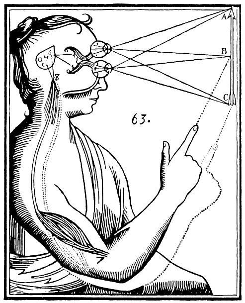
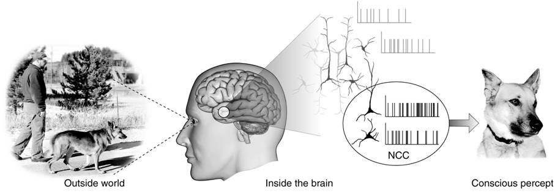
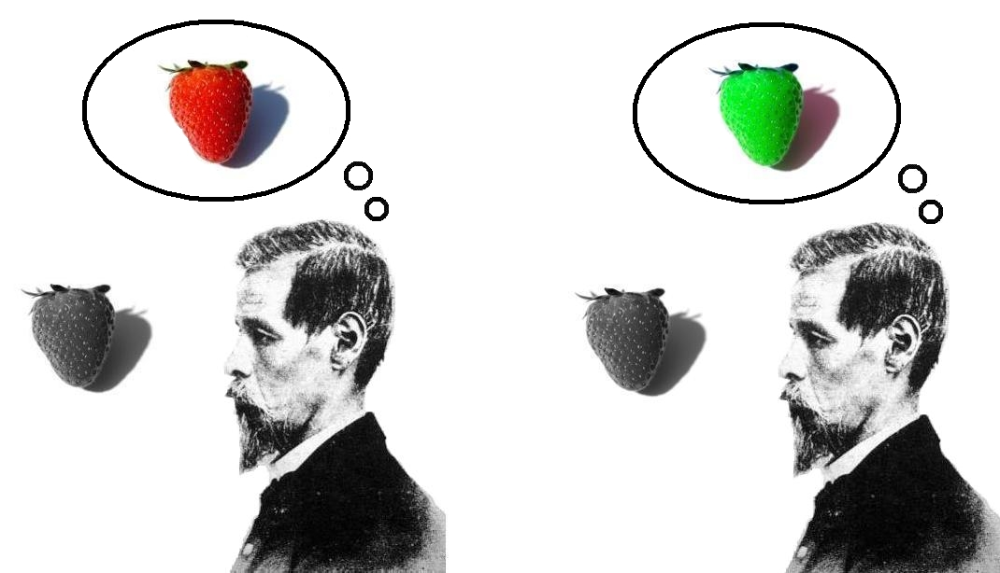
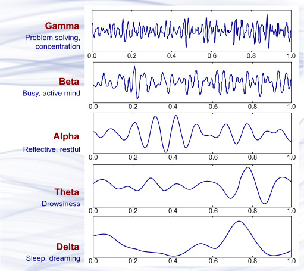
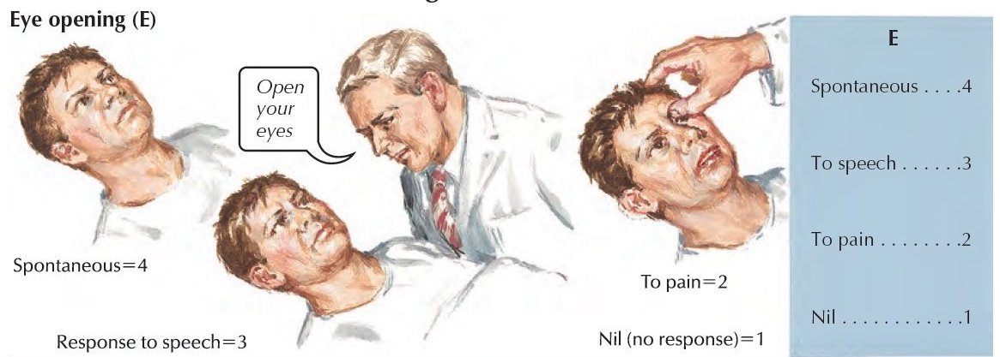
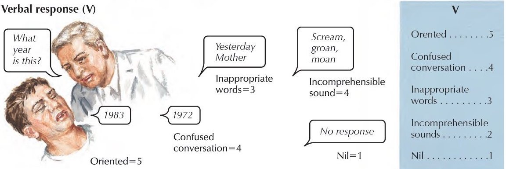

```{r setup, include=FALSE}
options(htmltools.dir.version = FALSE)

setwd("/Users/stephangoerigk/Desktop/Universität/CFH/Lehre/Bachelor/Einführung in die Forschungsmethoden der Psychologie und Psychotherapie/EFPP_Folien/")

library(tidyverse)
library(kableExtra)
library(ggplot2)
library(plotly)
library(htmlwidgets)
library(MASS)
library(ggpubr)
library(xaringanthemer)
library(xaringanExtra)

style_duo_accent(
  primary_color = "#621C37",
  secondary_color = "#EE0071",
  background_image = "blank.png"
)

xaringanExtra::use_xaringan_extra(c("tile_view"))

use_scribble(
  pen_color = "#EE0071",
  pen_size = 4
  )

knitr::opts_chunk$set(
  fig.retina = TRUE,
  warning = FALSE,
  message = FALSE
)

# library(RefManageR)
# BibOptions(
# check.entries = FALSE, 
# bib.style = "authoryear", 
# cite.style = "authoryear", 
# style = "markdown",
# hyperlink = FALSE, 
# dashed = FALSE)
# myBib = ReadBib("/Users/stephangoerigk/Desktop/Universität/CFH/Lehre/Bachelor/Einführung in die Forschungsmethoden der Psychologie und Psychotherapie/EFPP_Folien/myBib.bib")
```

name: Title slide
class: middle, left
<br><br><br><br><br><br><br>
# Einführung in die Forschungsmethoden der Psychologie und Psychotherapie

### Einheit 8: Leib-Seele Problematik
##### 08.12.2022 | Dr. phil. Stephan Goerigk

---
class: top, left
### Leib-Seele Problematik

#### Definition und Hintergrund

<small>

.center[
*Welche Beziehung besteht zwischen dem Leib (dem belebten Körper, insbesondere dem Gehirn) und der Seele (Geist, Bewußtsein)?*

**Leib-Seele-Problem aka psychophysisches Problem**
]

**Philosphie:**

* Von vielen als unlösbares Problem oder als Scheinproblem bezeichnet

* Schopenhauer: "Grundfrage der Philosophie oder "Weltknoten"

**In der Psychologie:**

* Auffassungen des Leib-Seele-Problems (z.B. Monismus gegenüber Dualismus) beeinflussen. als philosophische Vorentscheidungen die Theoriebildung und Forschungsmethodik, u.U. auch die Praxis.

**Moderne Forschungstheoretische Sicht**

* Wie man zugleich dem offensichtlichen Zusammenhang zw. mentalen und physischen Ereignissen und der Verschiedenheit ihres phänomenalen Gegebenseins Rechnung tragen.

</small>

---
class: top, left
### Leib-Seele Problematik

#### Definition und Hintergrund

Kern des Leib-Seele-Problems ist nach Bunge (1984):

Identifizierung des Subjekts mentaler Prädikate:

.center[*Ich fühle.. ich denke.. – wie heißt das Subjekt dieser Sätze?*]

* **grammatikalische** Antwort: "Ich"

* **ontologische** Antwort: individuelle Seele bzw. immaterieller Geist/Bewußtsein

* **empirische** Antwort: Gehirn

---
class: top, left
### Leib-Seele Problematik

#### Drei Hauptfragestellungen

1. Bedingungen des psychophysischen Niveaus: 
  * Wie kann es sein, daß ein elektrophysiologischer oder biochemischer Erregungsprozeß im Nervensystem Bewußtseins- und Erlebnis-Qualität erhält?

2. Ontologischer Aufbau: 
  * Sind Physis und Psyche nicht bloß der Erscheinung nach, sondern wesentlich und kategorial verschiedene, eigengesetzliche Seinsbereiche?
  * Sind es zwei Welten oder lassen sie sich auf eine einzige, letztlich materielle Basis reduzieren?
  * Hat ein Schöpfergott zweierlei geschaffen: einen Körper und beim Menschen auch eine Geistseele?
  
3. Adäquatheitsbedingungen psychophysischer Beschreibungen: 
  * Wie können höhere Lebensprozesse angemessen beschrieben werden? 
  * Gibt es hier Kriterien, und muß die jeweilige Beschreibungsweise gerechtfertigt werden?

---
class: top, left
### Leib-Seele Problematik

#### Erklärungsansätze: Monismus vs. Dualismus

.pull-left[
**Monismus:**
* geht davon aus, dass es nur eine einzige vereinheitlichende Realität gibt (nur Geist vs. nur Materie)

**Dualismus:**
* starre Unterscheidung zwischen den Bereichen Geist und Materie
* z. B. eine neutrale Substanz oder Essenz, mit der alles erklärt werden kann.
]

.pull-right[
.center[
```{r eval = TRUE, echo = F, out.width = "400px"}
knitr::include_graphics("bilder/dualism.png")
```
]
]

* Jede dieser Kategorien enthält zahlreiche Varianten


---
class: top, left
### Leib-Seele Problematik

#### Erklärungsansätze: Monismus vs. Dualismus

<small>

.pull-left[
**Monismus:**
* Materialismus (Physikalismus)
  * Seelisch-Geistiges existiert nicht (Radikaler Behaviorismus) $\rightarrow$ kaum haltbar
  * Eliminativer Materialismus: Geist resultiert aus Materie
* Idealismus/Spiritismus
  * nur der Gedanke/die Seele existiert wirklich 
  * Alles was existiert, existiert nur in meinem Geist (Solipsismus)
* Funktionalismus (Putnam)
 * mentalen Zuständen sind Funktionen
 * können grundsätzlich auch in Automaten bzw. Computern realisiert werden können
]
.pull-right[
**Dualismus:**

* Interaktionistischer Dualismus 
  * Geist und Materie sind verschiedene Substanzen
  * diese wirken aufeinander ein 
* Psychophysischer Parallelismus
  * Geist und Materie sind verschiedene Substanzen
  * laufen parallel, wirken nicht aufeinander 
* Epiphänomenalismus
  * Verhältnis von Geist und Materie als Einbahnstraße
  * Materie wirkt auf den Geist, aber nicht umgekehrt
* Eigenschaftsdualismus
  *  es gibt nur Materie
  * aber: Eigenschaft „auf bestimmte Art erlebt zu werden“ (Qualia) ist eine nichtmaterielle Eigenschaft

]

---
class: top, left
### Leib-Seele Problematik

#### Beispiel: Cartesianischer Dualismus

.pull-left[
* Das Leib-Seele-Problem wurde von René Descartes im 17. Jahrhundert bekannt gemacht

Descartes Idee: 

* Eingaben von den Sinnesorganen werden an die Epiphyse im Gehirn geleitet (Ort der Interaktion)

* von dort werden sie an den immateriellen Geist weitergeleitet 

* Form des Substanzdualismus
  * Das Mentale kann außerhalb des Körpers existieren
  * Der Körper kann nicht denken
  * z.B. kompatibel mit vielen theologischen Auffassungen
]

.pull-right[
.center[
```{r eval = TRUE, echo = F, out.width = "300px"}

```

René Descartes' Illustration des Geist-Körper-Dualismus.
]
]

---
class: top, left
### Leib-Seele Problematik

#### Übersicht:

.center[
```{r eval = TRUE, echo = F, out.width = "900px"}

```
]

---
class: top, left
### Leib-Seele Problematik

#### Neuronale Korrelate

##### Neurowissenschaften

* modernen Naturwissenschaften: materialistischer Ansatz

* Keine Veränderung der mentalen Zustände eines Menschen ohne eine Veränderung seines Gehirns

Disziplinen:

* Sinnesphysiologie: 
  * untersucht den Zusammenhang von Wahrnehmung und Reizverarbeitungsprozessen.
* Kognitive Neurowissenschaft: 
 * korreliert geistige Prozesse mit neuronalen Prozessen.
* Neuropsychologie: 
  * beschreibt die Abhängigkeit geistiger Fähigkeiten von einzelnen Hirnregionen.
* Evolutionspsychologie: 
  * menschliche Nervensystem als Grundlage des Geistes hat sich sowohl ontogenetisch als auch phylogenetisch aus einfacheren Vorstufen entwickelt  (Emergenz)

---
class: top, left
### Leib-Seele Problematik

#### Neuronale Korrelate

.center[
```{r eval = TRUE, echo = F, out.width = "500px"}

```
]


* Neurowissenschaftler nutzen empirische Ansätze, um neuronale Korrelate subjektiver Phänomene zu entdecken
* In diesem Fall geht es um synchronisierte Aktionspotentiale in neokortikalen Pyramidenneuronen beim Betrachten einer Szene

Annahme: 

* Bewusstsein entsteht/ist aktiv wenn Gehirnzellen feuern


---
class: top, left
### Leib-Seele Problematik

#### Neuronale Korrelate

Woher rührt die Überzeugung Gehirne seien für psychisches Geschehen und sogar für Bewusstsein verantwortlich?

**Beispiele für Begründungen aus der Neurowissenschaft:**

* "neuronale Entsprechungen“ illusionärer Seheindrücke

* Veränderung oder Beseitigung visuellen Bewusstseins durch Läsionen (partielle Schädigungen des Gehirns).

* Erzeugung von visuellen Eindrücken durch Hirnstimulation.

---
class: top, left
### Leib-Seele Problematik

#### Neuronale Korrelate

#### Beispiel: Visuelle Illusionen

* sind qualitativ vom objektiven Geschehen verschieden

* Wahrnehmung muss keine Widerspiegelung der objektiven Außenwelt sein.

* Beleg für konstruktiven Charakter der Wahrnehmung 

**Aber: **

* Visuelle Illusionen bestehen unabhängig von inter-individuellen Unterschieden

* Visuelle Illusionen können durch neuronales Geschehen (zum Teil) erklärt werden


---
class: top, left
### Leib-Seele Problematik

#### Neuronale Korrelate

#### Beispiel: Visuelle Illusionen (Hermann Gitter)

.center[
```{r eval = TRUE, echo = F, out.width = "450px"}

```
]

---
class: top, left
### Leib-Seele Problematik

.pull-left[
#### Neuronale Korrelate

#### Beispiel: Läsionen (Neglect)

* Läsion: Zerstörung von Gewebe- oder Zellverbänden (im Gehirn) durch Verletzung oder Krankheitsprozesse

* Mögliche Folge einer Läsion: Neglect Syndrom

* Neglect: Ein bestimmter Teil des Gesichtsfeldes wird gesehen, aber nicht wahrgenommen

* Schädigung des Okzipitallappens (z.B. durch Hirntraumata, Gehirntumor, Meningitis, Schlaganfall)

$\rightarrow$ Funktionsveränderung als kausale Folge neurologischer Veränderung

]

.pull-right[
.center[
```{r eval = TRUE, echo = F, out.width = "380px"}

```
]
]

---
class: top, left
### Leib-Seele Problematik

#### Neuronale Korrelate

##### Das schwierige Problem des Bewusstseins - Qualia-Problem (David Chalmers, 1995)

* Beziehung zwischen subjektiven bewussten mentalen Zuständen und Gehirnzuständen, die durch elektrochemische Wechselwirkungen im Körper entstehen

* Frage, warum es überhaupt Erlebnisgehalte – oder Qualia – gibt

Beispiel: Warum tut es etwa weh, wenn ich mir mit einer Nadel in den Finger steche?

* Von unserem Finger werden Signale ins Gehirn geleitet, dort finden komplexe Verarbeitungsprozesse statt. 
* Mit bildgebenden Verfahren können wir messen, welche Prozesse im Gehirn ablaufen, wenn wir Schmerzen erleben.

ABER: Warum tut es dabei weh?

Wir wissen Erklärung des Schmerzes aussehen könnte, aber nicht, wie eine Erklärung unserer Erlebnisse aussehen könnte.

---
class: top, left
### Leib-Seele Problematik

#### Neuronale Korrelate

##### Das schwierige Problem des Bewusstseins - Qualia-Problem (David Chalmers, 1995)

.center[
```{r eval = TRUE, echo = F, out.width = "400px"}

```
]

* Das schwierige Problem wird häufig mit dem Hinweis auf die Möglichkeit umgekehrter sichtbarer Spektren illustriert. 
* Es gibt keinen logischen Widerspruch in der Annahme dass das eigene Farbsehen invertiert sein könnte
* Mechanistische Erklärungen der visuellen Verarbeitung liefern keine Fakten darüber, wie es ist, Farben zu sehen.

---
class: top, left
### Leib-Seele Problematik

#### Neuronale Korrelate

.pull-left[

##### Erregung und Inhalt

<small>

* 2 unterschiedliche Dimensionen des Begriffs Bewusstsein

  1. Arousal
  2. Bewusstseinsinhalte 

* Bewusstsein erfordert relativ hohen Erregungszustand (Vigilanz $\rightarrow$ Wachzustand, REM-Schlaf)

* Veränderungen im Arousal sind beobachtbar
  * Schwankungen im zirkadianen Rhythmus
  * Alkohol und andere Drogen
  * körperliche Anstrengung
  
* Hohe Erregungszustände umfassen Bewusstseinszustände
  * spezifische Wahrnehmungsinhalte
  * Planung und Erinnerung
  * Fantasie 

</small>
]

.pull-right[
.center[
```{r eval = TRUE, echo = F, out.width = "500px"}

```
]
]
---
class: top, left
### Leib-Seele Problematik

#### Neuronale Korrelate

**Extrembeispiel: Koma (Glasgow Coma Scale)**

* Ziel: Grad der Erregung bei Patienten mit Bewusstseinsstörungen wie dem komatösen Zustand, dem Wachkoma und dem Zustand minimalen Bewusstseins zu beurteilen

.center[
```{r eval = TRUE, echo = F, out.width = "600px"}

```
]

---
class: top, left
### Leib-Seele Problematik

#### Neuronale Korrelate

**Extrembeispiel: Koma (Glasgow Coma Scale)**

.center[
```{r eval = TRUE, echo = F, out.width = "600px"}

```
]

---
class: top, left
### Leib-Seele Problematik

#### Neuronale Korrelate

**Extrembeispiel: Koma (Glasgow Coma Scale)**

* Ziel: Grad der Erregung bei Patienten mit Bewusstseinsstörungen wie dem komatösen Zustand, dem Wachkoma und dem Zustand minimalen Bewusstseins zu beurteilen

.center[
```{r eval = TRUE, echo = F, out.width = "600px"}

```
]

---
class: top, left
### Leib-Seele Problematik

#### Neuronale Korrelate

##### Nahtod-Forschung

* Gehirnoperation: 
  * Gehirn wird künstlich und messbar deaktiviert. 
  * Patienten berichten die Geschehnisse in der Umgebung wahrgenommen zu haben, also ein Bewusstsein gehabt zu haben. 
  
* Herzstillstand
  * Gehirn nach einem Herzstillstand nicht mehr mit Blut und Sauerstoff versorgt wird
  * stellt das Gehirn nach etwa 15 Sekunden seinen normalen Betrieb ein
  * d. h., das Gehirn fällt in einen Zustand der Bewusstlosigkeit.
  * Dennoch berichten Patienten von Erlebnissen

$\rightarrow$ Bislang vermuten die Neurowissenschaften, dass das Bewusstsein vom Gehirn erzeugt wird. 
$\rightarrow$ Dann könnte aber ein inaktives Gehirn kein Träger eines Bewusstseins sein. 

---
class: top, left
### Leib-Seele Problematik

#### Neuronale Korrelate

##### Systemtheorie

* Geistiges ist nicht die Eigenschaft eines Organs – etwa des Gehirns – oder eines Individuums

* Stattdessen die Eigenschaft eines Systems, das Informationen transportieren kann

* Mentale Eigenschaften werden auch als emergente Eigenschaften (Emergenz) komplexer physischer Systeme interpretiert

$\rightarrow$ Die geistigen Charakteristika sind nicht einem Teil immanent, sondern dem System als ganzem.

---
class: top, left
### Take-Aways
.content-box-gray[
* **Leib-Seele Problem:** In welchem Verhältnis stehen der physische Körper und Geist zueinander

* **Monismus:** Physische Körper und Geist lasssen sich auf die selbe Substanz zurückführen

* **Dualismus:** Physische Körper und Geist sind getrennte Substanzen

* Dualistische Positionen geben an, in welchem genauen **Verhältnis** Physischer Körper und Geist zueinander stehen

* Naturwissenschaftliche geprägtes Zeitalter: Es wird intuitiv der **Physikalismus** für plausibel gehalten und psychologische Forschung wird v.a. entsprechend dieser Annahme betrieben

* Aber: Erklärung des subjekten Erlebnisgehalts "wie sich etwas anfühlt" (**Qualia**) stellt Physikalismus vor Probleme
]

[**Link zur Wissensüberprüfung**]()

