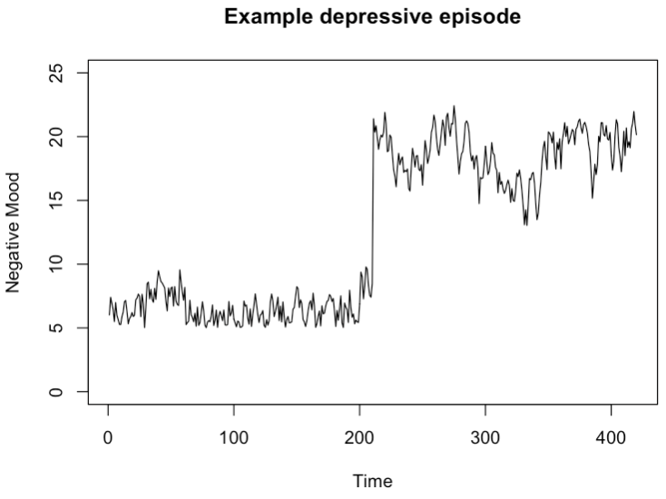

```{r setup, include=FALSE}
options(htmltools.dir.version = FALSE)

setwd("/Users/stephangoerigk/Desktop/Universität/CFH/Lehre/Bachelor/Einführung in die Forschungsmethoden der Psychologie und Psychotherapie/EFPP_Folien/")

library(tidyverse)
library(kableExtra)
library(ggplot2)
library(plotly)
library(htmlwidgets)
library(MASS)
library(ggpubr)
library(xaringanthemer)
library(xaringanExtra)

style_duo_accent(
  primary_color = "#621C37",
  secondary_color = "#EE0071",
  background_image = "blank.png"
)

xaringanExtra::use_xaringan_extra(c("tile_view"))

use_scribble(
  pen_color = "#EE0071",
  pen_size = 4
  )

knitr::opts_chunk$set(
  fig.retina = TRUE,
  warning = FALSE,
  message = FALSE
)

# library(RefManageR)
# BibOptions(
# check.entries = FALSE, 
# bib.style = "authoryear", 
# cite.style = "authoryear", 
# style = "markdown",
# hyperlink = FALSE, 
# dashed = FALSE)
# myBib = ReadBib("/Users/stephangoerigk/Desktop/Universität/CFH/Lehre/Bachelor/Einführung in die Forschungsmethoden der Psychologie und Psychotherapie/EFPP_Folien/myBib.bib")
```

name: Title slide
class: middle, left
<br><br><br><br><br><br><br>
# Einführung in die Forschungsmethoden der Psychologie und Psychotherapie

### Einheit 10: Operationalisierung von Gesundheit und Krankheit
##### 18.01.2023 | Dr. phil. Stephan Goerigk

---
class: top, left
### Operationalisierung von Gesundheit und Krankheit 

#### Klinische Psychologie

* Klinische Psychologie umfasst die Erforschung, Diagnostik und Therapie der Gesamtheit psychischer Störungen bei Menschen aller Altersstufen.

Dazu gehören u. a. die Themen
* Ätiologie und Bedingungsanalyse
* Klassifikation und Diagnostik
* Prävention, Psychotherapie und Rehabilitation
* Epidemiologie, Gesundheitsversorgung und Evaluation

Klinischen Psychologie hat enge Beziehungen zu  anderen Wissenschaftsdisziplinen
* Psychiatrie
* Soziologie
* neurobiologische Fächer (einschließlich der Gebiete Genetik und Psychopharmakologie)
* Neurologie und andere medizinischen Fächern.

---
class: top, left
### Operationalisierung von Gesundheit und Krankheit 

#### Was sind psychische Störungen?

* Merkmal der Definition des Faches Klinische Psychologie und Psychotherapie ist das Konstrukt "psychische Störungen"

* Psychische Störungen sind nicht grundlagenwissenschaftlich eindeutig definierte, feststehende Entitäten

* Stattdessen: nützliche Konstrukte, auf die sich Forscher und Praktiker als bestmögliche Lösung für eine begrenzte Zeit geeinigt haben

**Folge: **

Definition psychischer Störungen oder ganzer Teile eines Klassifikationssystems können sich ändern

**Beispiel: Diagnosewechsel in den 80er Jahren **

Angstneurose $\rightarrow$ Panikstörung, generalisierte Angststörung

---
class: top, left
### Operationalisierung von Gesundheit und Krankheit 

#### Was sind psychische Störungen?

.pull-left[

Relevante Fragen:

* Wie kann man psychische Störungen definieren?

* Gibt es eindeutige Grenzen zwischen normal und abnorm, gesund und krank?

* Wie kann man psychische Störungen verlässlich beschreiben (Nomenklatur)

* Wie kann man psychische Störungen einordnen und klassifizieren (diagnostisches Klassifikationssystem)
]

.pull-right[

.center[
```{r eval = TRUE, echo = F, out.width = "500px"}

```
]

Psychische Störung: 12-Monats-Prävalenz in Europa; in Klammern: geschätzte Anzahl in Millionen (nach Wittchen et al. 2011)

]
---
class: top, left
### Operationalisierung von Gesundheit und Krankheit 

#### Was sind psychische Störungen?

<small>

**Definition Psychische Störung:**

* Psychische Störungen sind ein klinisch bedeutsames Verhaltens- oder psychisches Syndrom oder Muster 
  * das mit momentanem Leiden (z. B. einem schmerzhaften Symptom) 
  * oder einer Beeinträchtigung (z. B. Einschränkungen in einem oder in mehreren wichtigen sozialen oder Leistungsbereichen) 
  * oder mit einem stark erhöhten Risiko einhergeht, zu sterben, Schmerz, Beeinträchtigung oder einen tiefgreifenden Verlust an Freiheit zu erleiden. 
  
* Das Syndrom oder Muster darf nicht nur eine verständliche und kulturell sanktionierte Reaktion auf ein Ereignis sein (z. B. normale Trauerreaktion bei Verlust eines geliebten Menschen).

* Unabhängig vom ursprünglichen Auslöser muss bei der betroffenen Person eine verhaltensmäßige, psychische oder biologische Funktionsstörung zu beobachten sein. 

* Weder normabweichendes Verhalten (z. B. politischer, religiöser oder sexueller Art) noch Konflikte des Einzelnen mit der Gesellschaft sind psychische Störungen, solange die Abweichung oder der Konflikt kein Symptom einer oben beschriebenen Funktionsstörung bei der betroffenen Person darstellt.

</small>

---
class: top, left
### Operationalisierung von Gesundheit und Krankheit 

#### Statistische Normen - klinische Signifikanz

<small>

* Gesundheit = Rückkehr zur "normalen" Funktionsweise (Follette und Revenstorf, 1984)

* Kliniker und Forscher erwarten oft, dass eine Behandlung das Problem, das der Klient in die Therapie mitbringt, beseitigt. 

* Eine Möglichkeit, diesen Prozess zu konzeptualisieren, besteht darin, die Klienten, die eine Therapie beginnen, als Teil einer dysfunktionalen Population zu betrachten. 

* Diejenigen, die z.B. gesund eine Therapie verlassen, sollten nicht mehr zur dysfunktionalen Population gehören.

</small>

.center[
```{r eval = TRUE, echo = F, out.width = "500px"}

```
]

---
class: top, left
### Operationalisierung von Gesundheit und Krankheit 

#### Statistische Normen - klinische Signifikanz

Möglichkeiten zur Operationalisierung des Prozesses der Rückkehr in "funktionale" Population:

(a) Das Funktionsniveau nach der Therapie sollte außerhalb der Spanne der dysfunktionalen Population liegen, wobei sich die Spanne auf zwei Standardabweichungen über den Mittelwert dieser Population (in Richtung der Funktionalität) erstreckt. 

(b) Der Grad der Funktionsfähigkeit nach der Therapie sollte innerhalb des Bereichs der funktionellen oder normalen Population liegen, wobei der Bereich als innerhalb von zwei Standardabweichungen des Mittelwerts dieser Population liegend bezeichnet wird.

(c) Das Funktionsniveau im Anschluss an die Therapie bringt den Klienten näher an den Mittelwert der funktionalen Population als an den Mittelwert der dysfunktionalen Population.

---
class: top, left
### Operationalisierung von Gesundheit und Krankheit 

#### Statistische Normen - klinische Signifikanz

(c) Das Funktionsniveau im Anschluss an die Therapie bringt den Klienten näher an den Mittelwert der funktionalen Population als an den Mittelwert der dysfunktionalen Population.

* Diese dritte Definition der klinisch signifikanten Veränderung ist die am wenigsten willkürliche. 

* Sie basiert auf der relativen Wahrscheinlichkeit, dass ein bestimmter Wert in der Verteilung der dysfunktionalen gegenüber der funktionalen Population landet. 
  
* Eine klinisch signifikante Veränderung liegt vor, wenn der Wert nach der Behandlung innerhalb der funktionalen Population für die betreffende Variable liegt (näher am Mittelwert). 
  
* Wenn der Wert dieses Kriterium erfüllt, ist es statistisch wahrscheinlicher, dass er aus der funktionalen als aus der dysfunktionalen Population stammt.
  
---
class: top, left
### Operationalisierung von Gesundheit und Krankheit 

#### Statistische Normen - klinische Signifikanz

.center[
```{r eval = TRUE, echo = F, out.width = "500px"}

```
]

$$c=\frac{s_0 M_1 + s_1M_0}{s_0+s_1}$$

**Problem:**

* Um für c zu lösen, werden Daten aus einer normativen für die interessierende Variable benötigt.
* Solche Normen fehlen für viele in der Psychotherapieforschung verwendete Maße.

---
class: top, left
### Operationalisierung von Gesundheit und Krankheit 

#### Beschwerde $\rightarrow$ Symtom $\rightarrow$ Syndrom $\rightarrow$ Diagnose

.center[
```{r eval = TRUE, echo = F, out.width = "500px"}

```
]

---
class: top, left
### Operationalisierung von Gesundheit und Krankheit 

#### Wie werden psychische Störungen derzeit klassifiziert?

<small>
.pull-left[

Es gibt aktuell zwei international gebräuchliche und kompatible Klassifikationssysteme:
* die ICD-10, bzw. ICD-11 (International Classification of Diseases)

* das DSM-IV, bzw. DSM-V (Diagnostic and Statistical Manual of Mental Disorders) 

* Sie unterscheiden sich nur geringfügig hinsichtlich der diagnostischen Kategorien und Definitionen.

* Die ICD ist zur Klassifikation aller Krankheiten und Störungen sowie Anlässe in der Gesundheitsversorgung konzipiert

* Das DSM ist ausführlicher und expliziter für mentale Gesundheit – deshalb für Psychologen leichter zu benutzen.]

</small>

.pull-right[
.center[
```{r eval = TRUE, echo = F, out.width = "500px"}

```
]

]

---
class: top, left
### Operationalisierung von Gesundheit und Krankheit 

#### Hauptkategorien ICD-10 und DSM-IV

.center[
```{r eval = TRUE, echo = F, out.width = "800px"}

```
]

---
class: top, left
### Operationalisierung von Gesundheit und Krankheit 

#### ICD-10-Klassifikation: F-Kodierungsbeispiele der psychischen Störungen

.center[
```{r eval = TRUE, echo = F, out.width = "800px"}

```
]

---
class: top, left
### Operationalisierung von Gesundheit und Krankheit 

#### Vergabe von Diagnosen: Beispiel IDCL-Checkliste Depression

.center[
```{r eval = TRUE, echo = F, out.width = "700px"}

```
]

---
class: top, left
### Operationalisierung von Gesundheit und Krankheit 

#### Vergabe von Diagnosen: Beispiel IDCL-Checkliste Depression

.center[
```{r eval = TRUE, echo = F, out.width = "700px"}

```
]

---
class: top, left
### Operationalisierung von Gesundheit und Krankheit 

#### Messung von Symptomen

Zur Messung von Symptomen können alle Ebenen von Messinstrumenten herangezogen werden, die wir bereits kennengelernt haben:

* Fragebogen (Selfrating)

* Fragebogen (Fremdrating)

* Diagnostisches Interview

* Verhaltensmarker 
  * standardisierte Testsituation
  * Alltag (z.B. Smartphones, Wearables)

* Biophysiologische Messungen

---
class: top, left
### Operationalisierung von Gesundheit und Krankheit 

#### Messung von Symptomen

##### Fragebogen (Selfrating)

Vorteile von Selbstbeurteilungsfragebögen:

* ermöglichen es der Person, die beurteilt wird, ihre eigene Perspektive und Selbsteinschätzung zu reflektieren.
* können helfen, Verantwortung für das eigene Verhalten und die eigene Entwicklung zu übernehmen.
* sind kosteneffizient und können einfach durchgeführt werden
* können schnell und unkompliziert Informationen sammeln

Nachteile von Selbstbeurteilungsfragebögen:

* können dazu führen, dass die Person die eigenen Symptome überschätzt oder unterbewertet.
* Person kann sich von ihrem Selbstbild beeinflussen lassen, anstatt objektiv zu beurteilen.
* können auch ungenau sein, weil die Person möglicherweise nicht bereit ist, sich selbst ehrlich zu beurteilen oder die Fragen nicht richtig versteht
* können dazu führen, dass die Person sich von sozialen Normen beeinflussen lässt 

---
class: top, left
### Operationalisierung von Gesundheit und Krankheit 

<small>

#### Messung von Symptomen

##### Fragebogen (Selfrating) - Störungsspezifische Beispiele

</small>

```{r echo = F}

df = data.frame(Störung = c("Agoraphobie und Panikstörung",
                            "Alkohol (Abhängigkeit bzw. schädlicher Gebrauch)",
                            "Aufmerksamkeitsstörung im Erwachsenenalter",
                            "Bipolare Störung",
                            "Borderline Persönlichkeitsstörung",
                            "Computerspiele und Onlineabhängigkeit",
                            "Depression",
                            "Dissoziative Störungen",
                            "Essstörungen",
                            "Hypochondrie",
                            "Posttraumatische Belastungsstörung",
                            "Schlafstörungen",
                            "Schmerz",
                            "Sexuelle Funktionsstörungen",
                            "Somatoforme Störungen",
                            "Soziale Phobie",
                            "(Anhaltende) Trauer",
                            "Zwang"),
                Skala = c("Fragebogen Ängste, Kognitionen und Vermeidung (AKV)",
                          "Alcohol Use Disorder Identification Test (AUDIT)",
                          "ADHS Selbstbeurteilung (AUDIT) und Wender Utah Rating Scale (WURS-k)",
                          "Altman Self Rating Mania Scale (ASMR)",
                          "Borderline Symptom List (BSL 23)",
                          "Computerspiel- und Onlineabhängigkeit (CSAS)",
                          "Beck Depressions Inventar II",
                          "Fragebogen zu Dissoziativen Symptomen (FDS-20)",
                          "Eating Disorder Inventory-2 (EDI-2)",
                          "Whiteley-Index und Illness Attitude Scale (WI/IAS)",
                          "Posttraumatic Stress Disorder Checklist for DSM-V (PCL-5) und International Trauma Questionnaire (ITQ)",
                          "Insomnia Severity Index (ISI)",
                          "Schmerzempfindungsskala und Fragebogen zur Erfassung der Schmerzverarbeitung (SES/FESV)",
                          "Sexual Behaviour Questionnaire (SBQ-G)",
                          "Screening für Somatoforme Störungen (SOMS)",
                          "Liebowitz Soziale Angst Skala (LSAS)",
                          "Inventory of complicated Grief (ICG-D)",
                          "Yale-Brown Obsessive Compulsive Inventory (YBOCS-SR)"))
df %>%
  kbl() %>%
  kable_styling(font_size = 10) %>%
  kable_classic(full_width = T)
```

---
class: top, left
### Operationalisierung von Gesundheit und Krankheit 

#### Messung von Symptomen

##### Fragebogen (Selfrating) - Beispiel BDI-II

* Testverfahren, das die Schwere depressiver Symptomatik im klinischen Bereich erfasst. 

* Es soll nicht die Depression an sich, sondern lediglich der Schweregrad der Depression erfasst werden.

* In dem Fragebogen werden 21 Gruppen von je 4 Aussagen vorgegeben. 

**Grenzwerte für das BDI-II:**

* 0–8: Keine Depression
* 9–13: Minimale Depression
* 14–19: Leichte Depression
* 20–28: Mittelschwere Depression
* 29–63: Schwere Depression

---
class: top, left
### Operationalisierung von Gesundheit und Krankheit 

#### Messung von Symptomen

##### Fragebogen (Selfrating) - Beispiel BDI-II (Ausschnitt Fragen 1-3. bzw. 6-8)

.center[
```{r eval = TRUE, echo = F, out.width = "600px"}

```
]

---
class: top, left
### Operationalisierung von Gesundheit und Krankheit 

#### Messung von Symptomen

##### Selfrating - Ecological Momentary Assessment (EMA)

* Wiederholte Erfassung Symptomratings in der realen Situation

* Durchführung mittels Apps (z.B. am Smartphone)

* Lassen sich häufig durchführen (Zeitreihen) $\rightarrow$ Identifikation kritischer Marker und Kipppunkte

.pull-left[
.center[
```{r eval = TRUE, echo = F, out.width = "250px"}

```
]
]
.pull-right[
.center[
.pull-left[
```{r eval = TRUE, echo = F, out.width = "300px"}

```
]
.pull-right[
```{r eval = TRUE, echo = F, out.width = "300px"}

```
]
]
]

---
class: top, left
### Operationalisierung von Gesundheit und Krankheit 

#### Messung von Symptomen

##### Fragebogen (Fremdrating) - Beispiel: Hamilton Depression Rating Scale (HDRS)

* Eines der am häufigsten verwendeten Instrumente zur Bewertung von Depressionen bei Erwachsenen und 

* Ermöglicht es Klinikern, die Art und den Schweregrad von Stimmungsstörungen bei Patientenpopulationen zu beurteilen. 

* Die Skala besteht aus 21 Items, von denen jedoch nur die ersten 17 in die Auswertung einfließen.

---
class: top, left
### Operationalisierung von Gesundheit und Krankheit 
<small>
#### Messung von Symptomen

##### Fragebogen (Fremdrating) - Beispiel: Hamilton Depression Rating Scale (HDRS)
</small>

.center[
```{r eval = TRUE, echo = F, out.width = "550px"}

```
]

---
class: top, left
### Operationalisierung von Gesundheit und Krankheit 

<small>

.pull-left[

#### Messung von Symptomen

##### Fragebogen (Fremdrating) - Beispiel: Hamilton Depression Rating Scale (HDRS)

* HDRS wird in klinische Studien oft zur Evaluation der antidepressiven Wirksamkeit von Therapien genutzt.

**Beispiel: ELECT Studie (Brunoni et al. 2017)**

* Vergleich eines SSRIs vs. Hirnstimulation vs. Placebo

* Zeit seit Beginn der Therapie auf x-Achse; HDRS Score (Stärke depr. Symptome) auf y-Achse

* Punkte zeigen Mittelwerte der Gruppen in der jeweiligen Therapiewoche

* HDRS Score soll herunter gehene $\rightarrow$ SSRI schneidet zum Endpunkt (Woche 10) am besten ab, Placebo am schlechtesten

</small>
]
.center[
<br><br>
```{r eval = TRUE, echo = F, out.width = "500px"}

```
] 

---
class: top, left
### Operationalisierung von Gesundheit und Krankheit 

#### Messung von Symptomen

##### Verhaltensmarker - Standardisierte Testsituation

* Testsituation mit Evozierung pathologischer Verhaltensmuster

* Standardisierte Messung und Beschreibungsebenen der Reaktionen

* Einordnung gegenüber Normstichprobe

**Beispiel: Cyberball-Paradigma zur Messung von Zurückweisungssensitivität**

* Besondere Relevanz bei Erkrankungen mit interpersonellen Aspekten (z.B. Borderline Persönlichkeitsstörungen, BPD)

* Systematische Induktion eines sozialen Ausschlusses (Ostrazismus)

[**Link Video 1**](https://www.youtube.com/watch?v=A3UTXsJzAj4)

[**Link Video 2**](https://www.youtube.com/watch?v=OwQ_VyOUGmY&t=2s)

---
class: top, left
### Operationalisierung von Gesundheit und Krankheit 

#### Messung von Symptomen

##### Verhaltensmarker - Standardisierte Testsituation

<small>

**Beispiel: Cyberball-Paradigma zur Messung von Zurückweisungssensitivität**

* Neuere Varianten nutzen Avatare (realistische Fotos)
* Mitspieler angeblich reale Personen, tatsächlich prgrammierte Bots
* Nach Ausschluss z.B. Messung der Stimmung, Sympathie der Mitspieler, etc.

</small>

.center[
```{r eval = TRUE, echo = F, out.width = "450px"}

```
] 

---
class: top, left
### Operationalisierung von Gesundheit und Krankheit 

#### Messung von Symptomen

##### Alltag (z.B. Smartphones, Wearables)

* Daten werden automatisch erfasst, zum Beispiel durch ein tragbares Gerät wie einen Accelometer

* Es können Marker in der Aktivität von Probanden bestimmt werden.

* Zeitreihen, statt Einzelmessungen; objektiv, da keine soziale Erwünschtheit

.center[
```{r eval = TRUE, echo = F, out.width = "800px"}

```
] 

---
class: top, left
### Operationalisierung von Gesundheit und Krankheit 

#### Messung von Symptomen

##### Alltag (z.B. Smartphones, Wearables)

* Einer der Vorteile ist, dass man Anzeichen für eine Verschlechterung der psychischen Gesundheit in einem frühen Stadium erkennen könnte. 

* Subtile Veränderungen in den Zeitreihen der Stimmungsvariablen könnten zum Beispiel einen Rückfall in die Depression signalisieren. 

* Wenn wir diese Veränderungen erkennen können, können präventive Maßnahmen eingeleitet werden, um einen Rückfall zu vermeiden.

Beispiel: Critical slowing down

* Phase der Inaktivität vor der Transition in eine depressive Episode

* Gekenntzeichnet z.B. durch Antriebslosigkeit, sozialen Rückzug, Rumination

* Sensitives Zeitfenster für Frühintervention

---
class: top, left
### Operationalisierung von Gesundheit und Krankheit 

<small>

#### Messung diagnosübergreifender Aspekte

**Beispiel: Interpersonelle Probleme und Kommunikationsstile - Kiesler Kreis**

Zur Bestimmung pathologischen Verhaltens können auch transdiagnostische Merkmale analysiert werden:

.center[
```{r eval = TRUE, echo = F, out.width = "600px"}

```
] 

</small>
---
class: top, left
### Operationalisierung von Gesundheit und Krankheit 

#### Neue Taxonomien jenseits traditionaller Klassifikationssysteme

**Research Domain Criteria (RDoC)**

* Initiative der personalisierten Medizin in der Psychiatrie, welche vom US-amerikanischen National Institute of Mental Health (NIMH) entwickelt wurde

* Im Gegensatz zum DSM, zielt RDoC darauf ab, die Heterogenität in der aktuellen Krankheitslehre zu adressieren

RDoC basiert auf vier Annahmen:

* ein diagnostischer Ansatz auf Grundlage der Biologie sowie der Symptome muss sich nicht auf bisherige DSM-Kategorien beschränken
* psychische Störungen sind biologische Störungen, die Netzwerke des Gehirns betreffen, welche spezifische Bereiche von Kognition, Emotion oder Verhalten betreffen
* jedes Analyselevel sollte über eine Funktionsdimension hinweg verstanden werden
* Abbilden kognitiver, genetischer und Netzwerk-Aspekte von psychischen Störungen wird neue und bessere Ziele für Behandlungen hervorbringen

---
class: top, left
### Operationalisierung von Gesundheit und Krankheit 

#### Neue Taxonomien jenseits traditionaller Klassifikationssysteme

**Research Domain Criteria (RDoC)**

.center[
```{r eval = TRUE, echo = F, out.width = "500px"}

```
]

---
class: top, left
### Operationalisierung von Gesundheit und Krankheit 

#### Neue Perspektiven: Krankheiten als komplexe Systeme

* Die zentrale Idee dieser Theorie ist, dass psychische Störungen als komplexe Systeme wirken (Borsboom, 2017)

* Komplexe Systeme bestehen aus interagierenden Elementen, die ein Verhaltensmuster erzeugen

* Dabei sind z.B. auch Rückkomplungsschleifen zwischen den einzelnen Systemebenen relevant

* Folge: Quantifizierung einer Erkrankung nicht durch eine Zahl (z.B. Symptomschwere, BDI-II), sondern über ein Netzwerkmodell

* Metapher: Psychische Gesundheit wie Ökosystem eines Sees $\rightarrow$ das System kann kippen $\rightarrow$ der See wird trübe (self-sustaining states vs. transitional states)

---
class: top, left
### Operationalisierung von Gesundheit und Krankheit 

#### Krankheiten als komplexe Systeme - Beispiel: Lunansky et al. 2022

.center[
```{r eval = TRUE, echo = F, out.width = "650px"}

```
]

---
class: top, left
### Take-Aways
.content-box-gray[

* **Psychische Störungen** sind Konstrukte, auf die sich Forscher und Praktiker als bestmögliche Lösung für eine begrenzte Zeit geeinigt haben (können sich ändern).

* Störungen lassen sich klinisch oder durch statistische Abweichung von einer **Norm** beschreiben.

* **Symptom** = Krankheitszeichen; **Syndrom** = durch das gemeinsame Auftreten bestimmter charakteristischer Symptome gekennzeichnetes Krankheitsbild

* Psychische Störungen werden derzeit anhand der **Klassifikationssysteme** ICD bzw. DSM diagnostiziert.

* Es gibt einen Trend zur **objektiven Symptommessung** z.B. mittels EMA oder im Alltag erhobenen Verhaltensmaßen.

* Neuere Auffassungen mentaler Gesundheit beinhalten dass psychische Störungen als **komplexe Systeme** von Einzekphänomenen operationalisiert werden sollten.
]

[**Link zur Wissensüberprüfung**](https://docs.google.com/forms/d/e/1FAIpQLSfkQM2uaO1Qv_PggSXeXiIc90D68uMN_3S_vdmBn6Ed8uJ0uA/viewform?usp=sf_link)

