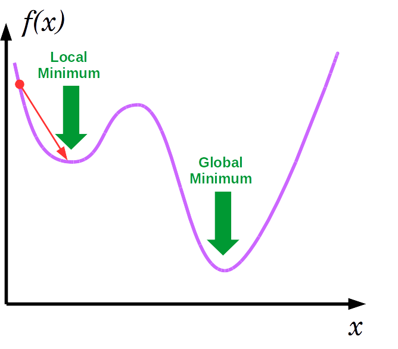
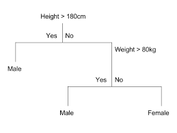
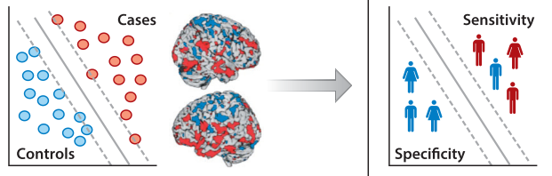
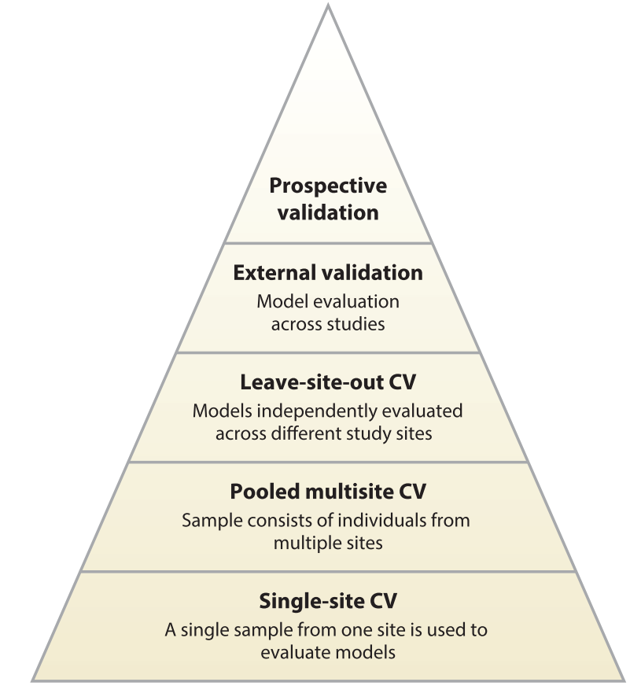

```{r setup, include=FALSE}
options(htmltools.dir.version = FALSE)

setwd("/Users/stephangoerigk/Desktop/Universität/CFH/Lehre/Bachelor/Einführung in die Forschungsmethoden der Psychologie und Psychotherapie/EFPP_Folien/")

library(tidyverse)
library(kableExtra)
library(ggplot2)
library(plotly)
library(htmlwidgets)
library(MASS)
library(ggpubr)
library(xaringanthemer)
library(xaringanExtra)

style_duo_accent(
  primary_color = "#621C37",
  secondary_color = "#EE0071",
  background_image = "blank.png"
)

xaringanExtra::use_xaringan_extra(c("tile_view"))

use_scribble(
  pen_color = "#EE0071",
  pen_size = 4
  )

knitr::opts_chunk$set(
  fig.retina = TRUE,
  warning = FALSE,
  message = FALSE
)

# library(RefManageR)
# BibOptions(
# check.entries = FALSE, 
# bib.style = "authoryear", 
# cite.style = "authoryear", 
# style = "markdown",
# hyperlink = FALSE, 
# dashed = FALSE)
# myBib = ReadBib("/Users/stephangoerigk/Desktop/Universität/CFH/Lehre/Bachelor/Einführung in die Forschungsmethoden der Psychologie und Psychotherapie/EFPP_Folien/myBib.bib")
```

name: Title slide
class: middle, left
<br><br><br><br><br><br><br>
# Einführung in die Forschungsmethoden der Psychologie und Psychotherapie

### Einheit 12: Big Data und Machine-Learning
##### 25.01.2023 | Dr. phil. Stephan Goerigk

---
class: top, left
### Big Data und Machine-Learning

#### Computer und mentale Gesundheit

* Idee Computer einzusetzen, um Diagnostik und Prognostik von  Erkrankungen zu verbessern ist nicht neu  

* Arthur Radbow aus den (60er Jahre): Machine Psychiatry aus „Closer than we think“. 

.center[
```{r eval = TRUE, echo = F, out.width = "750px"}
knitr::include_graphics("bilder/QvSElnX.png")
```
]

---
class: top, left
### Big Data und Machine-Learning

#### Computer und mentale Gesundheit

.center[
```{r eval = TRUE, echo = F, out.width = "720px"}
knitr::include_graphics("bilder/QvSElnX.png")
```
]

<small>

*  Idee: einen  Computer zu füttern mit allen Wesensäußerungen des Patienten. 
* Computer lerntaus den unterschiedlichsten Kombinationen von  emotionalen Ausdrücken, Kognitionen, Verhalten, Entscheidungsregeln abzuleiten
* Der Kliniker kann diese verwenden um zum  Beispiel seine Therapie danach auszurichten. 

</small>

---
class: top, left
### Big Data und Machine-Learning

.pull-left[

#### Big data - Definition

<small>

* große Datenmengen, die zu komplex sind, um sie mit traditionellen Methoden zu verarbeiten.

* umfasst sowohl strukturierte als auch unstrukturierte Daten, wie z.B. Text, Bilder, Audio- und Videodateien.

* Ziel: Muster, Trends und Verbindungen in den Daten zu erkennen und zu nutzen.

* Neue Technologien ermöglichen es, große Datenmengen zu speichern und zu verarbeiten.

* kann in vielen Bereichen wie Finanzen, Gesundheitswesen, Marketing und E-Commerce eingesetzt werden.

</small>
]

.pull-right[
.center[
```{r eval = TRUE, echo = F, out.width = "650px"}
knitr::include_graphics("bilder/bigd.jpg")
```
]
]

---
class: top, left
### Big Data und Machine-Learning

#### Wie kommt heutzutage KI ins Spiel?

* Dichte an Informationen,  die wir über Erkrankungen haben – nicht nur überpsychische Erkrankungen, sondern generell über Erkrankungen – nimmt exponentiell  

* Problem:  menschliche Kapazität mit diesem Wissen umzugehen ist begrenzt (Schere verfügbares vs. kognitiv verarbeitbares Wissen)

.center[
```{r eval = TRUE, echo = F, out.width = "650px"}
knitr::include_graphics("bilder/info.png")
```
]

---
class: top, left
### Big Data und Machine-Learning

#### Machine Learning

* Computerstrategie definiert, die *automatisch* Methoden und Parameter bestimmt (d.h. lernt), um eine optimale Lösung für ein Problem zu finden

* Wird nicht von vornherein von einem Menschen programmiert zu werden, um eine feste Lösung zu liefern. 

* Wird als Teilgebiet der künstlichen Intelligenz (KI) betrachtet

* Lernprozess simuliert vermeintlich eine Facette der menschlichen Intelligenz  

* Kann für vermeintlich intelligente Zwecke eingesetzt werden kann (z.B. Sprache, Schrift, Gesichtserkennung, selbstfahrende Autos oder medizinische Entscheidungshilfen).

---
class: top, left
### Big Data und Machine-Learning

#### Machine Learning - grobe Time Line

<small>

* 1940s-1950s: Entstehung der künstlichen Intelligenz (KI) und der Idee von neuronalen Netzen als möglichem Ansatz für KI.

* 1950s-1960s: Entwicklung von einfachen neuronalen Netzen und erste Anwendungen in Bereichen wie Handwriting Recognition und Bilderkennung.

* 1970s-1980s: Rückschlag in der Entwicklung von neuronalen Netzen aufgrund von Problemen mit dem Training und der Generalisierung.

* 1980s-1990s: Wiederaufleben des Interesses an neuronalen Netzen durch den Einsatz von "error backpropagation" und anderen verbesserten Trainingsalgorithmen.

* 1990s: Einführung von Support Vector Machines (SVMs) und anderen "shallow" Machine Learning-Methoden.

* 2000s: Einführung von "Big Data" und "Data Mining" als Schlagworte, sowie die Verfügbarkeit von großen Datenmengen und leistungsfähigen Computern.

* 2010s: Explosion des Interesses an "Deep Learning" und der Verfügbarkeit von großen, gut strukturierten Datensätzen und leistungsfähigen Grafikprozessoren (GPUs) für das Training tiefer Netze.

* 2020s: Deep Learning und Machine Learning werden in vielen Bereichen angewendet, wie zum Beispiel Computer Vision, Natur Sprachverarbeitung, Robotics und Medizin.

</small>

---
class: top, left
### Big Data und Machine-Learning

#### Machine Learning - grobe Time Line

.pull-left[

**Das Perzeptron:**

* Ziel: eine Maschine zu bauen, die ihre eigenen Formeln entwickelt, um Probleme durch Erlnen zu lösen (Rosenblatt 1958).

* Aufgabe: Bilder von Dreiecken von Quadraten unterscheiden mittels 400 Lichtsensoren

* Unterscheidung von Dreiecken von Quadraten nicht expliziert programmiert

* Traning über Trial und Error Prozess
]
.pull-right[
.center[
```{r eval = TRUE, echo = F, out.width = "350px"}

```
]
]

---
class: top, left
### Big Data und Machine-Learning

#### Machine Learning - grobe Time Line

.pull-left[

**Das Perzeptron:**

* Über viele Versuche hinweg änderte die Maschine die statistischen Gewichte, die mit jedem Lichtsensor verbunden waren, anhand einer internen Gleichung 

* Die Antworten einiger Sensoren wurden  sehr stark gewichtet, während andere (z. B. die in einem Viereckmuster) nicht gewichtet wurden

* In den Anfängen des maschinellen Lernens ging es also darum, aus realen Daten zu lernen, begrenzte Vorannahmen darüber zu treffen, wie diese Daten aussehen, und die Leistung der Maschine unter realen Bedingungen zu bewerten.
]

.pull-right[
.center[
```{r eval = TRUE, echo = F, out.width = "650px"}
knitr::include_graphics("bilder/perceptron-formule.png")
```
]
]

---
class: top, left
### Big Data und Machine-Learning

#### Machine Learning - grobe Time Line

* Das Perzeptron trug dazu bei, die Betrachtungsweise von Computern zu ändern

* Vorher: Rechenmaschinen, die die von vornherein mit bereits bekannten Formeln und Regeln programmiert werden mussten

* Nachher: Computer, die unscharfe Regeln selbständig erlernen konnten (z. B. Erkennung von Mustern). 

* Dieser frühe Erfolg löste einen großen Hype aus, der größtenteils aus phantasievollen Verallgemeinerungen der zugrundeliegenden Logik auf andere Probleme bestand

* Die Seifenblase platzte jedoch, als sich die Hoffnungen aufgrund der Beschränkungen der frühen Algorithmen und der damals verfügbaren Rechenleistung nicht erfüllten. 

* Einige dieser Beschränkungen können nun aufgrund der gestiegenen Rechenleistung überwunden werden, die es Maschinen ermöglicht, aus manchmal sehr komplexen Daten zu lernen, in Fällen, in denen traditionelle Modelle und Algorithmen nicht optimal funktioniert haben

---
class: top, left
### Big Data und Machine-Learning

#### Machine Learning - Entwicklung

* Machine Learning Algorithmen sind heute in unser tägliches Leben integriert 

  * Internet-Suchen 
  
  * Produktempfehlungen
  
  * Spracherkennungsdiensten 
  
  * selbstfahrenden Autos 
  
  * Bildklassifikation
  
  * Sprachmodelle (z.B. Deepl)
  
  * Generative Modelle (z.B. ChatGPT)


---
class: top, left
### Big Data und Machine-Learning

#### Entwicklungen im Gesundheitswesen

* Hoffnung klinische Entscheidungsfindung durch Informationsverabeitung zu verbessern

* Präzisionsmedizin (taylored Treatments): Richtige Behandlung für richtige Patient:in zur richtigen Zeit

.center[
```{r eval = TRUE, echo = F, out.width = "950px"}
knitr::include_graphics("bilder/klin.png")
```
]

---
class: top, left
### Big Data und Machine-Learning

#### Entwicklungen im Gesundheitswesen

<small>

* Ansatz des maschinellen Lernens  im Gesundheitswesen funktioniert insbesondere gut  bei Aufgaben, bei denen es um Mustererkennung in Bildern geht:

* Ebenso gut oder besser abgeschnitten als Kliniker, etwa bei 
  * der Erkennung von Hautkrebs (Esteva et al. 2017)
  * Lungenkrebs (Yu et al. 2016) 
  * Augenerkrankungen (Long et al. 2017)
  * Brustkrebs zu erkennen (z. B. Samsung, RS80A). 

*  Fortschritte treiben das rasche Wachstum kommerzieller Lösungen für maschinelles Lernen im Gesundheitswesen voran

</small>

.center[
```{r eval = TRUE, echo = F, out.width = "950px"}

```
]

---
class: top, left
### Big Data und Machine-Learning

#### Klassen von Machine Learning

<small>

Man unterscheidet im Machine Learninng i.d.R. drei unterschiedliche Anwendungsbereiche:

* **Unsupervised Learning:**
  * Beinhaltet keine vorgegebenen Labels oder Zielvariablen.
  * Ziel ist es, unbekannte Strukturen oder Muster in den Daten zu entdecken.
  * Beispiele: Clustering, Dimensionality Reduction.
  
* **Supervised Learning:**
  * Beinhaltet vorgegebene Labels oder Zielvariablen.
  * Ziel ist es, ein Modell zu entwickeln, das in der Lage ist, neue Datenpunkte richtig vorherzusagen.
  * Beispiele: Regression, Klassifikation.
  
* **Reinforcement Learning:**
  * Beinhaltet ein Agent-System, das in einer Umgebung agiert und Entscheidungen trifft.
  * Ziel ist es, das Verhalten des Agenten so anzupassen, dass es möglichst hohe Belohnungen erhält.
  * Beispiele: Game-playing, Robotics.

$\rightarrow$ Es ist zu beachten, dass diese drei Arten von Machine Learning-Methoden nicht immer klar voneinander abgegrenzt sind und es auch überlappende Anwendungen gibt.

</small>

---
class: top, left
### Big Data und Machine-Learning
.pull-left[
#### Klassen von Machine Learning

<small>

**Unsupervised Learning und Supervised Learning**

* Lassen sich noch auf klassische statistische Fragestellungen zurückführen

* Output dieser Algorithmen ist eine Kategorie, bzw. eine Zahl

* Unsupervised Learning: Gruppierungsvorschläge für chaotische Datenstrukturen, ohne Vorkenntnis von Kategorien (Clustering) $\rightarrow$ wichtig für Entdeckung neuer Krankheitsmuster etc.

* Supervised Learning: versucht bereits bekannte Kategorien in Daten wiederzuerkennen $\rightarrow$ wichtig für klinische Prognosen/Diagnosen

</small>
]
.pull-right[
.center[
```{r eval = TRUE, echo = F, out.width = "650px"}
knitr::include_graphics("bilder/supervised-vs-unsupervised-ml.png")
```
]
]

---
class: top, left
### Big Data und Machine-Learning
.pull-left[
#### Klassen von Machine Learning

**Reinforcement Learning**

* Beinhaltet das Erlernen von Funktionen und Entscheidungsregeln

* Output dieser Algorithmen kann ein komplexes Verhalten sein

* Kann implizit auch Klassifikationen oder Gruppierungen beinhalten

* Beispiele sind Schach spielen lernen, autonomes Fahren, etc.
]
.pull-right[
.center[
```{r eval = TRUE, echo = F, out.width = "350px"}
knitr::include_graphics("bilder/reward.png")
```
]
.center[
```{r eval = TRUE, echo = F, out.width = "350px"}
knitr::include_graphics("bilder/tesla.jpg")
```
]
* Output: z.B. Lenkrad links/rechts drehen
* Objective Function: schnell ans Ziel ohne Unfall/Risiko
]

---
class: top, left
### Big Data und Machine-Learning

#### Klassen von Machine Learning

**Reinforcement Learning - Gradient Descent**

<small>

* Lernen = Fehlerveringerung (Trial + Error)
* Standardmethode zur Modelloptimierung im Reinforcement Learning: Gradient Descent
* Schrittweise (inkrementelle) Modellanpassung veringert den Fehler
* VORICHT: Lokale Minima müssen vermieden werden

</small>

.pull-left[
.center[
```{r eval = TRUE, echo = F, out.width = "350px"}
knitr::include_graphics("bilder/gradient1.png")
```
]
]
.pull-right[
.center[
```{r eval = TRUE, echo = F, out.width = "350px"}

```
]
]

---
class: top, left
### Big Data und Machine-Learning

#### Machine Learning - Arten

Shallow Learning vs. Deep Learning

* Shallow Learning:
  * Einfachere Modelle, die schneller trainiert und implementiert werden können.
  * In der Regel benötigen sie weniger Daten, um zu trainieren.
  * Geeignet für Probleme mit einfachen Strukturen und klaren Mustern.

* Deep Learning:
  * Komplexere Modelle, die länger trainiert und implementiert werden müssen.
  * In der Regel benötigen sie mehr Daten, um zu trainieren.
  * Geeignet für Probleme mit komplexen Strukturen und unsicheren Mustern.
  * Beispiele: Convolutional Neural Networks (CNNs), Recurrent Neural Networks (RNNs), Autoencoder.

---
class: top, left
### Big Data und Machine-Learning

#### Machine Learning - Arten
.pull-left[
##### Shallow Learning:

Beispielalgorithmen:

* k-Nearest Neighbors (k-NN)
* Naive Bayes
* Linear/Logistic Regression
* Decision Trees und Random Forest
* Gradient Boosting
* Support Vector Machines (SVMs)
* Principal Component Analysis (PCA)
]
.pull-right[
.center[
Support Vector Machine:
```{r eval = TRUE, echo = F, out.width = "350px"}
knitr::include_graphics("bilder/svm.png")
```
]
]

---
class: top, left
### Big Data und Machine-Learning

#### Machine Learning - Arten
.pull-left[
##### Shallow Learning:

Beispielalgorithmen:

* k-Nearest Neighbors (k-NN)
* Naive Bayes
* Linear/Logistic Regression
* Decision Trees und Random Forest
* Gradient Boosting
* Support Vector Machines (SVMs)
* Principal Component Analysis (PCA)
]
.pull-right[
.center[
Decision Tree:

```{r eval = TRUE, echo = F, out.width = "350px"}

```
]
]


* Tiefe des Machine Learning-Algorithmus steht nicht unbedingt mit seiner Leistungsfähigkeit in Verbindung , und dass einige dieser Algorithmen, 
* z.B. Random Forest und Gradient Boosting, können auch tiefere Netze verwenden  und somit als "shallow" oder "deep" angesehen werden

---
class: top, left
### Big Data und Machine-Learning

#### Machine Learning - Arten

##### Deep Learning

.pull-left[
<small>

* Basiert auf künstlichen neuronalen Netzen, die aus Schichten von Neuronen (sogenannten "Knoten") bestehen.

* Jede Schicht wird trainiert, um bestimmte Merkmale oder Eigenschaften aus den Daten zu extrahieren.

* Die erste Schicht erkennt einfache Merkmale, die nächste Schicht erkennt komplexere Merkmale auf der Grundlage der ersten Schicht, und so weiter.

* Durch das Training der Netze mit großen Mengen an Daten, können die Neuronen selbstständig Muster und Zusammenhänge erkennen.

* Die tiefste Schicht des Netzes (die sogenannte "output layer") trifft schließlich die Entscheidung oder gibt eine Vorhersage ab.

</small>
]

.pull-right[
.center[
```{r eval = TRUE, echo = F, out.width = "650px"}
knitr::include_graphics("bilder/nnet.png")
```
]
]

---
class: top, left
### Big Data und Machine-Learning

#### Beispiel - Vorhersage von Schizophrenie-Onset im Prodrom (Koutsouleris et al. 2021)

.center[
```{r eval = TRUE, echo = F, out.width = "850px"}
knitr::include_graphics("bilder/pronia.png")
```
]


---
class: top, left
### Big Data und Machine-Learning

#### Logik der Prädiktiven Modellierung

.pull-left[
**Szenario:**

* Wir haben einen Trainingsdatensatz mit Brainscans 

* Wir wissen für Personen im Trainingsdatensatz, wer eine Diagnose hatte (rot) und wer nicht (blau)

* Prädiktion: Für neue Person (nicht im Datensatz) auf Basis der Brainscans vorhersagen, ob Diagnose vorhanden

]
.pull-right[
.center[
```{r eval = TRUE, echo = F, out.width = "150px"}
knitr::include_graphics("bilder/pred1.png")
```
]
.center[
```{r eval = TRUE, echo = F, out.width = "350px"}

```
]
]

---
class: top, left
### Big Data und Machine-Learning

#### Logik der Prädiktiven Modellierung

.pull-left[
**Schritt 1:**

* Im Trainingsdatensatz Modell auf Basis der Aktivierungsmuster im Brainscan trainieren
]
.pull-right[
.center[
```{r eval = TRUE, echo = F, out.width = "650px"}

```
]
]

---
class: top, left
### Big Data und Machine-Learning

#### Logik der Prädiktiven Modellierung

.pull-left[
**Schritt 2:**

* Im Trainingsdatensatz Modell auf Basis der Aktivierungsmuster im Brainscan trainieren.

* Prüfen, ob Diagnose durch das Modell vorhergesagt werden kann.
]
.pull-right[
.center[
```{r eval = TRUE, echo = F, out.width = "650px"}

```
]
]

---
class: top, left
### Big Data und Machine-Learning

#### Logik der Prädiktiven Modellierung - Genauigkeitsmaße

.pull-left[
.center[
```{r eval = TRUE, echo = F, out.width = "550px"}
knitr::include_graphics("bilder/acc.png")
```
]
]
.pull-right[
.center[
```{r eval = TRUE, echo = F, out.width = "550px"}

```
]
* Vorhersagegenauigkeit = **Accuracy**

* Vorliegen von Diagnose korrekt zu erkennen = **Sensitivität**

* Abwesenheit von Diagnose korrekt zu erkennen = **Spezifität**

]

---
class: top, left
### Big Data und Machine-Learning

#### Generalisierbarkeit und Kreuzvalidierung

**Schritt 3:** Um zu prüfen, ob das trainierte Modell gut funktioniert, müssen wir es validieren

* **Validierung**: Modell an Fällen erproben die nicht im Trainingsset dabei waren

* VORSICHT: strikte Trennung zwischen Trainings- und Testdaten (Data-Leakage) $\rightarrow$ sonst droht ein **Overfit**
  * Unfairer Vorteil: Vorhersage von Fällen, die das Modell schon "kennt"
  * Modell würde sonst besser performen, als in der Realität

* Einfachstes Szenario: **Simple Split** $\rightarrow$ Datensatz wird z.B. 50/50 in Tranings- und Testdatensatz geteilt
  * Problem: Forscher könnte genau so trennen, dass Modell gut funktioniert (das wäre Schummeln)
  
* Lösung: (k-fold) **Nested-Cross-Validation** (häufigstes Modell für kleinere Datensätze)

---
class: top, left
### Big Data und Machine-Learning

#### Generalisierbarkeit und Kreuzvalidierung

.pull-left[
<small>
** (k-fold) Nested-Cross-Validation:**

* Datensatz wird in k Folds geteilt (hier k=5)

* Runde 1: Training: 1-4 Folds, Test: 5. Fold
* Runde 2: Training: 1,2,3,5 Folds, Test: 4. Fold
* Runde 3: Training: 1,2,4,5 Folds, Test: 3. Fold
* ...

* Am Ende Gesamtgenauigkeit ausrechnen

* Vorteil: Kein Overfit + ganzer Datensatz kann ohne Data-Leakage genutzt werden 

</small>
]
.pull-right[
.center[
```{r eval = TRUE, echo = F, out.width = "650px"}
knitr::include_graphics("bilder/predx.png")
```
]
.center[
```{r eval = TRUE, echo = F, out.width = "550px"}

```
]
]

---
class: top, left
### Big Data und Machine-Learning

.pull-left[
#### Generalisierbarkeit und Kreuzvalidierung
<small>
**Generalisierbarkeitspyramide:**

* Je unterschiedliher die Kontexte (z.B. zeitlich, geografisch, kulturell) von Traning und Test Folds, desto generalisierbarer ist das Modell

* Leave-Site-out $\rightarrow$ Folds = einzelne Studienzentren
  * Modell funktioniert nicht nur in Klinik A sondern auch in Klinik B
  
* External $\rightarrow$ Folds = einzelne Studien
  * Modell funktioniert nicht nur in Studie A sondern auch in Studie B

* Prospective $\rightarrow$ Folds = Zeit
  * Modell kann fälle vorhersagen, die in der Zukunft liegen
  
</small>
]
.pull-right[
.center[
```{r eval = TRUE, echo = F, out.width = "400px"}

```
]
]


---
class: top, left
### Big Data und Machine-Learning

#### Generative Modelle
.pull-left[

<small>

**Generative Adversarial Networks (GAN):**

* Können nach einem Vorbild Content erzeugen

* Klassifikationsalgorithmus tritt gegen generativen Algorithmus an
  
* Iterative Annäherung an Zielzustand durch Induktion von Zufälligkeit

* Es können ohne großen Aufwand neue Inhalte kreiert werden
  
</small>
]
.pull-right[
.center[
```{r eval = TRUE, echo = F, out.width = "600px"}
knitr::include_graphics("bilder/gan.jpeg")
```
]
]

---
class: top, left
### Big Data und Machine-Learning

#### Generative Modelle - Bildtransfer

.center[
```{r eval = TRUE, echo = F, out.width = "800px"}
knitr::include_graphics("bilder/gan1.jpeg")
```
]

---
class: top, left
### Big Data und Machine-Learning

#### Generative Modelle - Bildtransfer

.center[
```{r eval = TRUE, echo = F, out.width = "900px"}
knitr::include_graphics("bilder/gan2.jpg")
```
]

---
class: top, left
### Big Data und Machine-Learning

#### Generative Modelle - Reperatur kompromittierter MRT Scans

.center[
```{r eval = TRUE, echo = F, out.width = "900px"}
knitr::include_graphics("bilder/gan3.jpg")
```
]


---
class: top, left
### Big Data und Machine-Learning

#### Mensch-Maschine Interaktion

Analogie: Stufen autonomen Fahrens

```{r echo = F}
df = data.frame(Stufe = 0:5,
                Name = c("No automation", "Driver assistance", "Partial automation", "Conditional automation", "High automation", "Full automation"),
                Interaktion = c("Fehlen von Assistenzsystemen.",
                                "Systeme, die dem Fahrer helfen, die Geschwindigkeit zu halten oder in der Spur zu bleiben, aber dem Fahrer die Kontrolle überlassen.",
                                "Die Kombination aus automatischer Geschwindigkeits und Lenkung - zum Beispiel Tempomat und Spurhaltung.",
                                "Automatisierte Systeme, die die Umgebung steuern und überwachen, aber auf einen menschlichen Fahrer als Unterstützung angewiesen sind.",
                                "Automatisierte Systeme, die alles erledigen - ohne menschliche Unterstützung - aber nur unter bestimmten Umständen.",
                                "Der echte elektronische Chauffeur: Er behält die volle Kontrolle über das Fahrzeug, braucht keine menschliche Unterstützung und fährt unter allen Bedingungen."))

df %>%
  kbl() %>%
  kable_styling(font_size = 18) %>%
  kable_classic(full_width = T)
```

---
class: top, left
### Big Data und Machine-Learning

#### Mensch-Maschine Interaktion

.center[
```{r eval = TRUE, echo = F, out.width = "750px"}
knitr::include_graphics("bilder/stages.png")
```
]

* Stufe 5, d. h. eine vollständige Automatisierung ohne die Möglichkeit der Unterstützung von Klinikpersonal, ist nicht das Ziel. 
* Auch Stufe 4 mit menschlicher Unterstützung unter sehr begrenzten Bedingungen ist nicht das Ziel. 
* Angestrebt werden Synergieeffekte, d. h. die Kombination von Funktionen, die Maschinen am besten erledigen, mit solchen, die am besten für Kliniker geeignet sind.
 
---
class: top, left
### Big Data und Machine-Learning

#### Klinische Akzeptanz von KI (Koutsouleris, 2021)

Anforderungen:

* Medizinische KI muss mindestens so genau sein kann wie menschliche, Heuristik
* KI muss mindestens so generalisierter sein wie klinische Entscheidungsfindungen
* KI muss so trainiert werden kann dass sie zu einer effektiven Nutzung bestehender Ressourcen führt
* Die Anwendungsindikation von medizinischer KI muss klar definiert ist
* Der Bias von KI muss offen gelegt werden können
* KI muss transparent bezüglich der eigenen Unsicherheit sein, um übermäßiger Technik Gläubigkeit vorzubeugen
* KI muss handlungsrelevante Informationen produzieren
* KI muss klinisch kontrolliert werden können (was eine entsprechende Ausbildung im Studium erfordert)

---
class: top, left
### Take-Aways
.content-box-gray[

* **Kapazitätsproblem:** menschliche Kapazität mit effizient Wissenszuwachs umzugehen ist begrenzt

* **Machine Learning:** Computerfunktionalität die nicht explizit programmiert wurde, sondern selbstständig "lernt"

* **Unsupervised ML** $\rightarrow$ Mustererkennung, **Supervised M**L $\rightarrow$ Prädiktion, **Reward Learning** $\rightarrow$ Operation

* Vorhersagegenauigkeit eines Prädiktionsmodells muss mittels **Validierung** geprüft werden.

* **Deep Learning:** Klasse von ML Modellen, die mit neuronalen Netzen (inkl. hidden layers) arbeiten

* **Overfit:** Überanpassung an die Daten $\rightarrow$ führt zu veringerter Generalisierbarkeit.

* **Generative Modelle** können genutzt werden um Inhalte zu erzeugen.
]

[**Link zur Wissensüberprüfung**](https://docs.google.com/forms/d/e/1FAIpQLSfkQM2uaO1Qv_PggSXeXiIc90D68uMN_3S_vdmBn6Ed8uJ0uA/viewform?usp=sf_link)

